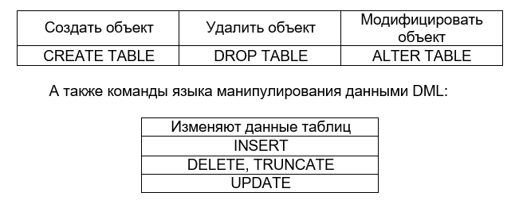

## Лабораторная работа 2

Создание структуры распределенной базы данных
Постановка задачи:
На основании таблиц физической модели данных и бизнес- правил предметной области создать:

1.	Скрипт создания таблиц БД.
2.	Скрипт модификации таблиц БД.
3.	Диаграмму БД.
4.	Скрипт удаления таблиц БД.
5.	Скрипт занесения информации в таблицы БД.
6.	Скрипт изменения информации в таблицах БД.
7.	Скрипт удаления информации из таблиц БД.
Для	создания	указанных	скриптов	использовать	следующие команды языка определения данных DDL:

Создать объект	Удалить объект	Модифицировать объект
CREATE TABLE	DROP TABLE	ALTER TABLE

Изменяют данные таблиц
INSERT
DELETE, TRUNCATE
UPDATE

Введение ограничений на столбцы и таблицы осуществлять с использованием следующих предложений - NOT NULL, UNIQUE, PRIMARY KEY, CHECK, DEFAULT, CONSTRAINT, FOREING KEY.
Письменный отчет по лабораторной работе должен содержать:

1.	Титульный лист, содержащий – название лабораторной работы, фамилию, имя, отчество, номер группы исполнителя, дату сдачи.
2.	Скрипт создания таблиц БД.
3.	Скрипт изменения таблиц БД.
4.	Диаграмму БД.
5.	Скрипт удаления таблиц БД.
6.	Скрипт занесения информации в таблицы БД.
7.	Скрипт обновления информации в таблицы БД.
8.	Скрипт удаления информации из таблиц БД. 
9.	Примеры таблиц с данными, таблиц после изменения данных и т.п.
10.	Выводы по лабораторной работе (в выводах отразить особенности построения модели, скриптов, и пути дальнейшей модернизации БД).

**Контрольные вопросы и задания**

1.	К каким языкам относится язык SQL?
2.	Какие формы языка SQL существуют?
3.	Каковы компоненты языка SQL?
4.	Каковы основные предложения компонент языка SQL?
5.	Какие действия можно выполнить с помощью предложений DDL?
6.	Каковы основные типы данных СУБД MS SQL Server?
7.	Какие действия выполняет команда CREATE TABLE?
8.	Каков синтаксис команда CREATE TABLE?
9.	Каким	образом	с	помощью	команды	CREATE	TABLE
поддерживается правило ссылочной целостности БД?
10.	Как	осуществляется	изменение	существующей	таблицы БД?
11.	Как осуществляется удаление таблицы БД?
12.	Какие бывают и как вводятся ограничения на столбец в БД?
13.	Какие бывают и как вводятся ограничения на таблицу в БД?
14.	Как осуществляется вставка данных в таблицу БД?
15.	Как осуществляется удаление данных из таблицы БД?
16.	Как осуществляется изменение данных в таблице БД?
