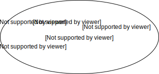
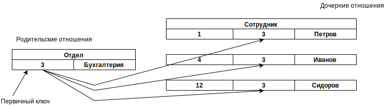

# Лекция 2. Основные понятия реляционной модели данных

## 2.1.	Отношения и их свойства. Домены

В реляционной модели используется математическая теория отношений (название "реляционная" происходит от relation - "отношение", "связь").

К числу достоинств реляционного подхода можно отнести:
- наличие небольшого набора абстракций, которые позволяют сравнительно просто моделировать большую часть распространенных предметных областей и допускают точные формальные определения, оставаясь интуитивно понятными;
- наличие простого и в то же время мощного математического аппарата, опирающегося главным образом на теорию множеств и математическую логику и обеспечивающего теоретический базис реляционного подхода к организации баз данных;
- возможность ненавигационного манипулирования данными без необходимости знания конкретной физической организации баз данных во внешней памяти;
- простота реляционной БД, гибкость её структуры и удобство реализации БД на ЭВМ.
К числу недостатков реляционного подхода относят:
- недостаточная эффективность реляционных СУБД;
- присущая этим системам некоторая ограниченность (прямое следствие простоты) при использовании в так называемых нетрадиционных областях (наиболее распространенными примерами являются системы автоматизации проектирования), в которых требуются предельно сложные структуры данных;
- невозможность адекватного отражения семантики (смысла)
предметной области.

Общая характеристика реляционной модели данных. Согласно К. Дейту реляционная модель состоит из трех частей, описывающих разные аспекты реляционного подхода: структурной части, манипуляционной части и целостной части.
 
В структурной части модели фиксируется, что единственной структурой данных, используемой в реляционных БД, является нормализованное n-арное отношение.
Целостностная часть описывает ограничения специального вида, которые должны выполняться для любых отношений в любых реляционных БД. Целостность данных - это механизм поддержания соответствия базы данных предметной области. В реляционной модели данных существует два вида целостности: - целостность ссылок; - целостность сущностей.
В манипуляционной части модели утверждаются два фундаментальных механизма манипулирования реляционными БД - реляционная алгебра (базируется на теории множеств) и реляционное исчисление (базируется на аппарате исчисления предикатов первого порядка).

**Структурная часть реляционной модели**

Основными понятиями реляционных баз данных являются тип данных, домен, атрибут, кортеж, первичный ключ и отношение.
Отношения удобно представлять в виде таблиц. На рисунке 2.1 представлена таблица Т (отношение “Сотрудники” степени 5, арность равна 5), содержащая некоторые сведения о работниках гипотетического предприятия. Строки таблицы соответствуют кортежам. Каждая строка фактически представляет собой описание одного объекта реального мира (в данном случае работника), характеристики которого содержатся в столбцах. Столбцы в таблице, представляющей отношение, называют атрибутами.

Рисунок 2.1 -  Основные компоненты 5-арного реляционного отношения “Сотрудники”

Каждый атрибут определен на домене, поэтому домен можно рассматривать как множество допустимых значений данного атрибута. Домен это семантическое (смысловое) понятие. Домен можно рассматривать как подмножество значений некоторого типа данных, имеющих определенный смысл.

Свойства домена:
 
- домен имеет уникальное имя (в пределах БД);
- домен определен на некотором простом (атомарном) типе данных или на другом домене;
- домен может иметь некоторое логическое условие, позволяющее описать подмножество данных, допустимых для данного домена (Домен D, имеющий смысл “возраст сотрудника” можно описать как следующее подмножество множества натуральных чисел - D={nєN: n≥18 and n≤60}. Условие на строковый тип данных, задающий домен “Имя”?);
- домен несет смысловую нагрузку.

Несколько атрибутов одного отношения и даже атрибуты разных отношений могут быть определены на одном и том же домене. На рисунке 2.1 атрибуты "Оклад" и "Премия" определены на домене "Деньги". Понятие домена имеет смысловую нагрузку: данные можно считать сравнимыми только тогда, когда они относятся к одному домену. В рассматриваемом примере сравнение атрибутов "Табельный номер" и "Оклад" является семантически некорректным, хотя они и содержат данные одного типа.

*Определение 1*. Атрибут отношения есть пара `<имя_атрибута: имя_домена>`.
Имена атрибутов должны быть уникальны в пределах отношения. Часто имена атрибутов отношения совпадают с именами соответствующих доменов.

*Определение 2*. Отношение R, определенное на множестве не обязательно различных доменов D1, D2,..., Dn, содержит две части: заголовок и тело:
1. Заголовок содержит фиксированное множество атрибутов или, точнее, пар `<имя- атрибута: имя-домена>`: {<A1: D1>, ..., <An: Dn>}, причем каждый атрибут Aj соответствует одному и только одному из лежащих в основе доменов Dj (j = 1, 2, ..., n). Все имена атрибутов A1, A2, ..., An разные. Заголовок отношения статичен, он не меняется во время работы с БД.
Иное название заголовка отношения – схема отношения или заголовок таблицы.
Число атрибутов n называют степенью (или арностью) отношения R ( n=1 - унарное, n=2 - бинарное, ..., n-арное отношение).
2. Тело отношения содержит множество кортежей. Каждый кортеж содержит множество пар <имя-атрибута: значение-атрибута>: { <A1:V1>, ..., <An:Vn> }. В каждом таком кортеже есть одна такая пара `<имя-атрибута: значение-атрибута>`, т.е. <Aj:Vj>, для каждого атрибута Aj в заголовке. Для любой пары <Aj:Vj> Vj принадлежит домену Dj, который связан с атрибутом Aj.
Тело отношения динамично - оно может изменяться во время работы с БД, то есть кортежи могут изменяться, добавляться и удаляться.
Мощность множества кортежей m называют кардинальным числом (или мощностью) отношения R.
3. Отношение обычно записывается в виде R(A1, A2, ..., An) или еще короче R.

*Определение 3.* Реляционной базой данных называется набор отношений.

*Определение 4.* Схемой реляционной базой данных называется набор заголовков отношений (именованных схем отношений), входящих в БД.

Хотя любое отношение можно изобразить в виде таблицы, но нужно понимать, что отношения не являются таблицами и что не любая таблица может представить отношение.
Различаются два вида отношения. Это переменная отношения и значение отношения. 
Переменная отношения - это обычная переменная, такая же как и в языках программирования, т.е. именованный объект, значение которого может изменяться со временем, а значение этой переменной в любой момент времени и будет значением отношения.
В таблице 2.1 представлены "табличные" синонимы терминов реляционной модели данных.

Таблица 2.1 -  “Табличные” синонимы терминов реляционной модели данных

| Реляционный термин | "Табличный" термин |
|---|---|
| База данных | Набор таблиц |
| Схема базы данных | Набор заголовков таблиц |
| Отношение, сущность | Таблица |
| Схема отношения | Заголовок таблицы |
| Домен | Общая совокупность допустимых значений |
| Заголовок отношения | Заголовок таблицы |
| Тело отношения | Тело таблицы |
| Атрибут отношения | Наименование столбца таблицы |
| Кортеж отношения | Строка (или запись) таблицы |
| Степень	(-арность) отношения | Количество столбцов таблицы |
| Мощность отношения (кардинальное число) | Количество строк таблицы |
| Первичный ключ | Уникальный идентификатор |

**Фундаментальные свойства отношений**

1.	Отсутствие кортежей-дубликатов. Из этого свойства вытекает наличие у каждого кортежа первичного ключа. Для каждого отношения, по крайней мере, полный набор его атрибутов является первичным ключом. При определении первичного ключа должно соблюдаться требование "минимальности", т.е. в него не должны входить те атрибуты, которые можно отбросить без ущерба для основного свойства первичного ключа - однозначно определять кортеж.
То свойство, что отношения не содержат кортежей-дубликатов, следует из определения отношения как множества кортежей.
2.	Отсутствие упорядоченности кортежей – следует из определения отношения-экземпляра как множества кортежей.
3.	Отсутствие упорядоченности атрибутов. Атрибуты отношений не упорядочены, поскольку по определению схема отношения есть множество пар {имя-атрибута : имя-домена}. Для ссылки на значение атрибута в кортеже отношения всегда используется имя атрибута. Это свойство позволяет, например, модифицировать схемы существующих отношений не только путем добавления новых атрибутов, но и путем удаления существующих атрибутов.
4.	Атомарность значений атрибутов. Значения всех атрибутов являются атомарными, то есть принадлежащими к простым типам данных без внутренней структуры (вернее внутренняя структура атрибутов не учитывается). Это следует из определения домена как потенциального множества значений простого типа данных, т.е. среди значений домена не могут содержаться множества значений (отношения).

Из свойств отношений следует, что не каждая таблица может задавать отношение. Для того, чтобы некоторая таблица задавала отношение, необходимо:
1. чтобы таблица имела простую структуру (содержала бы только строки и столбцы, причем, в каждой строке было бы одинаковое количество полей),
2. в таблице не должно быть одинаковых строк,
3. любой	столбец	таблицы	должен	содержать	данные	только одного типа,
4. все используемые типы данных должны быть простыми.

Таблицу Т на рисунке 2.1 можно рассматривать как изображение отношения (в смысле определения отношения), если в таблице выполняются следующие условия:
1. есть некоторые, лежащие в основе столбцов домены;
2. каждый столбец соответствует только одному из этих доменов;
3. каждая строка представляет кортеж;
4. каждое	значение	атрибута	принадлежит	соответствующему домену.

Если мы приняли все эти правила интерпретации, то тогда и только тогда можно говорить, что таблица - это приемлемое изображение отношения.
 
Пример. Таблица 2.2 является отношением, а таблицы 2.3 и 2.4 – нет.

Таблица 2.2

| 25 | Иванов | Иван |
| 26 | Петров | Семен |
| 26 | Серов | Петр |

Таблица 2.3

| 25 | Иванов | Иван |
| 28 | Петров | Семен |
| Петр | Серов | 30 |

Таблица 2.4

| 25 | Иванов | Иван |
| 28 | Петров | Семен |
| 30 Серов Петр |

## 2.2. Понятие ключа в  отношени

Первичный ключ (PRIMARY KEY, PK)  это просто уникальный идентификатор для некоторого отношения. Однако первичный ключ на самом деле является частным случаем более общего понятия потенциального ключа.

*Определение 5.* Пусть R - некоторое отношение. Тогда потенциальный ключ, например, K для R - это подмножество множества атрибутов R, обладающее следующими свойствами:
1. Свойством	уникальности.	Нет	двух	различных	кортежей	в отношении R с одинаковым значением K.
2. Свойством	неизбыточности.	Никакое	из	подмножеств	K	не обладает свойством уникальности.

Таким образом, каждое отношение имеет хотя бы один потенциальный ключ, так как не содержит одинаковых кортежей, то есть поскольку кортежи уникальны, то, по крайней мере, комбинация всех атрибутов обладает свойством уникальности и поэтому возможны два варианта:
1. Либо эта комбинация обладает свойством неизбыточности, а значит, будет потенциальным ключом.
2. Либо существует по крайней мере одно подходящее подмножество этой комбинации, заведомо обладающее свойством уникальности и к тому же обладающее свойством неизбыточности.

На практике в качестве первичного ключа используют несколько атрибутов, а не все атрибуты. Если кортежи идентифицируются только сцеплением значений нескольких атрибутов, то говорят, что отношение имеет составной ключ.
 
На практике также очень часто в качестве первичного ключа используют суррогатный (искусственный) ключ – данный ключ не является свойством сущности, но уникален и его просто генерировать. Причина важности потенциальных ключей заключается в том, что они обеспечивают основной механизм адресации на уровне кортежей в реляционной системе. Следовательно, единственный гарантируемый способ точно указать на какой-нибудь кортеж – это указать значение потенциального ключа.

Выводы из этого определения можно сделать следующие:
1. Отношения, которые не имеют потенциальных ключей (т.е. допускающие дублирование кортежей), ограничивают отображение нарушений или отклонений от нормального режима работы в определенных обстоятельствах.
2. Система, в которой не используются потенциальные ключи, иногда ограничена в возможностях отображения состояния, которое не является действительно реляционным, даже если используемые в ней отношения не допускают дублирования кортежей.

**Первичные и альтернативные ключи**

Базовое отношение может иметь больше одного потенциального ключа (Базовое отношение это отношение реально существующее в БД, а не возникающее в результате выполнения запроса.). В таком случае один из потенциальных ключей должен быть выбран в качестве первичного ключа в базовом отношении, остальные потенциальные ключи, если они есть, будут называться альтернативными (возможными) ключами. В приведенном на рис. 1 примере, в качестве первичного ключа можно выбрать атрибут "Табельный номер" T#, поскольку его значение уникально для каждого работника предприятия. Тогда атрибут "Имя" NAME будет альтернативным ключом.
Следовательно, каждое базовое отношение должно иметь всегда первичный ключ.
Пример. На рисунке 2.2 изображено множество потенциальных ключей некоторого отношения. Очевидно, что множество потенциальных ключей отношения {K} равно множеству альтернативных ключей {AltK} объединенному с первичным ключем
{PK}, то есть {K}={AltK}{PK}.

Рисунок 2.2 -  Множество потенциальных ключей отношения {K}

**Внешние ключи**

Для отражения связей между кортежами разных отношений используется дублирование их ключей. Пример, содержащий сведения о подразделениях предприятия и работающих в них сотрудниках, применительно к реляционной модели будет иметь вид (рисунок 2.3):

Рисунок 2.3 - База данных о подразделениях и сотрудниках предприятия (фрагмент)

Связь между отношениями ОТДЕЛ и СОТРУДНИК создается путем копирования первичного ключа "Номер_отдела" из первого отношения во второе. Таким образом:
- для того, чтобы получить список работников данного отдела, необходимо:
	1. из таблицы ОТДЕЛ установить значение атрибута "Номер_отдела", соответствующее данному "Наименованию_отдела"
	2. выбрать из таблицы СОТРУДНИК все записи, значение атрибута "Номер_отдела" которых равно полученному на предыдушем шаге.
- для того, чтобы узнать в каком отделе работает сотрудник, нужно выполнить обратную операцию:
	1. определяем "Номер_отдела" из таблицы СОТРУДНИК
	2. по полученному значению находим запись в таблице ОТДЕЛ.
Атрибуты, представляющие собой копии ключей (потенциальных или, как правило, первичных ключей) других отношений, называются внешними ключами (FOREIGN KEY, FK).
 
В реляционной модели подразумевается, что внешние ключи могут ссылаться точно на первичные ключи и ни как не иначе.
Определение внешнего ключа: Пусть R2 - базовое отношение. Тогда внешний ключ FK в отношении R2 – это подмножество множества атрибутов R2, такое что:
1. существует базовое отношение R1 с потенциальным ключом
CK (CK - вторичный ключ);
2. каждое значение FK в текущем значении R2 всегда совпадает со значением CK некоторого кортежа в текущем значении R1.

Внешний ключ должен принадлежать к тому же домену, что и первичный ключ. Не первичный ключ может быть внешним ключом. Ключ CK называют вторичным ключом. Ключ CK и внешний ключ FK называют полями связи отношений R1 и R2. Вторичный и первичный ключ в общем случае могут не совпадать.
Отношение R1 называют родительским, а отношение R2 – дочерним.

## 2.3. Ссылочная целостность

Целостность данных - это механизм поддержания соответствия базы данных предметной области. В реляционной модели данных существует два вида целостности:
- целостность  ссылок;
- целостность  сущностей.

Требование к БД состоит в том, что любой кортеж любого отношения БД должен быть отличим от любого другого кортежа этого отношения, то есть, любое отношение должно обладать первичным ключом. Это требование автоматически удовлетворяется, если в системе не нарушаются базовые свойства отношений.

**Целостность сущностей**

Требование целостности сущностей заключается в следующем: каждый кортеж любого отношения должен отличаться от любого другого кортежа этого отношения (т.е. любое отношение должно обладать первичным ключом).

Вполне очевидно, что если кортежи в рамках одного отношения не уникальны, то в БД может храниться противоречивая информация об одном и том же объекте. Поддержание целостности сущностей обеспечивается средствами СУБД. Это осуществляется с помощью двух ограничений:
- при добавлении записей в таблицу проверяется уникальность их первичных  ключей;
- не позволяется изменение значений атрибутов, входящих в первичный  ключ.

Определитель NULL (логическая величина "неизвестно") указывает, что значение атрибута в настоящий момент неизвестно или неприемлемо для этого кортежа. Другими словами, либо это значение не входит в область определения некоторого кортежа, либо никакое значение еще не задано. Ключевое слово _NULL_  представляет собой способ обработки неполных или необычных  данных.

Целостность сущностей – в базовом отношении ни один атрибут первичного ключа не может содержать значений, обозначаемых определителем _NULL_. Если допустить присутствие определителя _NULL_  в любой части первичного ключа, это равноценно утверждению, что не все его атрибуты необходимы для уникальной идентификации кортежей, что противоречит определению первичного ключа.

**Целостность ссылок**

Объекты реального мира представляются в реляционной БД в виде кортежей нескольких отношений, связанных между собой. При этом:
1. Связи между данными отношения описываются в терминах функциональных  зависимостей.
2. Для отражения функциональных зависимостей между кортежами разных отношений используется дублирование первичного ключа одного отношения (родительского) в другое (дочернее). Атрибуты, представляющие собой копии ключей родительских отношений, называются внешними  ключами.

Требование целостности по ссылкам (ссылочной целостности) состоит в следующем: для каждого значения внешнего ключа, появляющегося в дочернем отношении, в родительском отношении должен найтись кортеж с таким же значением первичного ключа (рисунок 2.4).

Рисунок  2.4 -  Связь  между  отношениями  “ОТДЕЛ”  и “СОТРУДНИК” типа “один ко многим” (1:M)

Или иначе, требование ссылочной целостности означает, что БД не должна содержать несогласованных значений внешних ключей. Несогласованное значение означает значение внешнего ключа, для которого не существует отвечающего ему значения соответствующего потенциального ключа в соответствующем родительском отношении. Проще говоря, если _B_  ссылается на _A_, тогда _A_  должно существовать. Поэтому, когда говорят – поддержка внешних ключей и поддержка ссылочной целостности, то подразумевают одно и то же.

Как правило, поддержание целостности ссылок также возлагается на СУБД. Например, она может не позволить пользователю добавить запись, содержащую внешний ключ с _NULL__-_ значением.

Требование целостности по ссылкам (или согласованного внешнего ключа) состоит в том, что для каждого значения внешнего ключа, появляющегося в ссылающемся отношении, в отношении, на которое ведет ссылка, должен найтись кортеж с таким же значением первичного ключа, либо значение внешнего ключа должно быть неопределенным (т.е. ни на что не указывать). Для примера (рис. 2.4) это означает, что если для сотрудника указан номер отдела, то этот отдел должен существовать.

При обновлении ссылающегося отношения (вставке новых кортежей или модификации значения внешнего ключа в существующих кортежах) достаточно следить за тем, чтобы не появлялись некорректные значения внешнего ключа. Но как быть при удалении кортежа из отношения, на которое ведет  ссылка?

Здесь существуют три подхода, каждый из которых поддерживает целостность по  ссылкам.

1. Запрещается производить удаление кортежа, на который существуют ссылки (т.е. сначала нужно либо удалить ссылающиеся кортежи, либо соответствующим образом изменить значения их внешнего  ключа).
2. При удалении кортежа, на который имеются ссылки, во всех ссылающихся кортежах значение внешнего ключа автоматически становится  неопределенным.
3. При удалении кортежа из отношения, на которое ведет ссылка, из ссылающегося отношения автоматически удаляются все ссылающиеся кортежи (каскадное  удаление).

В реляционных СУБД обычно можно выбрать способ поддержания целостности по ссылкам для каждой отдельной ситуации определения внешнего ключа.

Корпоративные ограничения целостности **–** дополнительные правила поддержки целостности данных, определяемые пользователями БД. Например, учебным отделом в соответствии с учебной нагрузкой определена численность преподавателей каждой из кафедр, превысить которую нельзя, но можно взять двух преподавателей по пол ставки на одну  должность.

## Контрольные вопросы:

1. Обосновать место реляционных баз данных среди других типов баз данных.
2. Каковы достоинства реляционных баз данных?
3. Каковы недостатки реляционных баз данных?
4. Перечислить и дать определения основным понятиям реляционных баз данных (отношение, домен, атрибут, кортеж, схема базы данных, арность отношения, мощность отношения, кардинальное число, потенциальный ключ, первичный ключ, альтернативный ключ, внешний ключ).
5. Что такое реляционная модель и перечислить основные её части?
6. Что такое целостность сущностей и целостность ссылок?
7. Что такое корпоративные ограничения целостности?