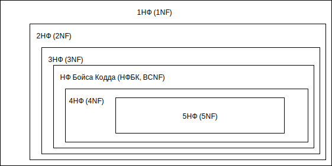
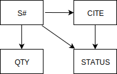
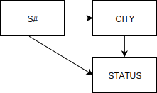
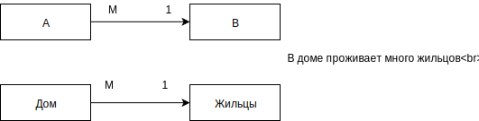

# Лекция 3. Нормальные формы отношений

## 3.1. Функциональные зависимости

Реляционная база данных содержит как структурную, так и семантическую информацию. Структура базы данных определяется числом и видом включенных в нее отношений, и связями типа "один ко многим", существующими между кортежами этих отношений. Семантическая часть описывает множество функциональных зависимостей, существующих между атрибутами этих отношений.

Концепция функциональной зависимости, является фундаментальной в теории реляционных базах данных. По сути, функциональная зависимость является связью типа многие-к-одному между множествами атрибутов внутри данного отношения. Но стоит разделять понятия значение отношения и набор всех возможных значений. Сначала дадим определение функциональной зависимости для значения отношения.

**Определение: Функциональная зависимость**

В отношении R атрибут Y функционально зависит от атрибута X (X и Y могут быть составными) в том и только в том случае, если каждому значению X соответствует в точности одно значение Y: R . XВ отношении R атрибут Y функционально зависит от атрибута X (X и Y могут быть составными) в том и только в том случае, если каждому значению X соответствует в точности одно значение Y: R . X(r) R . Y.
Другими словами: если даны два атрибута X и Y некоторого отношения, то говорят, что Y функционально зависит от X, если в любой момент времени каждому значению X соответствует ровно одно значение Y.
Функциональная зависимость обозначается X → Y (и читается либо как X функционально определяет Y, либо как X стрелка Y).
Можно сказать, что функциональные зависимости представляют собой связи типа "один ко многим", существующие внутри отношения.
Некоторые	функциональные	зависимости	могут	быть нежелательны. Иначе говоря, если два кортежа отношения R совпадают по значению X, они так же совпадают и по значению Y.

Рассмотрим отношение SCP, представленное в таблице 3.1.

Таблица 3.1 − Отношение SCP

| SCP                    |              |             |      |
|------------------------|--------------|-------------|------|
| S\# - номер поставщика | CITY - город | P\# - товар | QTY- |
| S1                     | Харьков      | Р1          | 100  |
| S1                     | Харьков      | Р2          | 100  |
| S2                     | Киев         | Р1          | 200  |
| S2                     | Киев         | Р2          | 200  |
| S3                     | Киев         | Р2          | 300  |
| S4                     | Харьков      | Р2          | 400  |
| S4                     | Харьков      | Р4          | 400  |
| S4                     | Харьков      | Р5          | 400  |

Отношение SCP удовлетворяет приведенной ниже функциональной зависимости, поскольку все кортежи отношения с одинаковым значением атрибута S# имеют одинаковое значение атрибута CITY:
`{ S# } → { CITY }`
На	самом	деле	это	отношение	удовлетворяет	нескольким функциональным зависимостям:

```
{ S#, P# } → { QTY }
{ S#, P# } → { CITY }
{ S#, P# } → { CITY, QTY }
{ S#, P# } → { S# }
{ S#, P# } → { S#, P#, CITY, QTY }
{ S# } → { QTY }
{ QTY } → { S# }
```

Левая и правая стороны символической записи функциональной зависимости иногда называют детерминантом и зависимой частью соответственно. Как говорится в определении, детерминант и зависимая часть являются множествами атрибутов. Когда множество содержит один атрибут, оно называется одноэлементным множеством, скобки опускают и символическая запись принимает вид: S# → CITY

Как было замечено ранее, эти функциональные зависимости относятся к значениям отношения. Однако при рассмотрении переменных отношения, например, базовых отношений, интерес представляет не столько функциональные зависимости для определенного в некоторый момент времени значения, сколько функциональные зависимости, выполняющиеся для всех возможных значений данной переменной. Например, в случае отношения SCP функциональная зависимость S# → CITY выполняется для всех возможных значений SCP, поскольку в любой момент времени данному поставщику соответствует в точности один город; таким образом любые два кортежа отношения SCP в один и тот же момент времени и с одним и тем же номером поставщика должны соответствовать одному и тому же городу. Практически утверждение, что данная функциональная зависимость выполняется всегда, является ограничением целостности для отношения SCP, поскольку при этом накладываются определенные ограничения на все допустимые значения.

**Определение**. Функциональная зависимость для набора всех возможных значений отношений

Пусть R является переменной отношения, а X и Y - произвольными подмножествами множества атрибутов отношения R. Тогда Y функционально зависимо от X, что в символическом виде записывается так: X→Y
тогда и только тогда, когда для любого допустимого значения отношения R каждое значение X связанно в точности с одним значением Y.

Иначе говоря, для любого допустимого значения отношения R, когда бы два кортежа отношения R ни совпадали по значению X, они также совпадают и по значению Y.

Следовательно, более правильно использовать термин функциональная зависимость в последнем безотносительном ко времени смысле.

Вот некоторые безотносительные зависимости для переменной отношения SCP:

```
{ S#, P# } → QTY
{ S#, P# } → CITY
{ S#, P# } → { CITY, QTY }
{ S#, P# } → S#
{ S#, P# } → { S#, P#, CITY, QTY } S# → CITY
```
Обратите внимание, что часть функциональных зависимостей в данном случае не выполняются:
```
S# → QTY 
QTY → S#
```

Иначе говоря, например, такое утверждение, как число деталей (товара) для каждой поставки данного поставщика одинаково, истинно для значений таблицы, представленной на рисунке, но не верно для всех возможных допустимых значений отношения SCP.

Следует отметить, что если X является потенциальным ключом отношения R, например X является первичным ключом, то все атрибуты Y отношения R должны быть обязательно функционально зависимы от X.

Одной из важных целей является сокращения до минимума числа функциональных зависимостей внутри отношения. Одна из причин, этого состоит в том, что функциональные зависимости являются ограничениями целостности, поэтому при каждом обновлении данных в СУБД все они должны быть проверены. Следовательно, для заданного множества функциональных зависимостей S желательно найти такое множество T, которое было бы гораздо меньшего размера, чем множество S, причем каждая функциональная зависимость множества S могла быть заменена функциональной зависимостью множества T. Поэтому задача поиска подходящего множества Т представляет большой практический интерес.

**Определение**. Взаимно независимые атрибуты – два или более атрибута взаимно независимы, если ни один из этих атрибутов не является функционально зависимым от других.

**Определение**. Избыточная функциональная зависимость Избыточная	функциональная	зависимость	–	зависимость, заключающая	в	себе	такую	информацию,	которая	может	быть получена на основе других зависимостей, имеющихся в базе данных.


## 3.2. 1, 2 и 3-я нормальные формы и НФ Бойса-Кодда

Очевидно, что для одной и той же предметной области реляционные отношения можно спроектировать множеством различных способов. Например, можно спроектировать несколько отношений с большим количеством атрибутов, или, наоборот, разнести все атрибуты по большому числу мелких отношений. Как определить, по каким признакам нужно помещать атрибуты в те или иные отношения? Какие отношения “хорошие”, а какие – “плохие”?

Понятие нормализации введено Коддом Э.Ф. в начале 70-х годов. В настоящее время под нормализацией реляционной БД понимают формальный процесс удаления избыточных данных, основанный на определенных математических понятиях реляционной теории.

Корректной считается такая схема базы данных, в которой отсутствуют избыточные функциональные зависимости. В противном случае приходится прибегать к процедуре декомпозиции (разложения) имеющегося множества отношений. Суть декомпозиции заключается в том, что отношение разбивается, например, на два отношения по значению определенного атрибута. (Декомпозиция должна быть выполнена без потерь информации в БД.) При этом порождаемое множество содержит большее число отношений, которые являются проекциями отношений исходного множества.

Обратимый пошаговый процесс замены данной совокупности отношений другой схемой отношений с устранением избыточных функциональных зависимостей называется *нормализацией*.

Условие обратимости требует, чтобы декомпозиция сохраняла эквивалентность схем при замене одной схемы на другую, т.е. в результирующих отношениях:

-не должны появляться ранее отсутствовавшие кортежи;

-на отношениях новой схемы должно выполняться исходное множество функциональных зависимостей.

*Нормализация* – это разбиение таблицы на две или более таблицы, обладающие лучшими свойствами при включении, изменении и удалении данных. Окончательная цель нормализации сводится к получению такого проекта базы данных, в котором каждый факт появляется лишь в одном месте, т.е. исключена избыточность информации.

Нормализация выполняется *с целью*:

-исключения возможной противоречивости хранимых данных (основная цель),

-минимизации занимаемой данными памяти,

-оптимизации затрат на выполнение различных операций над данными БД.

Каждая таблица в реляционной БД удовлетворяет условию, в соответствии с которым в позиции на пересечении каждой строки и столбца таблицы всегда находится единственное атомарное значение, и никогда не может быть множества таких значений. Любая таблица, удовлетворяющая этому условию, называется нормализованной. Фактически, ненормализованные таблицы, т.е. таблицы, содержащие повторяющиеся кортежи, даже не допускаются в реляционной БД.


Существует 6 нормальных форм, в которых могут находиться отношения внутри БД (рисунок 3.1).

Именно в таком отношении (рис. 1) и находятся между собой все формы. То есть нормальная форма более низкого порядка является подмножеством нормальной формы более высокого порядка. Как правило большинство современных баз данных находятся в нормальной форме Бойса-Кодда (НФБК). Дальнейшая нормализация является часто просто невыполнимой или ненужной из-за избыточности, которую она дает.



Рисунок 3.1 − Взаимосвязь нормальных форм

Основные свойства нормальных форм:

-каждая следующая нормальная форма в некотором смысле лучше предыдущей;

-при	переходе	к	следующей	нормальной	форме	свойства предыдущих нормальных форм сохраняются.

В основе процесса проектирования БД лежит метод нормализации – декомпозиция отношения, находящегося в предыдущей нормальной форме, в два или более отношения, удовлетворяющих требованиям следующей нормальной формы. Декомпозиция, является главным инструментом при нормализации. При нормализации должна производится декомпозиция отношения без потерь информации.

Пример декомпозиции с потерями и без потерь. Рассмотрим отношение поставщиков S, имеющее вид:

| S   |        |         |
|-----|--------|---------|
| S\# | STATUS | CITY    |
| S3  | 30     | Киев    |
| S5  | 30     | Полтава |

Над	таким	отношением	можно	провести	следующие декомпозиции:

| SST |        |
|-----|--------|
| S\# | STATUS |
| S3  | 30     |
| S5  | 30     |

| SC  |         |
|-----|---------|
| S\# | CITY    |
| S3  | Киев    |
| S5  | Полтава |

| SST |        |
|-----|--------|
| S\# | STATUS |
| S3  | 30     |
| S5  | 30     |

| STC |         |
|-----|---------|
| S\# | CITY    |
| S3  | Киев    |
| S5  | Полтава |

Суть декомпозиции заключается в том, что отношение разбивается на два отношения по значению определенного атрибута. В первом случае это атрибут S#, во втором – STATUS.

В первом случае информация не утрачивается, поскольку отношения SST и SC все еще содержат данные о том, что поставщик S3 имеет статус 30 и находится в Киеве, а поставщик S5 имеет статус 30	и	находится	в	Полтаве.	Иначе	говоря,	первая	декомпозиция является декомпозицией без потерь.

Во		втором	случае,		наоборот	некоторая	информация утрачивается, поскольку оба поставщика имеют статус 30, но при этом нельзя сказать, какой из них в каком городе находится. Другими словами вторая декомпозиция не является декомпозицией без потерь. 

Именно,	для	того		чтобы	декомпозиция	была	выполнена правильно, нужно учитывать свойство функциональной зависимости отношений.

Определение первой нормальной формы:

Отношение находится в 1NF если значения всех его атрибутов атомарны (неделимы).

Первая нормальная форма (1НФ) – это обычное отношение. В реляционной БД любое отношение автоматически находится в 1НФ.

Свойства 1НФ (это и свойства отношения):

-в отношении нет одинаковых кортежей,

-кортежи не упорядочены,

-атрибуты не упорядочены и отличаются по наименованию,

-все значения атрибутов атомарны.

Пример. Рассмотрим отношение First (пусть поставщик находится в одном городе) (таблица 3.2).

| First                  |                            |              |       |                                   |
|------------------------|----------------------------|--------------|-------|-----------------------------------|
| S\# - номер поставщика | STATUS – статус поставщика | CITY - город | P\# - | QTY- количество товара в поставке |
| S1                     | 20                         | Харьков      | P1    | 300                               |
| S1                     | 20                         | Харьков      | P2    | 200                               |
| S1                     | 20                         | Харьков      | P3    | 400                               |
| S1                     | 20                         | Харьков      | P4    | 200                               |
| S1                     | 20                         | Харьков      | P5    | 100                               |
| S1                     | 20                         | Харьков      | P6    | 100                               |
| S2                     | 10                         | Киев         | P1    | 300                               |
| S2                     | 10                         | Киев         | P2    | 400                               |
| S3                     | 10                         | Киев         | P2    | 200                               |
| S4                     | 20                         | Харьков      | P2    | 200                               |
| S4                     | 20                         | Харьков      | P4    | 300                               |
| S5                     | 30                         | Cумы         | P5    | 400  

Отношение First имеет следующие функциональные зависимости:

В этом примере имеется функциональная	зависимость CITY→STATUS - статус поставщика определяется его местоположением.



Такое универсальное отношение First имеет следующие недостатки:

1. *Избыточность*. Данные хранятся с большой избыточностью – повторяются города, статусы поставщиков, виды товара и т.п.
2. Аномалии обновления (Update). Названия, например, городов (статусов, товаров) повторяются во многих кортежах, поэтому если поставщик меняет город, то такое изменение необходимо одновременно выполнить во многих местах, иначе отношение станет некорректным. Следовательно, при обновлениях необходимо просматривать всю таблицу для нахождения и изменения всех соответствующих кортежей
3. Аномалии включения (Insert). В БД не может быть записан новый поставщик (S6, 30, Полтава, Р2), если продукт (Р2) им пока не поставляется. Другими словами в базу нельзя занести, например, информацию о поставщике, не указав какой товар и сколько товара он поставил.
4. Аномалии удаления (Delete). При удалении некоторых данных может произойти потеря другой важной информации. Например проблема возникает при необходимости удаления товара (Р5). При таком удалении будут утрачены сведения о поставщике этого товара (S5).

Следовательно, есть необходимость перехода ко второй нормальной форме.

**Определение**. Полная функциональная зависимость

Неключевой атрибут функционально полно зависит от составного ключа если он функционально зависит от всего ключа в целом, но не находится в функциональной зависимости от какого-либо из входящих в него атрибутов. (Функциональная зависимость R.X (r) R. Y называется полной, если атрибут Y не зависит функционально от любого точного подмножества X.)

В отношении First неключевой атрибут CITY зависит от части ключа S#.

Определение второй нормальной формы:

Отношение R находится во второй нормальной форме (2NF) в том и только в том случае, когда оно находится в 1NF, и каждый неключевой атрибут полностью зависит от первичного ключа.

Для того чтобы перевести наше отношение во вторую нормальную форму, необходимо провести его декомпозицию на два отношения SECOND

(табл)

и SP следующим образом: 

```sql
SECOND { S#, STATUS, CITY } SP { S#, P#, QTY }
```
что дает следующие новые отношения:

| SECOND |        |         |
|--------|--------|---------|
| S\#    | STATUS | CITY    |
| S1     | 20     | Харьков |
| S2     | 10     | Киев    |
| S3     | 10     | Киев    |
| S4     | 20     | Харьков |
| S5     | 30     | Сумы    |


|     SP          |
|-----|-----|-----|
| S\# | P\# | QTY |
| S1  | P1  | 300 |
| S1  | P2  | 200 |
| S1  | P3  | 400 |
| S1  | P4  | 200 |
| S1  | P5  | 100 |
| S1  | P6  | 100 |
| S2  | P1  | 300 |
| S2  | P2  | 400 |
| S3  | P2  | 200 |
| S4  | P2  | 200 |
| S4  | P4  | 300 |
| S5  | P5  | 400 |


Отношение	SECOND	имеет	следующие	функциональные зависимости:



S# - первичный ключ, неключевые атрибуты CITY и STATUS взаимно зависимы:


Отношение SP имеет следующие функциональные зависимости:

Значения атрибута QTY должны	определяться	составным первичным ключом S# P#.

Достоинства:

1. Теперь в операциях вставки в отношение SECOND можно включить информацию о том, что поставщик находится, например, в Изюме, даже если он не поставляет никаких товаров.
2. Операции удаления позволяют удалить информацию о поставке, в которой сведены все сведения о поставщике S3 и товаре P2, удаляя соответствующий кортеж из отношения SP, при этом информация о том, что поставщик S3 находится в Киеве, не утрачивается.
3. В переработанной структуре название города для каждого поставщика встречается всего один раз, поскольку существует только один кортеж для данного поставщика в отношении SECOND. Иначе говоря, избыточность данных S# - CITY устранена. Благодаря этому теперь  можно  раз и навсегда  изменить  в соответствующем  кортежеотношения SECOND название города для поставщика S1, например, вместо Харьков задать Полтава.

Однако, несмотря на то, что исключена избыточность, отношение SECOND обладает некоторыми недостатками:

*Аномалии включения (Insert)* - нельзя включить данные о некотором городе, обладающим некоторым статусом, например, нельзя указать, что все поставщики из Ровно обладают статусом 50, до тех пор пока в этом городе не существует некоторого конкретного поставщика.

*Аномалии удаления (Delete)* - при удалении из отношения SECOND кортежа для некоторого города будет удалена не только информация о данном поставщике, но также информация о том, каким статусом обладал этот город. Например, при удалении из отношения SECOND кортежа для поставщика S5 будет утрачена информация о том, что для Cум был задан статус 30.

*Аномалии обновления (Update)* - в отношении SECOND статус для каждого города повторяется несколько раз. Таким образом, при изменении значения статуса Харьков с 20 на 30 возникнет либо проблема необходимости поиска в отношении SECOND всех кортежей для Харьков, либо проблема получения несовместимого результата.

Для решения этой проблемы переходим к 3 нормальной форме. 

**Определение**. Взаимно независимые атрибуты 

Два или более атрибута взаимно независимы, если ни один из этих атрибутов не является функционально зависимым от других.
В отношении SECOND атрибут STATUS зависит от атрибута CITY.

**Определение**. Неключевой атрибут – это атрибут, который не входит в состав ключа (в том числе и первичного ключа).

Определение третьей нормальной формы:

Отношение R находится в 3-ей НФ в том и только в том случае, когда оно находится во 2NF, и все неключевые атрибуты взаимно независимы.

Для того чтобы перевести отношение SECOND в 3НФ необходимо выполнить следующую декомпозицию:
`SC { S#, CITY }`,	`CS { CITY, STATUS }`

Получим такие таблицы:


| SС     |        |
|--------|--------|
| S\#    | CITY   |
| S1     | Харьков|
| S2     | Киев   |
| S3     | Киев   |
| S4     | Харьков|
| S5     | Сумы   |

| CS     |        |
|--------|--------|
| CITY   | STATUS |
| Харьков| 20     |
| Киев   | 10     |
| Сумы   | 30     |
| Полтава| 40     |


На практике 3НФ схем отношений достаточна в большинстве случаев, и приведением к 3НФ процесс проектирования реляционной базы	данных	обычно	заканчивается.	Однако	в	случае	сложных отношений полезно продолжить процесс нормализации.

Отношения SC и CS имеют следующие функциональные зависимости:


Все выше перечисленные формы нормализации и декомпозиция отношений были сделаны исходя из определения, что каждое отношение имеет только один потенциальный ключ (а именно первичный ключ), и рассматривается достаточно общий случай. Однако существуют более сложные отношения вот с такими условиями:

1. Отношение имеет два или более потенциальных ключа.
2. Два потенциальных ключа являются сложными.
3. Они перекрываются (т.е. имеют, по крайней мере, один общий атрибут).

Заметим, что на практике отношения с такими условиями встречаются достаточно редко (для всех прочих отношений 3NF и BCNF эквивалентны).

Поэтому оригинальное определение 3НФ было впоследствии заменено более строгим определением Бойса-Кодда, для которого было принято отдельное название – нормальная форма Бойса-Кодда (НФБК). Эта нормальная форма вводит дополнительное ограничение по сравнению с 3НФ.

Определение нормальной формы Бойса-Кодда(BCNF):

Отношение R находится в BCNF тогда и только тогда, если оно находится в 3НФ и когда детерминанты всех функциональных зависимостей являются потенциальными ключами. (* Отношение находится в НФБК, если любая функциональная зависимость между его полями сводится к полной функциональной зависимости от возможного ключа [5].)

Стоит отметить также, что определение НФБК (\*) концептуально проще, чем определение ЗНФ, поскольку в нем нет явных ссылок на 1НФ и 2НФ.

На практике НФ Бойса-Кодда лежит в основе современных методологий анализа, когда с помощью некоторого абстрактного инструмента, который определяет правила изображения законов работы и потоков информации в исследуемой предметной области, в проектируемые отношения специально вносят атрибут, который выполняет только роль первичного ключа и только от которого функционально зависят остальные атрибуты отношения. Таким образом, проектировщик не ищет первичный ключ в множестве атрибутов, а искусственно вводит атрибут, назначая ему роль первичного ключа. Такой подход очень упрощает работу с БД и формализует подход к их проектированию.

Таким образом основная идея процедуры нормализации состоит в систематическом приведении отношения R (отношение R обладает функциональными зависимостями, многозначными зависимостями и зависимостями соединения) к набору меньших отношений, который в некотором заданном смысле эквивалентен отношению R, но более предпочтителен. Каждый этап процесса приведения состоит из разбиения на проекции отношений, полученных на предыдущем  этапе. При этом заданные ограничения используются на каждом шаге процедуры нормализации для выбора проекций на следующем этапе.

*Алгоритм нормализации* (приведения к НФБК):

1. (приведение к 1НФ). Задается одно или несколько отношений, отображающих понятия предметной области. По модели предметной области (а не по отношениям) выписываются обнаруженные функциональные зависимости. Все отношения автоматически находятся в 1НФ.
2. (приведение к 2НФ). Если в некоторых отношениях обнаружена зависимость от части составного ключа, то проводим декомпозицию этих отношений на несколько отношений следующим образом – те атрибуты, которые зависят от части сложного ключа выносятся в отдельное отношение вместе с этой частью ключа. В исходном отношении остаются все ключевые атрибуты.
3. (приведение к 3НФ). Если в некоторых отношениях обнаружена зависимость некоторых неключевых атрибутов от других неключевых атрибутов, то проводим декомпозицию этих отношений следующим образом – те неключевые атрибуты, которые зависят от других неключевых атрибутов, выносятся в отдельное отношение. В новом отношении ключом становится детерминант функциональной зависимости.
4. (приведение к НФБК). Если имеются отношения, имеющие несколько потенциальных ключей, то необходимо  проверить,  имеются ли функциональные зависимости, детерминанты которых не являются потенциальными ключами. Если такие функциональные зависимости имеются, то необходимо провести дальнейшую декомпозицию отношений. Те атрибуты, которые зависят от детерминантов, не являющихся потенциальными ключами, выносятся в отдельное отношение вместе с детерминантами.

Правила 1-4 могут быть сконцентрированы в одном: "Исходное отношение следует разбить на проекции для исключения всех функциональных зависимостей, в которых детерминанты не являются потенциальными ключами".

После приведения таблиц БД к НФБК можно сделать вывод, что любое изменение информации приведет к изменению только одной записи таблицы. Это и является результатом нормализации: множество таблиц, которые обновляются максимально легким способом, с помощью всего одного фрагмента данных.

## 3.3. 4-я и 5-я нормальные формы

### Многозначные зависимости и 4-ая НФ (4NF).

4НФ касается отношений, в которых имеются многозначные зависимости. В этом случае используют декомпозицию, основанную на многозначных зависимостях.

Определение многозначной зависимости: Пусть R – отношение и X, Y, Z – некоторые из его атрибутов (или непересекающиеся множества атрибутов). Тогда атрибуты Y и Z многозначно зависят от X (обозначается X→→Y\|Z) тогда и только тогда, когда из того, что в отношении R содержатся кортежи r1=(x, y, z1) и r2=(x, y1, z) следует,  что в отношении R содержится также и кортеж r3=(x, y, z).

Многозначная зависимость является обобщением функциональной зависимости и рассматривает соответствия между множествами значений атрибутов.

Очевидно, что каждая функциональная зависимость является многозначной, но не каждая многозначная зависимость является функциональной.

Определение четвертой нормальной формы: Отношение R находится в 4-ой НФ (4NF) в том и только в том случае, когда оно находится в НФБК и если в случае существования многозначной зависимости A→→B\|С все остальные атрибуты R функционально зависят от A. (Или другими словами: Отношение находится в 4NF если оно находится в BCNF и в нем отсутствуют многозначные зависимости, не являющиеся функциональными зависимостями.)

### Зависимости по соединению и 5-ая НФ (5NF)

До сих пор мы предполагали, что единственной операцией, необходимой для устранения избыточности в отношении, была декомпозиция его на две проекции. Однако, существуют отношения, для которых нельзя выполнить декомпозицию без потерь на две проекции, но которые можно подвергнуть декомпозиции без потерь на три (или более) проекций. Этот факт получил название зависимости по соединению, а такие отношения называют 3-декомпозируемые отношения (ясно, что любое отношение можно назвать "n- декомпозируемым", где n >= 2).

Отношения, в которых имеются зависимости по соединению, не являющиеся одновременно ни многозначными, ни функциональными, также характеризуются аномалиями обновления. Поэтому, вводится понятие 5НФ.

Определение пятой нормальной формы:

Отношение R находится в 5-ой НФ (нормальной форме проекции-соединения - PJ/NF) в том и только в том случае, когда любая	зависимость	соединения	в	R	следует	из	существования некоторого возможного ключа в R.

*5-ая НФ* – это последняя НФ, которую можно получить путем декомпозиции. Ее условия достаточно нетривиальны, и на практике 5НФ не используется. Заметим, что зависимость соединения является обобщением как многозначной зависимости, так и функциональной зависимости.

Как нормализация является процессом организации данных в манере, позволяющей вносить изменения в БД без излишних операций, так денормализация представляет собой обратный процесс, преднамеренно вносящий эту избыточность. С теоретической точки зрения денормализация никогда не должна выполняться. Однако на практике иногда денормализировать данные нужно в интересах производительности. Чрезмерно нормализованная БД замедляет работу, так как из-за многочисленных связей между таблицами серверу приходится выполнять большое число операций. Причем, проход по связям между таблицами является для сервера одной из самых трудоемких операций.

Рекомендации по денормализация таблиц:

1. если модель нормализованных данных содержит таблицы с составными первичными ключами (в ключе 4 и более полей), целесообразно денормализировать данные, введя произвольные суррогатные ключи;
2. если в запросах очень часто используются вычисляемые значения (максимальные, минимальные и так далее), то средством денормализации данных может являться вставка этих вычисляемых данных в сами таблицы;
3. разбиение экстремально больших таблиц на множество избыточных таблиц, в которые вынесены либо отдельные столбцы, либо отдельные строки (редко используемые) исходной таблицы;
4. если запросы к некоторой таблице часто используют столбец (фрагмент) из другой таблицы, то можно внести в эту таблицу копию этого столбца (фрагмента).

Для денормализации таблиц должны существовать веские причины и денормализация в обязательном порядке должна документироваться и обосновываться.

## 3.4. Типы связей

Одно из основных требований к организации реляционной БД – это обеспечение возможности поиска одних кортежей по значениям других, для чего необходимо установить между отношениями связи.

*Связь* (relationship) – поименованная ассоциация между двумя отношениями (сущностями), значимая для рассматриваемой предметной области. *Связь* – это ассоциация между отношениями (сущностями), при которой, как правило, каждый кортеж одного отношения, называемого родительским отношением, ассоциирован с произвольным (в том числе нулевым) количеством кортежей второго отношения, называемого отношением-потомком, а каждый кортеж отношения-потомка ассоциирован в точности с одним кортежем отношения-родителя.

Наибольшее распространение получили бинарные связи между отношениями. Бинарная связь – это связь, в которую вступают ровно две сущности.

Связь обладает следующими характеристиками:

1. степень связи (кардинальное число связи),
2. обязательность (модальность) связи.

Важнейшее свойство связи – кардинальное число связи (мощность или степень связи). Оно описывает максимально возможное количество связей для каждого экземпляра сущностей, участвующих в связи.

Существуют следующие основные типы бинарных связей:

1. Один-к-одному – в каждый момент времени каждому кортежу отношения А соответствует 0 или 1 кортеж отношения В.


Классическим примером этого типа связи является связь муж- жена для тех стран, где не разрешено многоженство.

2. Один-ко-многим –	каждому	кортежу	отношения	А соответствует несколько кортежей отношения В.


Примеры этого типа связей – группа-студент, бригада-рабочий, поезд-вагон, автобус-место и т.д.

Пример.

| Группа  |        |
|---------|--------|
| GR\#    | Имя    |
| GR1     | Группа1|
| GR2     | Группа2|
| GR3     | Группа3|

| Студент|         |        |
|--------|---------|--------|
| ST\#   | Имя     | GR\#   |
| ST1    | Студент1| GR1    |
| ST2    | Студент2| GR2    |
| ST3    | Студент3| GR3    |
| ST4    | Студент4| GR4    |
| ST5    | Студент5| GR5    |

Исходя из значений атрибутов отношений “Группа” и “Студент” можно сказать, что Группа1 состоит из Студент1, Студент2, Группа2 – из Студент3, Студент4, а Группа3 – Студент5.


Многие-к-одному	–	множеству	кортежей	отношения	А соответствует один кортеж отношения В.


3. Многие-ко-многим – множеству кортежей отношения А соответствует множество кортежей отношения В. (Этот тип связи в реляционных БД непосредственно не поддерживается)




Например, студент-предмет, книга-читатель и т.д.

Реляционная модель не позволяет описать связи многие-ко- многим непосредственно, а только с помощью промежуточного преобразования. Суть преобразования заключается в  разбиении связи многие-ко-многим на две связи один-ко-многим через промежуточное отношение. Возьмем к примеру связь Предмет- Студент. Получается, что один предмет может изучатся несколькими студентами и наоборот, несколько студентов могут изучать один предмет. Для того, чтобы преобразовать это отношение на два один- ко-многим вводится дополнительное отношение Предмет_Студент, которое фактически определяет какой предмет, каким студентом изучается:

| Предмет |         |
|---------|---------|
| Sj\#    | Имя     |
| Sj1     | Предмет1|
| Sj2     | Предмет2|
| Sj3     | Предмет3|
| Sj4     | Предмет4|

| Предмет |         |
|---------|---------|
| Sj\#    | ST\#    |
| Sj1     | ST1     |
| Sj1     | ST2     |
| Sj2     | ST1     |
| Sj3     | ST5     |
| Sj3     | ST4     |
| Sj1     | ST5     |
| Sj2     | ST4     |

| Студент|         |
|--------|---------|
| ST\#   | Имя     |
| ST1    | Студент1|
| ST2    | Студент2|
| ST3    | Студент3|
| ST4    | Студент4|
| ST5    | Студент5|
| ST6    | Студент6|
| ST7    | Студент7|

Исходя из данных этих отношений видно, что Предмет1 изучается студентами Студент1, Студент2 и Студент5. При этом можно сказать, что Студент1 изучает предметы Предмет1, Предмет2. Характерной чертой этого преобразования является возможность указать такие данные в отношениях, которые в данный момент времени не связаны между собой, например, Предмет4 не изучается ни одним из студентов. А Студент7, Студент6 и Студент3 не изучают предметов.

Вторым параметром связи может быть ее обязательность, называемая также модальностью связи, или классом принадлежности.

Каждая из связей может иметь одну из двух модальностей:

1. Модальность “может” соответствует необязательному классу принадлежности – экземпляр сущности может быть связан с одним или несколькими экземплярами другой сущности, а может и не связан ни с одним экземпляром другой сущности.
2. Модальность “должен” соответствует обязательному классу принадлежности – каждый экземпляр сущности обязан быть связан с не менее чем одним экземпляром другой сущности.

## Контрольные вопросы

1. Что такое функциональная зависимость в значении отношения? Что такое функциональная зависимость для набора всех возможных значений отношений?
2. Перечислить и дать определения наиболее распространенным в практике проектирования БД нормальным формам отношений, перечислить шаги перехода от более низкой нормальной формы к более высокой.
3. Каковы недостатки 1НФ, которые устраняются в результате перехода ко 2НФ?
4. Каковы недостатки 2НФ, которые устраняются в результате перехода к 3НФ?
5. Каковы недостатки 3НФ, которые устраняются в результате перехода к форме Бойса-Кодда (BCNF)?
6. Каковы недостатки BCNF, которые устраняются в результате перехода к 4НФ?
7. Какова	цель	денормализации	таблицы?	Каковы	основные рекомендации по денормализация таблиц?
8. Какие	типы	бинарных	связей	поддерживаются	(не поддерживаются) в базах данных?
9. Какие существуют типы обязательности связей?
