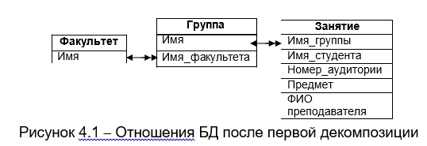
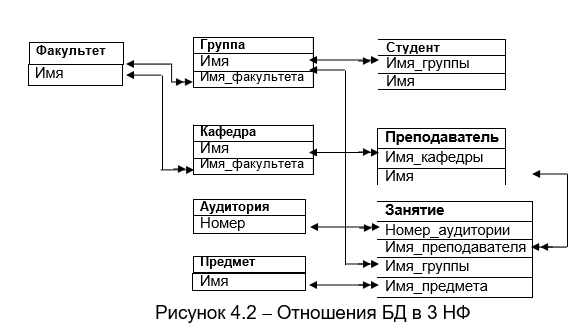
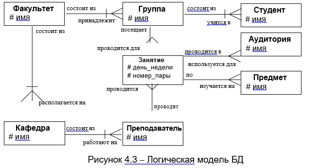
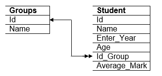
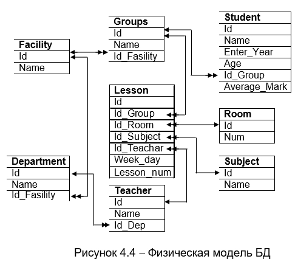

# Лекция 4. Логическая и физическая модели базы данных

Основные цели моделирования системы:

1. скрыть неинтересные, несущественные детали моделируемой системы,
2. заменить значительные по объему компоненты компактным символами,
3. подчеркнуть важные (убрать незначительные) символы и связи,
4. способствовать пониманию системы в целом.

При разработке реляционной БД обычно выделяется несколько уровней (этапов) моделирования, с помощью которых происходит переход от предметной области к конкретной реализации БД средствами конкретной СУБД.

Можно выделить следующие этапы моделирования реляционной


БД:

1. Концептуальное моделирование.

Под концептуальной моделью понимается модель предметной области – наши знания о предметной области, выраженные, например, в вербальном виде (должностные инструкции, правила ведения дел в фирме и т.п.).

Под предметной областью понимается часть реального мира, данные о которой необходимо отразить в БД.

2. Логическое моделирование. Логическая модель данных (ЛМД) предметной области описывает понятия предметной области, их взаимосвязь, а также ограничения на данные, налагаемые предметной областью. Основное средство разработки ЛМД – различные варианты ER-диаграмм (Entity-Relationship, диаграммы сущность-связь). Чем больше атрибутов имеют отношения, разработанные в ходе ЛМД, тем медленнее будут выполняться операции обновления данных за счет затрат времени на перестройку большого количества индексов, создаваемых для таблиц. Увеличение числа отношений приводит к замедлению выполнения операций выборки данных с помощью SQL-запросов, так как операция соединения таблиц, выполняемая при выборке данных из БД с большим числом взаимосвязанных отношений, является одной из самых дорогостоящих операций в БД.

3. Физическое моделирование. Физическая модель данных описывает данные средствами конкретной СУБД. Ограничения, имеющиеся в ЛМД, реализуются различными средствами СУБД, например, с помощью декларативных ограничений целостности, триггеров, хранимых процедур. Решения, принятые в процессе логического моделирования, влияют на качество физическая модели и скорость работы БД.

После разработки физической модели данных создается собственно база данных и приложения, то есть БД реализуется на конкретной программно-аппаратной основе.

Особенности проектирования БД:

- основной упор делается на отражение предметной области,

- основное внимание – на нормализацию отношений,

- в отношения могут быть добавлены дополнительные атрибуты,

- проектировщик никогда не работает со значениями отношений, а только с отношениями, 

- при	проектировании	как	правило	не	делается	никаких предположений о данных, которые хранятся в отношениях,

Главная цель проектирования - это выявление всех атрибутов и нормализация всех отношений, входящих в БД.

## 4.1. Логическая модель базы данных

Основными компонентами логической модели являются:

- сущности (нормализованные отношения),

- атрибуты сущностей,

- связи между сущностями.

Сначала рассмотрим пример проектирования в “лоб”. В качестве примера возьмем предметную область - преподаватели, студенты, занятия, аудитории.

Построим	первую	нормальную	форму	БД,	что	позволит определить все необходимые атрибуты (таблица 4.1).

Таблица 4.1 − Таблица БД в 1НФ

| Факультет | Группа | ФИО студента | Номер аудитории | Предмет | ФИО преподавателя | Имя кафедры |
|-----------|--------|--------------|-----------------|---------|-------------------|-------------|
| РТСЛА     | 535    | Ст1          | 118             | ОБД     | Преп 1            | КСС         |
| РТСЛА     | 535 а  | Ст2          | 118             | ОБД     | Преп 2            | КСС         |
| РТСЛА     | 535 б  | Ст3          | 235             | ОБД     | Преп 3            | КСС         |

Недостатки данного отношения:

1. Данные хранятся с большой избыточностью.
2. Аномалии обновления, включения и удаления.
3. Наличие нежелательных функциональных зависимостей в БД.

Попытаемся перейти ко 2 и 3 нормальным формам. Для этого выявим существующие функциональные зависимости и постараемся от них избавиться.


Функциональные зависимости исходного отношения. Из-за того, что группа учится на определенном факультете, то между атрибутами “Группа” и “Факультет” существует зависимость (Группа→Факультет), которая приводит к многократному повторению имени факультета. То же самое можно сказать и о зависимости между именем группы и Ф.И.О. студента (Группа→Ф.И.О. студента). Таким образом, в результате первой декомпозиции мы получаем следующие отношения (рисунок 4.1).



Рисунок 4.1 − Отношения БД после первой декомпозиции

Первая	строка	каждой	таблицы	определяет	ее	имя. Все остальные строки – атрибуты. Линия, которая соединяет таблицы между собой отражает, что они связаны, а так же показывает тип связи и поля, которые участвуют в связи. Двойная стрелка на конце линии обозначает сторону “многие”, одинарная - “один”.

Согласно определениям нормальных форм видно, что таблицы “Факультет” и “Группа” находятся в 3 нормальной форме (Отношение R находится в 3-ей НФ в том и только в том случае, когда оно находится во 2NF, и все неключевые атрибуты взаимно независимы.). Таблица “Занятие” упростилась, но продолжает представлять 1 нормальную форму.

Рассмотрим функциональные зависимости существующие в таблице “Занятие”. Существует зависимость между атрибутами “Имя_кафедры” и “Ф.И.О. преподавателя” (Имя_кафедры→ Ф.И.О. преподавателя). Атрибут “Имя_кафедры” также функционально зависит от атрибута “Факультет” (Факультет→Имя_кафедры). Имя_студента, Номер_Аудитории и Предмет так же стоит вынести в отдельные таблицы. В результате после декомпозиции получается следующая структура (рисунок 4.2).



Рисунок 4.2 − Отношения БД в 3 НФ

Теперь все таблицы находятся в 3-ей НФ и БД можно считать нормализованной.

Данная структура обладает некоторыми недостатками.

1.	в качестве первичных ключей выбраны не детерминанты. Имя_факультета, имя_группы и т.д. – идентификаторы из “жизни” и несмотря на то, что они приняты атомарными, правила их составления все же существуют.

Для того, чтобы перевести наши таблицы в нормальную форму Бойса-Кодда требуется ввести в каждую таблицу дополнительный атрибут, который будет выполнять только роль первичного ключа, будет детерминантом и не будет изменяться в течении всей жизни таблицы.

2. неполное покрытие спроектированной структурой предметной области. Например, мы знаем аудиторию, где проводятся занятия, по какому предмету и каким преподавателем, но не знаем день недели и время проведения занятий. Чтобы пример не получился слишком сложным остановимся на полученной функциональности и будем считать, что БД создана и нормализована.

Существует большое количество информационных моделей:

- модель, построенная с использованием языка Universal Modeling Language (UML) фирмы Rational Software, 

- модель, построенная с использованием диаграмм “сущность- связь” (ERD - Entity-Relationship). 

Нотация ERD была впервые введена в 1976 г. Питером Ченом и получила дальнейшее развитие в работах Баркера (сase-метод Баркера, нотации Баркера, логическая модель Баркера). Аналогом CASE-метода Баркера является метод IDEF1, разработанный Т. Рэмей, и также основанный на подходе П. Чена. IDEF1Х-диаграммы используются	в частности	такими	CASE-средствами	как	ERWin, Design/IDEF.

Цель модели Баркера – снижение числа ошибок в БД и ускорение процесса проектирования.

Информационная модель Баркера является логической и создает сущности, которые находятся в 3-ей нормальной форме. Поэтому ключевой атрибут, формирующий связь, не показывается ни на одной сущности, которая входит в связь. Наличие самой линии говорит о том, что существуют ключевые атрибуты, которые формируют связь.

Важным компонентом, который гарантирует правильное проектирование, является постоянная проверка сделанного проекта. Для этого модель Баркера требует, чтобы связи подписывались. Например, “группа состоит из студентов” и наоборот “студенты учатся в группе”. Если подобрать слова не удается, то это явный признак того, что сущности не могут быть связанны между собой напрямую.

Последним атрибутом связи, который изображается как перечеркнутая в любом месте под 90 градусов линия связи, является признак обязательности.

Пример обязательной связи – группа обязательно состоит из студентов.

Пример необязательной связи. Существует некоторое количество спортивных секций, одну из которых может посещать студент.

Логическая	модель	Баркера	для	нашей	задачи	имеет	вид (рисунок 4.3).



Рисунок 4.3 − Логическая модель БД

Данная схема (рисунок 4.3) называется логической моделью и представляет логические сущности и связи между ними. При задании имен сущностей и их атрибутов используются символы и слова того языка, который наиболее удобен.

Ключевые атрибуты сущностей обозначаются символом “#”.

Еще одним важным моментом является появление в сущности “Занятие” новых атрибутов “день_недели” и “номер_пары”.

В данной модели некоторые связи являются необязательными. Это связь – Преподаватель-занятие. Если в текущем семестре преподаватель не читает своих предметов, то это значит, что он не проводит занятия. Поэтому связь является необязательной. Аналогично можно сказать и про связи Группа-Занятие, Аудитория- Занятие и Предмет-Занятие.

## 4.2. Физическая модели базы данных

Модель Баркера является полностью логической. То есть в ней отсутствуют такие понятия, как тип данных, множество значений и т.д., которые присущи полям таблиц баз данных как объектам управления. Поэтому следующим шагом проектирования является переход к физической модели. На данном этапе логические сущности преобразуются в конкретные таблицы СУБД.
 При этом используется те термины, которые присущи данной СУБД.
Основным компонентами физической модели являются:

- таблицы,	поля	таблиц,	типы	данных	(с	названиями, присущими конкретной СУБД),

- ключи (первичные и внешние),

- бизнес-правила,

- SQL-скрипт – набор SQL-операторов для создания таблиц БД.

Алгоритм преобразования модели Баркера в физическую модель (гарантирована по крайней мере 3НФ):

1. каждой сущности ставится в соответствие отношение;
2. каждый атрибут сущности становится атрибутом отношения, которому приписывают тип данных и свойство допустимости/недопустимости для него значения NULL (не определен);
3. компоненты уникального идентификатора сущности (первичный ключ сущности) становятся первичным ключом отношения (PRIMARY KEY) (или в качестве первичного ключа используется суррогатный ключ), атрибуты, входящие в первичный ключ, получают свойство обязательности (NOT NULL) и уникальности (UNIQUE);
4. атрибуты сущности, участвующие в организации связи “один-ко- многим” и “один-к-одному”, становятся внешними ключами (у подчиненных отношений добавляются в качестве атрибута внешние ключи (FOREIGN KEY), которые обычно являются первичными ключами родительских отношений);
5. индексы создаются для первичного ключа, внешних ключей и атрибутов, которые предполагается часто использовать в запросах.

Фрагмент рассмотренной ранее структуры, состоящий из двух сущностей Группа-Студент, имеет вид 


и преобразуется вот в такую физическую структуру:



Поскольку существует связь между сущностями “Группа” и “Студент”, то для ее реализации требуется введение дополнительного поля Id_Group в таблице Student. Поле Id таблицы Groups является первичным ключом.

Поле id_Group таблицы Student является внешним ключом, который определяет какие студенты учатся в какой группе. Связь между этими полями показывается на рисунке с помощью линии и стрелок - со стороны “один” стрелка одна, а со стороны “многие” их две.

С учетом этих особенностей перехода от логической модели к физической модели базы данных последняя примет вид (рисунок 4.4).

Приведенная структура (рисунок 4.4) описывает имена таблиц, названия их полей и указывает связи между таблицами. Но она не дает описания типов данных и дополнительных характеристик полей. Это делается с помощью вот таких таблиц:

Таблица Facility:

| Атрибут | Тип данных   | PKEY | FKEY | NOT NULL | UNIQUE |
|---------|--------------|------|------|----------|--------|
| id      | tinyint      | \*   |      | \*       | \*     |
| name    | nvarchar(20) |      |      | \*       | \*     |

Столбец с типом данных tinyint может хранить значения от 0 до 255 или Null. Тип данных занимает 1 байт памяти.

Столбец с типом данных nvarchar предназначен для хранения строковых данных переменной длины таблицы Unicode. Максимальный размер столбца nvarchar – 4000 символов.



Рисунок 4.4 − Физическая модель БД

Таблица Groups:

| Атрибут     | Тип данных  | PKEY | FKEY         | NOT NULL | UNIQUE |
|-------------|-------------|------|--------------|----------|--------|
| id          | tinyint     | \*   |              | \*       | \*     |
| name        | nvarchar(5) |      |              | \*       | \*     |
| id_facility | tinyint     |      | Facility(id) | \*       |        |

Таблица Student:

| Атрибут      | Тип данных     | PKEY | FKEY       | NOT NULL | UNIQUE |
|--------------|----------------|------|------------|----------|--------|
| id           | int            | \*   |            | \*       | \*     |
| name         | nvarchar(40)   |      |            | \*       |        |
| Enter_Year   | tinyint        |      |            |          |        |
| Age          | tinyint        |      |            |          |        |
| id_Group     | tinyint        |      | Groups(id) | \*       |        |
| Average_Mark | numeric (5, 2) |      |            |          |        |

Формат numeric используется для хранения дробных чисел. Диапазон значений от (-1038-1) до (1038-1). Эти данные содержат два параметра: точность и масштаб. Точность – общее количество цифр, которое может храниться в поле. Масштаб - количество цифр справа от десятичной точки (222.11 – точность равна 5, а масштаб равен 2).

Таблица Department:

| Атрибут     | Тип данных   | PKEY | FKEY         | NOT NULL | UNIQUE |
|-------------|--------------|------|--------------|----------|--------|
| id          | tinyint      | \*   |              | \*       | \*     |
| name        | nvarchar(20) |      |              | \*       | \*     |
| id_facility | tinyint      |      | Facility(id) | \*       |        |

Таблица Teacher:

| Атрибут  | Тип данных   | PKEY | FKEY           | NOT NULL | UNIQUE |
|----------|--------------|------|----------------|----------|--------|
| id       | tinyint      | \*   |                | \*       | \*     |
| name     | nvarchar(20) |      |                | \*       |        |
| id\_ dep | tinyint      |      | Department(id) | \*       |        |

Таблица Room:

| Атрибут | Тип данных  | PKEY | FKEY | NOT NULL | UNIQUE |
|---------|-------------|------|------|----------|--------|
| id      | tinyint     | \*   |      | \*       | \*     |
| name    | nvarchar(5) |      |      | \*       | \*     |

Таблица Subject:

| Атрибут | Тип данных   | PKEY | FKEY | NOT NULL | UNIQUE |
|---------|--------------|------|------|----------|--------|
| id      | tinyint      | \*   |      | \*       | \*     |
| name    | nvarchar(30) |      |      | \*       | \*     |

Таблица Lesson:

| Атрибут    | Тип данных | PKEY | FKEY        | NOT NULL | UNIQUE |
|------------|------------|------|-------------|----------|--------|
| id         | tinyint    | \*   |             | \*       | \*     |
| id_group   | tinyint    |      | Groups(id)  | \*       |        |
| id_room    | tinyint    |      | Room(id)    | \*       |        |
| id_subject | tinyint    |      | Subject(id) | \*       |        |
| id_teacher | tinyint    |      | Teacher(id) | \*       |        |
| week_day   | tinyint    |      |             | \*       |        |
| lesson_num | tinyint    |      |             | \*       |        |

Рассмотрим более подробно поля приведенных таблиц.

Колонка “атрибут” задает имя атрибута, чьи свойства мы описываем.

Колонка “тип данных” определяет тип данных атрибута. Эта колонка оперирует типами данных СУБД, которые используются для хранения информации.

Колонка “PKEY” говорит о том, что данный атрибут является первичным ключом, если он состоит из одного атрибута или же частью первичного ключа, если он состоит из нескольких атрибутов. Для обозначения признака принадлежности к первичному ключу используется символ “ * ”.

Колонка “FKEY” описывает внешние ключи. Наличие информации в ней, говорит о том, что данный атрибут является внешним ключом. При описании внешнего ключа указывают сущность, на которую ссылается данный внешний ключ, и имя её первичного ключа.

Колонка “NOT NULL” является признаком того, что поле не может содержать значение NULL. Значение NULL говорит о том, что данное поле может не содержать никакого значения. Так пусть у студента нет телефона, и тогда у пользователя есть возможность просто не задавать это значения, а СУБД предоставляет ему способ сохранения такой информации.

Колонка “UNIQUE” говорит о том, что значение атрибута является уникальным в рамках всей таблицы. Уникальность поля контролируется автоматически СУБД. Попытка поместить в базу запись с значением поля, которое уже существует, приведет к ошибке выполнения операции вставки записи. Для того чтобы понять важность атрибута UNIQUE вернемся к определениям информационной модели Баркера.

Ключевые атрибуты сущностей в логической модели БД обозначаются символом “#”. Одно из свойств ключевого атрибута – его неповторяемость. При этом после перехода от логической модели к физической мы добавляем в базу специальные поля, которые используются для связи сущностей между собой. Таким образом, появляется первичный ключ и может появиться внешний. Создается впечатление, что о ключевых атрибутах сущностей, которые присутствовали в модели Баркера мы просто забыли. Это конечно не верно. Существование свойства UNIQUE и его поддержка языком определения данных позволяет нам одновременно сохранять таблицы в нормальной форме Бойса-Кодда и при этом сохранить свойство уникальности для тех полей, которые являются ключами в жизни информационной системы.

Теперь на основании информации, которая храниться в этих таблицах, можно создавать конкретные таблицы, которые хранят информацию в определенной СУБД. Физическая модель таблиц поможет в дальнейшем при написании серверной части БД.

Следует обратить особое внимание на многократное повторение одной и той же информации. Сначала мы описываем логическую модель. Потом переходим от нее к физической, затем описываем каждую таблицу отдельно. И каждый раз мы повторяемся, когда речь идет об атрибутах таблиц, о связях, первичных и внешних ключах. Это сделано специально. По причине огромной цены ошибки, которая не выявляется в процессе проектирования структуры базы данных.

Если ошибка не была выявлена и проявила себя уже в процессе кодирования программного обеспечения, то ее ценой может быть частичный	или	полный	пересмотр	структуры	всего	программного комплекса. А это требует времени и усилий конкретных исполнителей. 

В качестве примера рассмотрим набор SQL-операторов, которые создают таблицы нашей предметной области. Помещенный в файл, такой набор представляет объект, который называется SQL-скрипт:

```sql
CREATE TABLE FACILITY (
	ID tinyint IDENTITY NOT NULL PRIMARY KEY, NAME nvarchar(20) NOT NULL UNIQUE
)
```

Свойство поля таблицы IDENTITY (seed, increment) (ID entity – идентификационный номер сущности) разрешает автоматическую нумерацию поля – в поле IDENTITY таблицы автоматически обеспечивается вставка уникального значения, монотонно увеличивающегося при вставке каждой новой строки. Первоначальное значение указывается с помощью аргумента seed (по умолчанию seed=1), а шаг приращения – с помощью аргумента increment (по умолчанию increment=1). Свойство IDENTITY может быть установлено только для столбцов с типом данных int, smallint, tinyint, decimal(p, 0) и numeric(p, 0). В пределах одной таблицы можно создать только один столбец с установленным свойством IDENTITY. Определение значения по умолчанию для столбца с установленным свойством IDENTITY невозможно.

```sql
CREATE TABLE GROUPS (
	ID tinyint IDENTITY NOT NULL,
NAME nvarchar(5) NOT NULL UNIQUE,
	ID_FACILITY tinyint NOT NULL,
CONSTRAINT FK_GROUPS	/*имя ограничения*/ FOREIGN KEY (ID_FACILITY) REFERENCES FACILITY(ID) ON
DELETE CASCADE ON UPDATE No Action
)
```

Если сразу не определен РК для поля таблицы, то возможно два
пути выхода из этой ситуации:

- удалить	существующую	таблицу	и	создать	новую	с	РК	в соответствующем поле,

- использовать команду для вставки ограничения РК на поле таблицы.

```sql
/*если сразу не введено ограничение “первичный ключ”*/ ALTER TABLE GROUPS
ADD CONSTRAINT PK_GROUPS		/* имя ограничения* / PRIMARY KEY (ID)	/* вид ограничения* /
```

В таблице 4.2 представлены опции ссылочной целостности.

Таблица 4.2 − Настройки опции ссылочной целостности

| Настройка   | Параметр Delete Rule                                                                                                                                                                                                                               | Параметр Update Rule                                                                                                                                                                                                                             |
|-------------|----------------------------------------------------------------------------------------------------------------------------------------------------------------------------------------------------------------------------------------------------|--------------------------------------------------------------------------------------------------------------------------------------------------------------------------------------------------------------------------------------------------|
| No Action   | Нельзя удалить в родительской таблице строку, на которую ссылается строка во внешней таблице.                                                                                                                                                      | Нельзя вставить во внешнюю таблицу строку, для которой нет соответствующей записи в родительской таблице.                                                                                                                                        |
| Cascade     | Если в родительской таблице будет удалена строка, на которую ссылается строка во внешней таблице, то строка во внешней таблице также будет удалена.                                                                                                | Если обновляется ключевое значение в родительской таблице, то это значение будет обновлено во всех строках внешней таблице.                                                                                                                      |
| Set Null    | Если в родительской таблице будет удалена строка, на которую ссылается строка во внешней таблице, то значениям столбцов, формирующих внешний ключ, будет присвоено значение Null.                                                                  | Если в родительской таблице обновляется строка, на которую ссылается строка во внешней таблице, то значениям столбцов, формирующих внешний ключ, будет присвоено значение Null.                                                                  |
| Set Default | Если в родительской таблице будет удалена строка, на которую ссылается строка во внешней таблице, то значения в столбцах внешнего ключа примут значения по умолчанию. В этом случае все столбцы внешнего ключа должны иметь значения по умолчанию. | Если в родительской таблице обновляется строка, на которую ссылается строка во внешней таблице, то значения в столбцах внешнего ключа примут значения по умолчанию. В этом случае все столбцы внешнего ключа должны иметь значения по умолчанию. |

## 4.3. Формирование бизнес-правил предметной области

Вернемся вновь к таблицам, которые подробно описывают структуру таблиц базы. Если внимательно присмотреться, то возникает законный вопрос, почему длина поля Name в таблице Facility 20 символов, а в таблице Groups 5 символов? Что послужило причиной такой разницы.

Вопрос будет висеть в воздухе пока мы не создадим еще один документ, описывающий бизнес-правила нашей предметной области.

Бизнес-правила (пользовательская целостность, бизнес- целостность) - это правила, по которым строится функционирование всей предметной области и которые полностью или частично не могут быть заданы языком описания данных (это правила, которые не входят в иные виды целостности). Ярким примером такого правила может быть ограничение на минимально возможную заработную плату сотрудника. Для хранения этой величины используется тип данных numeric (6, 2), который представляет число с фиксированной точкой. С точки зрения хранения информации значение (-1000,85 грн.) является правильным. Но с точки зрения успешного функционирования информационной системы данный размер зарплаты является абсурдным. Поэтому бизнес-правила ограничивают возможности стандартных типов данных. Это первый тип бизнес-правил. Как правило, их очень трудно описать с помощью языка описания данных, и требуется дополнительные усилия программистов для задания их логики работы.

Бизнес-правило “студент принадлежит определенной группе” представляет второй тип бизнес-правил, которые уточняют свойства связей. Как правило, такое бизнес-правило реализуется языком описания данных и автоматически поддерживается СУБД. Существование такого механизма очень важно. Во-первых, описанное бизнес-правило является следствием правила ссылочной целостности. Во-вторых, СУБД берет на себя часть работы, которую должен реализовать программист. Возможность переложить часть функциональности на другую подсистему является очень удобной, потому что сокращает число возможных ошибок программы и время ее разработки.

Третий тип бизнес-правил, так же относится к уточнению использования стандартных типов данных. Если мы на основании анализа предметной области говорим, что максимальная длина имени группы 5 символов, то это должно быть записано и является отправной точкой при определении максимальной длины строки, которая хранит имя группы. На основании правил этого типа в таблице были заданы длины всех символьных атрибутов.

В большинстве случаев лучше всего поддерживать бизнес- правила на уровне сервера. Если поместить бизнес-правила на сторону клиента, то их придется дублировать во всех клиентских приложениях.

Бизнес-правила влияют не только на базу данных. Некоторые из них реализовываются и в интерфейсе пользователя. Наиболее простой иллюстраций этого является возможность задания максимальной длины строки в стандартном интерфейсном компоненте “поле ввода символов”. Если в диалоговом окне создания новой группы студентов ограничить количество символов в поле ввода, то это приведет к автоматическому контролю бизнес-правила на уровне ресурса операционной системы.

Для нашей предметной области можно определить следующие бизнес-правила:

1. Максимальная длина наименования факультета 20 символов.
2. Максимальная длина имени группы 5 символов.
3. Группа должна принадлежать факультету.
4. Максимальная длина имени студента 40 символов.
5. Студент обязательно учится в группе.
6. Максимальная длина названия кафедры 20 символов.
7. Кафедра обязательно находится на факультете.
8. Максимальная длина имени преподавателя 40 символов.
9. Преподаватель всегда работает на кафедре.
10. Максимальная длина наименования аудитории 5 символов.
11. Максимальная длина наименования предмета 30 символов.
12. Занятие обязательно проводится в аудитории по предмету преподавателем для группы.
13. Для обозначения дней недели используются следующие константы: 1 – понедельник, 2 – вторник, 3 – среда, 4 – четверг, 5 – пятница, 6 – суббота, 7 – воскресенье.
14. Для обозначения номера пары используются следующие константы: 1 – первая, 2 – вторая, 3 – третья, 4 – четвертая, 5 – пятая.

Как видите большинство бизнес-правила довольно нудные. Но  их определение – это еще один шаг проверки  правильно составленной информационной модели.

## Контрольные вопросы

1. Каковы цели моделирования базы данных?
2. Каковы этапы моделирования реляционной базы данных?
3. Что	понимается	под	концептуальной	моделью	базы данных?
4. Каковы особенности логической модели базы данных?
5. Каковы особенности физической модели базы данных?
6. Каковы основные компоненты физической модели базы данных?
7. Каков алгоритм преобразования логической модели базы данных в физическую?
8. Какие	опции	ссылочной	целостности	используются	при создании таблиц в MS SQL Server?
9. Определение и особенности формирования бизнес-правил предметной области.

