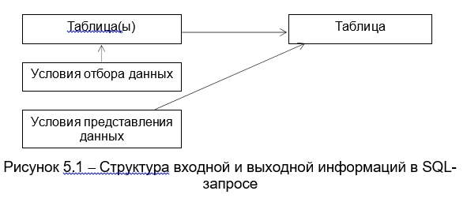

# Лекция 5. Операторы создания, модификации и удаления таблиц базы данных

## Основные понятия языка SQL

Структурированный язык запросов (SQL) был разработан IBM в конце 1970-х годов. С тех пор в язык вносились изменения и усовершенствования, но его принципы остались прежними. Прежде всего, SQL – непроцедурный язык высокого уровня.Прикладная программа не сообщает Машине БД, как выполнить задачу, а формулирует,что должно содержаться в результате (декларативный подход).В отличие от процедурных языков, которые также могут быть использованы для работы с БД, SQL ориентирован не на записи, а на множества. Это означаетследующее: в качестве входной информации для формулируемого на языке SQL запросак БД используется множество записей одного или нескольких отношений. Врезультате выполнения запроса образуется множество записей результирующей таблицы. То есть, в SQL результатом любой операции над отношениями также необходимых для получения результата), а условия, которым должны удовлетворятькортежи результирующего отношения, сформулированные в терминах входного (иливходных) отношения (Рисунок 5.1).



Структура входной и выходной информаций в SQL - запросе


Первый стандарт языка SQL был принят в 1989 году. Все известные коммерческие продукты в настоящее время поддерживают этот продукт. В 1992 году был принят второй стандарт SQL, в котором, в частности, были реализованы напрямую теоретико-множественные операции реляционной алгебры (РА) (до этого их можно было моделировать на основе аналогии РА с реляционным исчислением (РИ), а РИ с SQL). Третий стандарт SQL, направленный на сближение языка с ОО подходом, был принят в 1998 году. Различные производители БД вносят в синтаксис SQL небольшие изменения. Однако, как правило, стандартный запрос SQL без труда переносится на различные платформы.

С помощью SQL можно не только обрабатывать информацию запросами, но и управлять данными (вставка, модификация, удаление записей, сортировка), а также осуществлять сопровождение БД (описание типов данных и структуры таблиц, удаление и изменение таблиц, индексирование, управление правами доступа к данным).

Имеются две формы SQL: 
-  интерактивный SQL, 
-  вложенный SQL.

Обе формы SQL работают практически одинаково, но используются различно.

Интерактивный SQL используется для функционирования непосредственно в БД. В этой форме языка введенная команда тотчас же выполняется и результат (если он существует) немедленно отображается.

Вложенный SQL состоит из команд языка, помешенных внутри программ, которые обычно написаны на некотором другом языке (C#,С++, РНР и т. д., часто СУБД предоставляет свое процедурное расширение – язык Transact SQL от MS SQL Server или PL/SQL от ORACLE). Это делает программы более мощными и эффективными. Однако, допуская другие языки, приходится иметь дело со структурой SQL и стилем управления данными, который требует некоторых расширений к интерактивному SQL.

Команды SQL делятся на следующие категории (компоненты SQL):
-	Предложения Языка Определения Данных - Data Definition Language (DDL). DDL (в ANSI он называется Языком Описания Схем – Shema Definition Language) состоит из тех команд, которые создают объекты (таблицы, представления, индексы) в БД. Также DDL предложения используются для определения характеристик БД, их изменения и удаления БД. 
-	Предложения Языка Манипулирования Данными - Data Manipulation Language (DML). DML состоит из предложений (команд), определяющих, какие данные находятся в таблицах в любой момент времени. DML предложения предназначены для манипулирования данными в структурах данных, определенных DDL предложениями.
-	Предложения Языка Управления Данными - Data Control Language (DCL). DCL состоит из предложений, определяющих, может ли пользователь выполнить отдельное действие. Согласно ANSI, DCL является частью DDL.Речь идет не о различных языках как таковых, а о разделах команд одного языка, сгруппированных в соответствии с их функциональным назначением.

## Основные команды SQL

Предложения DDL:

| Создать объект   | Удалить объект | Модифицировать объект |
|------------------|----------------|-----------------------|
| CREATE DATABASE  | DROP DATABASE  | ALTER DATABASE        |
| CREATE INDEX     | DROP INDEX     | ALTER INDEX           |
| CREATE PROCEDURE | DROP PROCEDURE | ALTER PROCEDURE       |
| CREATE TABLE     | DROP TABLE     | ALTER TABLE           |
| CREATE TRIGGER   | DROP TRIGGER   | ALTER TRIGGER         |
| CREATE VIEW      | DROP VIEW      |                       |

-   DDL базируется на трех командах SQL:
-   CREATE (создать) – позволяет определять и создавать объекты БД,
-   DROP (удалить) – позволяет удалять существующий объект БД,
-   ALTER (изменить) – позволяет изменять определение объекта БД.
-   С помощью операторов DDL можно:
-   создать новую БД,
-   определить структуру новой таблицы и создать эту таблицу,
-   изменить определение существующей таблицы,
-   удалить существующую таблицу,
-   определить представление данных,
-   обеспечить условия безопасности БД,
-   создать индексы для доступа к таблицам,
-   управлять размещением данных на устройствах хранения.

Предложения DML:

| Изменяют данные таблиц | Не изменяют данные таблиц |
|------------------------|---------------------------|
| INSERT                 | SELECT                    |
| DELETE                 |                           |
| UPDATE                 |                           |

Предложения DCL:

В SQL привилегии даются и отменяются двумя командами

-   GRANT (допуск) и REVOKE (отмена).

Пример. Пользователь SA владеет таблицей STUD и желает позволить пользователю SB
выполнить запрос (произвести вставку, обновление) к ней. Пользователь SA должен
в этом случае выполнить следующую команду:

Предложения DML:

| Изменяют данные таблиц | Не изменяют данные таблиц |
|------------------------|---------------------------|
| INSERT                 | SELECT                    |
| DELETE                 |                           |
| UPDATE                 |                           |

Предложения DCL:
В SQL привилегии даются и отменяются двумя командами

-   GRANT (допуск) и REVOKE (отмена).

Пример. Пользователь SA владеет таблицей STUD и желает позволить пользователю SB
выполнить запрос (произвести вставку, обновление) к ней. Пользователь SA должен
в этом случае выполнить следующую команду:

-  ```sql
GRANT SELECT ON STUD TO SB GRANT INSERT ON STUD TO SB
```
-  `GRANT UPDATE (FAM) ON STUD TO SB //позволено`

модифицировать только поле FAM
```sql
REVOKE DELETE, INSERT ON STUD TO SB //отмена привилегий на удаление и вставку
```

Диалог с СУБД осуществляется только с помощью SQL-операторов, вне зависимости от того, хотим мы создать таблицу,поместить в нее данные, создать пользователя СУБД или же получить информацию озагрузке процессора. Но этот класс операторов не выделяют отдельно. Потому чтоих реализация зависит от производителя СУБД и не всегда понятно, что реально делает оператор. Так, например, для создания пользователя необходимо запустить соответствующий оператор, который создает объект СУБД. Следовательно, можно сказать, что этот оператор принадлежит к DDL. Но для того, чтобы посмотреть загрузку процессора требуется обратиться к определенной системной таблице СУБД.А для этого используется оператор SQL. По этой причине все множество операторов работы с реляционной СУБД называется SQL.

## SQL-оператор создания таблицы CREATE TABLE

В MS SQL Server инструментально существует три способа создания объектов БД:

1.  С помощью средств языка SQL.
2.  С помощью инструментальных средств интегрированной среды Management Studio    (в этом случае сервер все равно генерирует SQL-скрипт).
3.  С использованием первого и второго способов.

Язык DDL, как видно из названия, применяется для определения таблиц, полей,индексов и прочих объектов, которые располагаются в СУБД и, как правило, хранятданные или облегчают их обработку.

Таблицы базы данных создаются с помощью команды CREATE TABLE. Эта команда:

-   создает пустую таблицу, то есть таблицу, не имеющую строк,
-   значения в эту таблицу вводятся с помощью команды INSERT,
-   определяет имя таблицы и множество поименованных столбцов в указанном   порядке (каждая создаваемая таблица должна иметь, по крайней мере, один столбец),
-   для каждого столбца должен быть определен тип данных и размер,
-   для каждого столбца могут быть определены различные ограничения (PRIMARY   KEY, FOREING KEY, Not Null, Unique, Default, Check, Constraint).
Синтаксис оператора CREATE TABLE выглядит вот так: 

```sql
CREATE TABLE имя_таблицы (

поле1 тип1 [NOT NULL] [UNIQUE] [PRIMARY KEY],
поле2 тип2 [NOT NULL] [UNIQUE],
...
полеN типN [NOT NULL] [UNIQUE],
[FOREING KEY (поле) REFERENCES таблица(поле)
[ON DELETE { No Action | CASCADE | SET NULL | Set Default }]
[ON UPDATE { No Action | CASCADE | SET NULL | Set Default
}]]

)
```
Поскольку пробелы используются для разделения частей команды SQL они не могут быть частью имени столбца или таблицы (или любого другого объекта БД). операторе CREATE TABLE определения полей перечисляются через “запятую”.

Пример. Создание таблицы STUDENT (STUDENT (ID – номер зачетки, FAM – фамилия,STIP – стипендия, OCENКА - оценка, GR – группа, CITY – город, BIRTHDAY – год рождения ))
```sql
CREATE TABLE STUDENT

(ID SMALLINT IDENTITY NOT NULL PRIMARY KEY,

FAM NVARCHAR(10), STIP NUMERIC (6, 2), OCENКА TINYINT, GR NVARCHAR(5),

CITY NVARCHAR(15), BIRTHDAY SMALLDATETIME)
```

Порядок расположения полей в таблице определяется тем, в какой последовательности они указаны в команде создания таблицы.

Когда создается таблица или изменяется ее структура, можно устанавливатьограничения на значения, которые могут быть введены в поля. Если это сделано,СУБД будет отвергать любые значения, которые нарушают оговоренные критерии.

-  Имеются следующие типы ограничений (constraint) целостности
БД:
-   ограничение поля (атрибута) (применяется только к
определенному полю),
-   ограничение таблицы (отношения) (применяется к группам из одного и более    полей),
-   ограничение ссылочной целостности (применяется для определения внешнего    ключа).
-  Ограничения на уровне поля:
-   ограничения неопределенных значений (NOT NULL - запрет неопределенных   значений) (NULL — это специальный маркер, обозначающий тот факт, что поле  пусто или неопределенно, значение NULL вводится по умолчанию),
-   ограничения уникальности столбца (UNIQUE) (ограничение UNIQUE применяется  только совместно с ограничением NOT NULL),
-   ограничения первичного ключа (PRIMARY KEY, что эквивалентно NOT NULL UNIQUE)   (Если ключ состоит из нескольких атрибутов, тогда используется немного   другое определение.),
-   ограничения внешнего ключа (ограничения столбца по ссылке) (FOREING KEY),
-   ограничения проверки на допустимость значения (CHECK),
-   ограничения заданных по умолчанию значений (DEFAULT).

Эти ограничения иногда называют ограничениями семантической целостности – длявозможности смыслового описания данных.

Пример. Неопределенное значение не может быть установлено для поля FAM.
```sql
CREATE TABLE STUDENT
(…
	FAM NVARCHAR(10) NOT NULL,
…)
```
ример. Необходимо гарантировать, что все значения, введенные в поле FAM,отличаются друг от друга. При этом СУБД отклонит любую попытку ввода в это поле значения, которое уже имеется в другой строке. Это ограничение применяется кполям, для которых ранее было объявлено ограничение NOT NULL. Если такое поле неявляется первичным ключом, то оно является альтернативным ключом.
```sql
CREATE TABLE STUDENT
(…
	FAM NVARCHAR(10) NOT NULL UNIQUE,
…)
```
Пример. Объявление группы из двух полей уникальными (ограничение таблицы) cприсваиванием этому ограничению таблицы уникального имени.
```sql

CREATE TABLE STUDENT

(…

FAM NVARCHAR(10) NOT NULL, NAME NVARCHAR(10) NOT NULL,

…
```
Пример. Объявление cоставного первичного ключа (ограничение таблицы). Любое
поле, используемое в ограничении PRIMARY KEY, должно уже быть объявлено NOT
NULL. Первичный ключ состоит из двух полей.

UNIQUE (FAM, NAME))

Или так `CONSTRAINT UN_FAM_NAME UNIQUE (FAM, NAME)` .

Ограничениям таблиц можно присваивать уникальные имена. Преимущество явного задания имени ограничения состоит в том, что в этом случае при выдаче системой сообщения о нарушении установленного ограничения будет указано его имя, что упрощает обнаружение ошибок. Для присвоения имени ограничению используется несколько измененный синтаксис команд CREATE TABLE и ALTER TABLE.

Пример. Объявление cоставного первичного ключа (ограничение таблицы). Любое поле, используемое в ограничении PRIMARY KEY, должно уже быть объявлено NOT NULL. Первичный ключ состоит из двух полей.

```sql
CREATE TABLE STUDENT
(…
	FAM NVARCHAR(10) NOT NULL,
	NAME NVARCHAR(10) NOT NULL,
…
=
PRIMARY KEY (FAM, NAME))
```
В этом запросе UN_FAM_NAME — это имя, присвоенное указанному ограничению таблицы.Пример. Объявление cоставного первичного ключа (ограничение таблицы). Любое поле, используемое в ограничении PRIMARY KEY,должно уже быть объявлено NOT NULL. Первичный ключ состоит из двух полей.

```sql
CREATE TABLE STUDENT
(…
FAM NVARCHAR(10) NOT NULL,


NAME NVARCHAR(10) NOT NULL,
…
PRIMARY KEY (FAM, NAME))
```

Или так

```sql
… CONSTRAINT PK_ STUDENT PRIMARY KEY(FAM, NAME)… .
```
Условие проверки на допустимость значения: CHECK(<булево выражение>).
Особенности работы с ограничением целостности CHECK:

 1. основные конструкции, используемые в CHECK - <, >, =, !=, And, Or, IN, Between, Like,
 2. ограничение может относиться к одному столбцу,
 3. ограничение может быть распространено на всю таблицу, в смысле, что проверка значений в одном столбце осуществляется на сновании значений другого столбца (при условии, что столбцы принадлежат одной таблице и берутся из одной и той же обновляемой или вставляемой строки),
 4. на основании CHECK может быть выполнена проверка того, соответствует ли некоторое сочетание значений столбцов заданному критерию,
 5. правила составления CHECK аналогичны правилам составления конструкции WHERE,
 6. проверка CHECK позволяет достичь более высокой производительности по сравнению с проверками с помощью правил и триггеров.
 
Пример.    Введение    ограничений    на    поле    оценка    OCENКА (ограничение проверки на допустимость значения).
```sql
CREATE TABLE STUDENT
(…
OCENКА TINYINT CHECK (OCENКА <=5),
…)
Или так … OCENКА TINYINT CHECK IN (2, 3, 4, 5) … .
Или так … OCENКА TINYINT CHECK (OCENКА BETWEEN 2 AND 5)
```
Или так
 ```sql
 CONSTRAINT CH_ OCENКА CHECK (OCENКА <=5)
 ```
 Пример. Введение ограничений на поля оценка OCENКА и дата
TDATE (ограничение таблицы)
```sql

CREATE TABLE STUDENT
(…
OCENКА  TINYINT, TDATE 

SMALLDATETIME,

CHECK (OCENКА <5 AND TDATE > 31/03/2010))
```
Или так
```sql
CONSTRAINT CH_STUD CHECK (OCENКА <5 AND TDATE > 31/03/2010)
```
Значение по умолчанию: [DEFAULT {<значение>|USER|NULL}] – здесь ключевое слово USER означает, что при заполнении столбца ему будет присвоена символьная строка, содержащая имя текущего пользователя.

Значение DEFAULT не ограничительного свойства, оно определяет, что должно случиться, если не введено любое из явных допустимых значений. Использовать значение по умолчанию – это альтернатива для NULL.

Пример. Введение ограничений на поле оценка OCENКА и задание значения 5 по умолчанию.
```sql
CREATE TABLE STUDENT
(
OCENКА TINYINT CHECK IN (2, 3, 4, 5) DEFAULT 5,
)
```
Ограничение столбца по ссылке: объявление поля внешним ключом.

```sql
FOREIGN KEY (<поле>) REFERENCES <имя_основной_таблицы> (<имя_первичного_ключа_основной_таблицы>)
[ON DELETE { No Action | CASCADE | SET NULL | Set Default }] [ON UPDATE { No Action | CASCADE | SET NULL | Set Default }]
```
*На рисунке 5.2 приведена иллюстрация связи один-ко-многим между полями таблиц GROUPS и STUDENT.*


pic 5.2 − Связь один-ко-многим между полями таблиц GROUPS и STUDENT

Пример. Объявление поля внешнего ключа
```sql

CREATE TABLE STUDENT ( …
ID_GROUP TINYINT NOT NULL,
…
CONSTRAINT FK_STUD FOREIGN KEY (ID_GROUP) REFERENCES GROUPS(ID) ON DELETE CASCADE    ON UPDATE
CASCADE)
```
Особенности задания ограничения столбца по ссылке:

1. Основная таблица должна быть описана до подчиненной.
2. Все поля, используемые в качестве внешних ключей, должны в родительской таблице иметь ограничения PRIMARY KEY или NOT NULL и UNIQUE.
3. Для определения поля, которое является внешним ключом, сначала его нужно определить - описать его наименование, тип данных и прочие атрибуты.
4. После определения всех полей может следовать одно или несколько определений FOREIGN KEY, которые задают поле внешнего ключа и определяют таблицу и поле, на которое ссылается внешний ключ.
5. Несколько определений FOREIGN KEY перечисляются через запятую.

Правило ссылочной целостности говорит, что внешний ключ не может ссылаться на несуществующий первичный ключ. Ссылочная целостность обозначает поддержку внешних ключей с возможностью выбора одного из следующих принципов удаления связанных кортежей:

- ON DELETE CASCADE - кортежи подчиненного отношения уничтожаются при удалении связанных с ними кортежей основного отношения (если мы хотим удалить первичный ключ, то предварительно мы должны явно удалить все записи подчиненных таблиц, внешние ключи которых ссылаются на этот первичный ключ) (Определение “ON DELETE CASCADE” включает механизм каскадного удаления. При наличии “ON DELETE CASCADE” СУБД автоматически удаляет все записи, которые ссылаются на этот первичный ключ.),

- ON DELETE SET NULL - кортежи подчиненного отношения модифицируются в NULL при удалении связанных с ними кортежей основного отношения,

- ON DELETE No Action - запрет на удаление кортежа основного отношения при наличии кортежей подчиненного отношения, связанных с ним.

В качестве примера рассмотрим набор SQL-операторов, которые создают таблицы нашей предметной области. Помещенный в файл, такой набор представляет объект, который называется SQL-скрипт: 

```sql
CREATE TABLE STUDENT (
ID INT IDENTITY NOT NULL PRIMARY KEY, NAME NVARCHAR (40) NOT NULL, ENTER_YEAR TINYINT,
AGE TINYINT,
ID_GROUP TINYINT NOT NULL, AVERAGE_MARK NUMERIC (5, 2),
FOREIGN KEY (ID_GROUP) REFERENCES GROUPS(ID) ON DELETE CASCADE ON UPDATE NO ACTION
)
CREATE TABLE DEPARTMENT (
ID TINYINT IDENTITY NOT NULL PRIMARY KEY, NAME NVARCHAR (20) NOT NULL UNIQUE, ID_FACILITY TINYINT NOT NULL,FOREIGN KEY (ID_FACILITY) REFERENCES FACILITY(ID) ON DELETE CASCADE ON UPDATE NO ACTION
)
CREATE TABLE TEACHER (
ID TINYINT IDENTITY NOT NULL PRIMARY KEY, NAME NVARCHAR (40) NOT NULL,
ID_DEP TINYINT NOT NULL,
FOREIGN KEY (ID_DEP) REFERENCES DEPARTMENT(ID) ON DELETE CASCADE ON UPDATE NO ACTION
)
CREATE TABLE ROOM (
ID TINYINT IDENTITY NOT NULL PRIMARY KEY, NAME NVARCHAR (5) NOT NULL UNIQUE
)
CREATE TABLE SUBJECT (
ID TINYINT IDENTITY NOT NULL PRIMARY KEY, NAME NVARCHAR (30) NOT NULL UNIQUE,
)
CREATE TABLE LESSON (
ID TINYINT IDENTITY NOT NULL PRIMARY KEY, ID_GROUP TINYINT NOT NULL,
ID_ROOM TINYINT NOT NULL, ID_SUBJECT TINYINT NOT NULL, ID_TEACHER TINYINT NOT NULL, WEEK_DAY TINYINT NOT NULL, LESSON_NUM TINYINT NOT NULL,
FOREIGN KEY (ID_GROUP) REFERENCES GROUPS(ID) ON DELETE CASCADE ON UPDATE NO ACTION,
FOREIGN KEY (ID_ROOM) REFERENCES ROOM(ID) ON DELETE CASCADE ON UPDATE NO ACTION,
FOREIGN KEY (ID_SUBJECT) REFERENCES SUBJECT(ID) ON DELETE CASCADE ON UPDATE NO ACTION,
FOREIGN KEY (ID_TEACHER) REFERENCES TEACHER(ID) ON DELETE CASCADE ON UPDATE NO ACTION
)

```
Важным является понимание того, что правило ссылочной целостности реализовано не только в операциях работы с данными, но и в операциях создания объектов, которые эти данные хранят. Другими словами, до тех пор, пока вы не создадите таблицу с первичным ключом, вы не сможете создать таблицу с внешним ключом, который на него ссылается. То есть порядок создания таблиц существует.

Приведенный скрипт учитывает это свойство. Если посмотреть на скрипт, то можно увидеть явную корреляцию определений полей и той информации, которую мы создавали, когда описывали таблицы при проектировании. Конечно структура таблицы, использованная при проектировании, специально выбрана таким образом, чтобы эта корреляция имела место. Цель одна – уменьшить количество ошибок за счет многократного определения сущностей в базе.

**SQL-оператор изменения существующей таблицы**

#ALTER TABLE#

Для модификации структуры и параметров существующей таблицы используется команда ALTER TABLE. Синтаксис команды ALTER TABLE для добавления столбцов в таблицу имеет вид

```sql
ALTER TABLE <имя таблицы> ADD (<имя столбца> <тип данных>
<размер>)
```
По этой команде для существующих в таблице строк добавляется новый столбец, в который заносится NULL-значение. Этот столбец становится последним в таблице. Можно добавлять несколько столбцов, в этом случае их определения в команде ALTER TABLE разделяются запятой.

Оператор ALTER TABLE не действует, когда таблица должна быть переопределена, однако при разработке БД не стоит исключать необходимость этого действия.

Пример. Добавление к таблице STUDENT двух полей для хранения информации о курсе и специальности студента.


```sql
ALTER TABLE STUDENT ADD СOURS TINYINT, SPEC NVARCHAR(10)
```
Пример. Удаление из таблицы STUDENT поля курс СOURS. 
```sql
ALTER TABLE STUDENT DROP COLUMN СOURS
```
Упрощенная версия синтаксиса для оператора ALTER TABLE
приведена ниже:
```sql
 ALTER TABLE <имя> {
[ALTER COLUMN <определение_столбца>] | [ADD <определение_столбца>] |
[DROP COLUMN <имя_столбца>] |
[ADD [WITH NOCHECK] CONSTRAINT <ограничение_для_таблицы>]}
```
Ключевые слова CHECK (подразумевается) и NOCHECK перед ограничением таблицы, предписывают SQL Server тестировать или не тестировать имеющиеся в таблице данные с учетом нового ограничения. WITH NOCHECK используется лишь в крайне редких случаях.

Ниже представлено несколько ограничений для фразы ALTER COLUMN. Столбец не может быть изменен, если он:

- имеет тип данных text, image, ntext или timestamp;
- является    вычисляемым    столбцом    или    используется    в вычисляемом столбце;
- является реплицированным;
- используется в индексе – если только столбец не имеет тип данных varchar, nvarchar или varbinary; тип данных не изменяется и размер столбца не уменьшается;
- используется    в    статистике,    генерируемой    оператором CREATE STATISTIC; 
 - используется в ограничении PRIMARY KEY; 
 - используется в ограничении FOREIGN KEY;
 - используется в ограничении CHECK;
 - используется в ограничении UNIQUE;
 - указывается как DEFAULT.
 Возможно изменение описания столбцов. Часто это связано с изменением размеров столбцов, добавлением или удалением ограничений, накладываемых на их значения. Синтаксис команды в этом случае имеет вид:

 ```sql

 ALTER TABLE <имя_таблицы> ALTER <имя_столбца> <тип данных>
<размер/точность>
```
Пример. Модификация типа данных поля ID_NUM в таблице USP.

(code cледует иметь в виду, что изменение характеристик столбца)

может осуществляться не в любом случае, а с учетом следующих ограничений:

-изменение типа данных возможно только в том случае, если столбец пуст;
-для незаполненного столбца можно изменять размер/точность;
-для заполненного столбца размер/точность можно увеличить, но нельзя понизить;
-ограничение NOT NULL может быть установлено, если ни одно значение в столбце не содержит NULL. Опцию NOT NULL всегда можно отменить;
-разрешается изменять значения, установленные по умолчанию.

Изменение структуры таблицы в тот момент, когда она находится в использовании, чревато потерей информации – например, запрос может потерпеть неудачу по той причине, что некоторого поля в таблице уже не существует. Таким образом, лучше разрабатывать БД так, чтобы использовать ALTER TABLE только в крайнем случае.

## 5.4 SQL-оператор удаления таблиц DROP TABLE

SQL-оператор DROP TABLE предназначен для удаления таблиц.
Общий вид синтаксиса оператора DROP TABLE следующий: 
```sql
DROP TABLE <имя_таблицы1>, <имя_таблицы2>, … Особенности оператора DROP TABLE:
```
1. Для того чтобы иметь возможность удалить таблицу, пользователь должен быть ее собственником, то есть создателем.
2. Перед удалением желательно произвести очистку таблицы от данных, что позволяет избежать случайной и невосполнимой потери информации.
3. Операция удаления выполняется вне зависимости от того, существуют в таблице данные или нет.
4. После удаления таблицы ее восстановление не возможно. После выполнения этой команды, имя таблицы больше не распознается, и нет таких действий, которые могли быть выполнены с этим объектом.
5. Для избегания многих трудностей (например, удаление таблицы было ошибкой), рекомендуется создавать резервную копию БД перед удалением из нее объектов. Впоследствии при необходимости можно восстановить необходимые объекты из резервной копии.
6. Правило ссылочной целостности реализовано и здесь. Нельзя удалить таблицу, содержащую первичный ключ, пока не будет удалена связанная с ней таблица (или ее ограничения целостности), которая содержит внешний ключ, ссылающийся на поле удаляемой таблицы. Это приводит к тому, что последовательность удаления таблиц обратна последовательности их создания.

Рассмотрим скрипт удаления таблиц для нашей задачи: 
```sql
DROP TABLE lesson, subject;
DROP TABLE room;
DROP TABLE teacher; DROP TABLE department; DROP TABLE student; DROP TABLE groups; DROP TABLE facility;
```
При разработке программного продукта иногда требуется полное удаление базы вместе с последующим её восстановлением. Именно поэтому создают скрипты создания и удаления таблиц базы. Кроме того, процесс создания таблиц БД является частью инсталляции программного обеспечения.

## 5.5 SQL-оператор вставки данных в таблицу INSERT

SQL-оператор INSERT используется для вставки данных в таблицу БД.
Оператор INSERT имеет следующий синтаксис:
```sql
SERT    INTO    <имя_таблицы|    представление>    [(имя_поля1,
имя_поля2, ...)] VALUES <(значение1, значение2, ...)>| <подзапрос>
```
Существует две формы оператора INSERT:

- первая форма позволяет вставлять в таблицу новые строки путем непосредственного задания значения каждого поля,
- вторая форма базируется на данных, которые передаются в оператор INSERT посредством запроса на выборку данных SELECT
Первая форма оператора INSERT имеет следующий синтаксис: 
```sql
INSERT    INTO    <имя_таблицы|    представление>    [(имя_поля1, имя_поля2, ...)] VALUES <(значение1, значение2, ...)>
```
Особенности работы оператора INSERT:
1. Оператор вставляет только одну запись в таблицу с  именем “имя_таблицы”. Таблица, в которую производится вставка, должна быть предварительно определена оператором CREATE TABLE.
2. Если поля для вставки вообще не указаны, то их последовательность задается оператором CREATE TABLE. Значения в списке полей для вставки вводятся в таблицу в том порядке, в котором они записаны в команде.

Пример. Вставить в таблицу Teacher (id (код_преподавателя), name (имя_преподавателя), id_dep (код_кафедры)) новую запись – 1234, Иванов, 503. INSERT INTO TEACHER (id, name, id_dep) VALUES (1234, ‘ Иванов’, 503);

3. Если в операторе заданы не все поля для вставки, то в отсутствующие поля помещается значение “NULL”. При этом нужно учитывать возможность наличия условия NOT NULL.
4. Чтобы присвоить значения не всем полям записи или изменить порядок ввода значений, следует явно задавать список полей после имени таблицы.

Пример. Вставить в таблицу Teacher новую запись – Петров, код_преподавателя – 1237.

5. Рекомендуется указывать вставляемые поля таблицы явным образом. Это связанно с тем, что последовательность полей, которую задает оператор CREATE TABLE можно просто забыть. Существует также возможность добавления новых полей в таблицу после создания БД.
6. Вставка даты/времени в таблицу БД (таблица 5.1).

 Таблица 5.1 − Типы данных даты/времени в SQL Server 2005

| Имя типа данных | Размер в байтах | Описание                                                                                                                                        |
|-----------------|-----------------|-------------------------------------------------------------------------------------------------------------------------------------------------|
| DateTime        | 8               | Данные о дате и (или) времени, которые относятся к периоду с 1 января 1753 года по 31 декабря 9999 года,                                        |
|                 |                 | определяемые с точностью до 3–х сотых секунды.                                                                                                  |
| SmallDateTime   | 4               | Данные о дате и (или) времени, которые относятся к периоду с 1 января 1900 года по 06 июня 2079 года, определяемые с точностью до одной минуты. |

Преобразование строки в дату при вставке может выполняться двумя способами:

-  неявно – присваивая символьную строку значению переменной даты-времени (рискованный вариант),
-  явно – с помощью встроенных функций Cast и CONVERT (наиболее предпочтительный вариант).

Пример. Вставка в таблицу “Успеваемость” USP (ID - первичный ключ, ID_NUM - номер зачетки, OCENKA - оценка, ID_PREDM – код предмета, CDATE – дата оценки типа smalldatetime), дата вставляется неявно.

```sql
INSERT INTO USP(ID, ID_NUM, OCENKA, ID_PREDM, CDATE ) VALUES(1, 3001, 3, 1, '2010/05/19') --(формат ‘YYYY/MM/DD’)
```
Или так 
```sql
VALUES(… , '2010-05-19') -- (формат ‘YYYY-MM-DD’).
```
Или так 
```sql
VALUES(… , '2010.05.19') -- (формат ‘YYYY.MM.DD’).
```
Или так 
```sql
VALUES(… , '05.19.10') -- (формат ‘MM.DD.YY’).
```
Однако вставка даты в формате VALUES(… , '09.05.19') будет выполнена, но даст результат 2019-09-05 00:00:00, т.е. '09.05.19' это формат 'месяц.день.год'
Ошибка преобразования (Conversion failed when converting character string to smalldatetime data type.) возникнет в случае:… VALUES ('05 19 2010')

Таблица 5.2 − Функции для работы со значениями даты/времени в

 SQL Server 2005

| № | Функция    | Характеристика                                                                                                                                                                                                              |
|---|------------|---------------------------------------------------------------------------------|
| 1 | DAY        | Возвращает целое число, представляющее часть даты \<date\> и соответствующее дню месяца. Синтаксис: DAY (\<date\>).                                                                                                         |
| 2 | YEAR       | Возвращает целое число, соответствующее числовому значению года. Синтаксис: YEAR (\<date\>).                                                                                                                                |
| 3 | MONTH      | Возвращает целое число, соответствующее                                                                                                                                                                                     |
|   |            | номеру месяца года. Синтаксис: MONTH (\<date\>). Select id, DAY(tdate) As 'День', MONTH(tdate) As 'Месяц', YEAR(tdate) As 'Год' From TTime Столбец tdate имеет тип smalldatetime.                                           |
| 4 | GETDATE    | Возвращает текущую системную дату и время. INSERT INTO TTime (tdate) VALUES (GETDATE()) При выводе получится значение 2010-05-17 10:07:00.                                                                                  |
| 5 | DATENAME   | Возвращает строку со значением даты/времени (или фрагмент даты/времени).                                                                                                                                                    |
| 6 | DATEPART   | Возвращает целое число со значением даты/времени (или фрагмент даты/времени).                                                                                                                                               |
| 7 | DATEADD    | Складывает значение даты \<date\> с интервалом \<number\> и возвращает новое значение даты. Параметр \<datepart\> определяет единицу измерения интервала. Синтаксис: DATEADD (\<datepart\>, \<number\>, \<date\>).          |
| 8 | DATEDIFF   | Возвращает результат вычисления разности между датами в указанных единицах измерения времени. Параметр \<datepart\> определяет единицу измерения интервала. Синтаксис: DATEDIFF (\<datepart\>, \<startdate\>, \<enddate\>). |
| 9 | GETUTCDATE | Возвращает текущее значение всеобщего скоординированного времени (UTC – Universal Coordinated Time) (всемирного гринвического среднего времени).          

В таблице 5.3 приведены основные компоненты и шаблоны для обозначения даты/времени в SQL Server 2005

Таблица 5.3 − Компоненты и шаблоны для обозначения даты/времени

| №  | Компонент даты          | Шаблон даты |
|----|-------------------------|-------------|
| 1  | Год                     | yy, yyyy    |
| 2  | Квартал                 | qq, q       |
| 3  | Месяц                   | mm, m       |
| 4  | Номер дня с начала года | dy, y       |
| 5  | Сутки                   | dd, d       |
| 6  | Неделя                  | wk, ww      |
| 7  | День недели             | dw          |
| 8  | Час                     | hh          |
| 9  | Минута                  | mi, n       |
| 10 | Секунда                 | ss, s       |
| 11 | Миллисекунда            | ms          |

Функции Cast и Convert для преобразования типов Функции    Cast    и    Convert    выполняют    почти    что    одинаковые действия по преобразованию типов (если преобразование не осуществляется неявно), однако функция Cast совместима со стандартом ANSI, а функция Convert не предусмотрена стандартом ANSI.

Синтаксис функций преобразования: 

```sql
Cast (expression As data_type) Convert (data_type, expression [, style])
```

- expression – выражение для преобразования,
- data_type – тип в который происходит преобразование,
- style    –    опция    форматирования    преобразования    (вид результата).
Пример.

```sql
Преобразовать дату (tdate) в строку. TTime(id (первичный ключ) smallint IDENTITY(1,1) NOT NULL, tdate (дата) smalldatetime NOT NULL).
Select id, ('дата '+ tdate) As 'Date' From TTime
```

Данный    оператор    Select    не    выполнится,    будет    ошибка преобразования:

```sql
Msg 295, Level 16, State 3, Line 1
Conversion failed when converting character string to smalldatetime data type.
```

Пример использования функции Cast

```sql
Select id, ('дата '+ Cast (tdate As varchar)) As 'Date' From TTime
```
Результат имеет вид:

```sql
 дата May 17 2010 10:07AM
Select id, ('дата '+ Cast (tdate As varchar(12))) As 'Date' From TTime
```

Результат имеет вид:

```sql
дата May 17 2010
```
Пример использования функции CONVERT

```sql
Select id, ('дата '+ CONVERT(VARCHAR(12), tdate, 111)) As 'Date' From TTime

```

style=111    –    стиль    японского    стандарта    вывода    даты    в    виде    - 2010/05/17 style=100 – стиль стандарта вывода даты в виде - May 17 2010 Результат имеет вид: дата 2010/05/17

7. Предложение VALUES задает в круглых скобках значения, которые будут помещены в таблицу или эти значения формируются посредством подзапроса. Обязательным является требование совместимости типов данных полей и типов данных значений, которые в них помещаются.
8. Значения, которые задаются в VALUES, являются скалярными и не могут быть вычисляемыми выражениями.
9. Сама команда INSERT никакого вывода не производит.

Вторая форма оператора вставки INSERT имеет следующий синтаксис:
Применение оператора INSERT с подзапросом позволяет загружать сразу несколько строк в одну таблицу, используя информацию, выбранную SQL-оператором SELECT из другой таблицы этой же или другой БД. INSERT с подзапросом добавляет в таблицу столько строк, сколько извлекает подзапрос из другой таблицы.
Особенности работы оператора INSERT:
1. Требуется полная совместимость таблицы, которую возвратит SQL-оператор SELECT, с полями таблицы, которые заданны в SQL-операторе INSERT. Другими словами, количество полей, порядок их следования и типы данных должны совпадать.
2. Предложение FROM подзапроса не должно содержать ссылок на таблицу, в которую вставляют строки, то есть нельзя использовать коррелированные подзапросы.
3. В INSERT можно использовать подзапросы внутри любого запроса, причем эти подзапросы могут быть и соотнесенные (связанные, коррелированные).

Пример. Вставить в таблицу Excellent записи о студентах отличниках, которые необходимо выбрать из таблицы Usp. 
```sql
INSERT INTO EXCELLENT
SELECT *    FROM USP    WHERE OCENKA=5
```
Для того чтобы не произошло ошибки, таблица EXCELLENT должна уже быть создана и иметь тоже количество столбцов и типы данных в столбцах, что и в таблице USP (в общем случае – что возвращает запрос).

С помощью указания имен столбцов при вставке можно переупорядочивать добавляемую информацию.

Пример. Вставить в таблицу RAITING информацию о среднем балле каждого студента.
```sql
INSERT INTO RAITING (Id_Stud, AVG_Ocenka)
SELECT Id_Stud, AVG(Ocenka) FROM USP
GROUP BY Id_Stud
```
Необходимо чтобы имена столбцов таблицы RAITING, а значит, последовательность данных во вставляемом списке, совпадали с порядком следования полей в предложении SELECT.

Таблицы USP и RAITING никак не связаны между собой. Если в дальнейшем оценки студентов, а значит и средний балл, будут меняться, то эти изменения, внесенные в таблицу USP, не затронут таблицы RAITING. Если необходимо, чтобы в таблице оперативно поддерживалась информация, следует использовать возможности представления.

Вторая форма оператора часто используется для решения задач “упаковки” таблиц путем сохранения результирующих данных в других таблицах с удалением более подробной информации, которая являлась источником. Такая задача в ряде систем является очень острой.

Пример. Пусть существует БД городской АТС, в которой регистрируются все звонки абонентов. Для каждого звонка сохраняется его дата, длительность, номер абонента с которым был разговор. Таким образом, в течении месяца создается некоторое количество записей для каждого абонента АТС. В конце месяца на основании этой информации абоненту распечатывается и отсылается счет за услуги связи, в котором проставлено только общее время пользования телефоном. После того, как абонент рассчитался за услуги и не требует предоставить ему полную распечатку, информация о звонках становится не нужной и более того потенциально опасной. Опасность заключается в ее количестве. Обычная АТС содержит в своем составе несколько десятков тысяч номеров. Следовательно, каждые несколько секунд в базу поступает информация о сделанных абонентами звонках. За год работы АТС объем информации, будет громадным. Это скажется на скорости работы информационной системы, поскольку при построении отчета используется вся информация, которая хранится за год, хотя фактически требуется за последний месяц. Построение промежуточных отчетов позволяет руководству видеть картину загрузки АТС в течении заданного промежутка времени и одновременно отсылать отчеты абонентам. Таким образом, этот пример демонстрирует как можно повысить производительность информационной системы за счет грамотного проектирования ее частей.

## 5.6 SQL-операторы удаления данных из таблицы DELETE и TRUNCATE
SQL Server предоставляет два оператора для удаления строк из таблицы или представления: оператор DELETE и оператор TRUNCATE TABLE. Оператор TRUNCATE TABLE безо всяких условий удаляет все строки в таблице. Оператор DELETE обеспечивает большую гибкость и дает возможность удалять только избранные строки с помощью фразы WHERE, которая может включать дополнительные таблицы и представления.

Оператор DELETE имеет следующий синтаксис:
```sql
DELETE [FROM]
```
таблица или представление
```sql
[FROM источники_таблиц] [WHERE условие_отбора]
```
Особенности оператора DELETE:

1. Первая фраза FROM является необязательной и используется для удобочитаемости.
2. Список столбцов в операторе DELETE не указывается, поскольку при удалении строки удаляются также все столбцы.
3. Необязательная фраза WHERE дает возможность указывать, какие строки следует удалить.
4. Если фраза WHERE опущена, удаляются все строки в указанной таблице или представлении.
5.Необязательная вторая фраза FROM позволяет задавать дополнительные источники (таблицы или представления), которые будут использоваться в условии отбора в фразе WHERE.
6. Подобный синтаксис оператора может ввести в заблуждение, поскольку строки не будут удаляться из таблиц и представлений, указанных во второй фразе FROM.
7. Если во второй фразе FROM указывается более одной таблицы или представления, их имена следует отделять запятыми.
Пример. Удаление данных из таблицы STUDENT.

```sql
DELETE FROM STUDENT - удаление всего содержимого таблицы
STUDENT.
```
```sql
DELETE FROM STUDENT WHERE OCENKA=5 DELETE FROM STUDENT WHERE TDATE<=31/03/2010
```
Результат выполнения оператора TRUNCATE TABLE идентичен результату выполнения оператора DELETE, для которого не указано условие WHERE, т.е. из таблицы удаляются все строки.

Пример.

```sql
TRUNCATE TABLE STUDENT
```
Оператор TRUNCATE TABLE работает более эффективно, чем аналогичный оператор DELETE, так как последний удаляет по одной строке за один проход и вносит в журнал транзакций отдельные записи для каждой из них. Оператор TRUNCATE TABLE удаляет все строки  путем    очищения    страниц,    назначенных  для    таблицы,    и в журнал транзакций записываются только эти освобождения.Особенности оператора TRUNCATE TABLE:

1. При использовании TRUNCATE TABLE автоинкрементный счетчик обнуляется, при добавлении следующей строки будет использовано исходное начальное значение для этого столбца. Инструкция DELETE сохраняет значение счетчика.
2. Оператор TRUNCATE TABLE нельзя использовать для таблиц, на которую есть ссылки внешнего ключа из других таблиц. В этом случае надо использовать DELETE.
3. Удаления, выполненные посредством TRUNCATE TABLE, не активизируют триггеры удаления. Это, по сути, обход инстукции DELETE.
4. Если таблица является частью индексированного представления, то в ней не удастся использовать инструкцию TRUNCATE TABLE.

Чтобы  Синтаксис оператора SQL Удалить    все    строки    с DELETE таблица или представление использованием оператора
DELETE
Удалить избранные строки  с DELETE    таблица или представление использованием    фразы WHERE (условие отбора)
WHERE
Удалить избранные строки  с DELETE        таблица или представление использованием  условия на FROM    источники таблиц    WHERE
основе другой таблицы    (условие_отбора)
Удалить    все    строки    с TRUNCATE    TABLE использованием        оператора таблица или представление TRUNCATE TABLE

## 5.7 SQL-оператор модификации данных в таблице UPDATE

SQL-оператор UPDATE представляет операцию изменения уже существующих данных в таблице.
Синтаксис оператора модификации UPDATE следующий:
```sql
 UPDATE <имя_таблицы>
 SET<имя_поля1>=<значение1|выражение>[,<имя_поля2>=<значение2
|выражение>,...] [FROM <имя_таблиц(ы)_источника>] [ WHERE <условие ограничения > ]

```
За ключевым словом SET следует перечень подлежащих обновлению столбцов, отделяемых запятыми, а также их новые значения. Форма записи при этом следующая: имя столбца новое значение. Новое значение может быть константой, выражением, которое также может ссылаться на сам столбец, DEFAULT или NULL. Например, выражение STIP = STIP * 1.10 будет увеличивать значения в столбце STIP на 10 процентов.

Фраза WHERE является необязательной. Если она имеется, то должна задавать строки, подлежащие обновлению. Если фраза WHERE в операторе UPDATE отсутствует, будут модифицироваться все строки в таблице.

Особенности работы оператора UPDATE:

1. Оператор UPDATE работает только с одной таблицей.
2. Предложение SET определяет набор полей и значений, которые будут им присвоены.
3. Если условие WHERE отсутствует, то изменения вносятся во все строки таблицы.

Пример. Изменить в таблице USP оценки всех студентов на 5.
```sql

UPDATE USP SET OCENKA=5
```

4. Предложение WHERE задает условие, определяющее множество записей, в которых в указанные поля будут помещены соответствующие значения.
Пример. Изменить в таблице USP оценки на 5 по предмету с кодом 503.
```sql
UPDATE USP SET OCENKA=5    WHERE Id_Predm=503
```
5. В предложении можно использовать выражения, располагая их в списке для того поля, которое необходимо изменить.

Пример. В таблице STUDENT увеличить стипендию на 50% тем студентам, у которых стипендия не превышает 75.
```sql

UPDATE STUDENT SET Stip = Stip * 1.5    WHERE Stip <= 75
```

6. Так как предложение не является предикатом, то можно обычным образом вводить NULL значения.
Пример. Изменить в таблице USP оценки на NULL по предмету с кодом 503.
```sql
UPDATE USP SET OCENKA = NULL WHERE Id_Predm=503
```

7.	В предложении WHERE оператора UPDATE допустимо использовать подзапросы. Запрещены ссылки во вложенных запросах к таблице, которая модифицируется командой UPDATE.
Пример. В таблице STUDENT увеличить стипендию в два раза тем студентам, у которых имеются оценки по крайней мере по двум предметам.
```sql
UPDATE STUDENT
	SET Stip=Stip*2 WHERE 2<=
		(SELECT COUNT(Id_Predm) FROM USP
			WHERE STUDENT.Id_Predm=USP.Id_Predm
				AND OCENKA IS NOT NULL)
```

Здесь внутренний запрос подсчитывает количество записей с оценками в таблице успеваемости USP для каждого студента, и, если оно 2 или более, то предикат основной функции становится истинным, а размер стипендии модифицируется.
Пример. Увеличить значение размера стипендии на 50 в записях студентов, сдавших экзамены на 4 и 5.

```sql
UPDATE STUDENT
	SET STIP = STIP + 50 WHERE 4 <=
		(SELECT MIN(OCENKA) FROM USP
			WHERE USP. ID_STUD = STUDENT. ID_STUD)
```

8.	К существенному недостатку UPDATE стоит отнести невозможность из команды модификации UPDATE сослаться на таблицу, используемую в подзапросе. Пример. Невозможно одной командой выполнить такое  действие, как модификация оценок студентов, у которых оценки ниже средней. Для выполнения этого действия сначала надо вычислить среднюю оценку
```sql
SELECT AVG(OCENKA) FROM USP
```
А	затем	результат	этого	запроса	(пусть	это	будет	4.3)
использовать для модификации.
```sql
UPDATE USP
SET OCENKA = OCENKA -1	WHERE OCENKA<=4.3
```

Пример. Пусть средний бал студента с именем “Иванов” был посчитан не верно и требуется обновить информацию в поле avg_mark таблицы STUDENT. Последовательность операторов будет выглядеть вот так:

1.	`SELECT id FROM STUDENT WHERE name='Иванов';`
2.	сохранить поле `id`
3.	`UPDATE STUDENT SET avg_mark=4.8 WHERE id=сохр_поле;`

Можно задать вопрос: если используется имя студента для получения его первичного ключа, то нельзя ли вместо 3 действий воспользоваться одним, и записать оператор обновления информации так:

```sql
UPDATE STUDENT SET avg_mark=4.8 WHERE name='Иванов';
```

Ответ, конечно, можно. Но такой оператор таит в себе потенциальную опасность, связанную с тем, что в базе может храниться информация об однофамильцах или родственниках. Тогда такой оператор изменит содержимое в нескольких записях. Именно по этой причине более правильным является первая последовательность, которая состоит из 3 операторов. Как и в случае с SQL-оператором DELETE последовательность разнесена во времени. Первые два оператора выполняются для обеспечения пользователя необходимой информацией через интерфейс, а третий, только тогда, когда он изменяет информацию. Задачей программиста здесь является извлечение первичного ключа вместе с информацией, которая отображается пользователю на экран, и сохранение его значения для дальнейшего использования.

| Чтобы... | Синтаксис оператора SQL |
|---|---|
| Модифицировать все строки в таблице | UPDATE таблица_или_представление
SET объекты_изменения
Объекты_изменения представляют собой список отделяемых запятыми элементов вида столбец = значение, столбец = значение, ... |
| Модифицировать избранные строки в таблице | UPDATE таблица_или_представление
SET объекты_изменения
WHERE условие |
| Модифицировать строки с использованием фразы FROM | UPDATE таблица_или_представление
SET объекты_изменения
FROM таблица_или_представление оператор_связывания условие_связывания
[WHERE (условие_ограничения)] |
## Контрольные вопросы
 
1.	Какие существуют формы языка SQL?
2.	Какие существуют компоненты языка SQL?
3.	Какие основные предложения входят в состав DDL, DML и DCL?
4.	Назначение,	синтаксис	и	особенности	оператора	CREATE TABLE?
5.	Какие существуют типы ограничений целостности базы данных?
6.	Какие существуют виды ограничений целостности базы данных на уровне поля? С помощью каких операторов они реализуются?
7.	Каковы особенности задания ограничения столбца по ссылке?
8.	Как	обеспечивается	ссылочная	целостность	при	удалении связанных кортежей?
9.	Каковы назначение, синтаксис и особенности оператора ALTER TABLE?
10.	Каковы назначение, синтаксис и особенности оператора DROP TABLE?
11.	Каковы назначение, синтаксис и особенности оператора INSERT? Две формы оператора INSERT.
12.	Каковы назначение, синтаксис и особенности оператора DELETE?
13.	Каковы назначение, синтаксис и особенности оператора TRUNCATE?
14.	Каковы назначение, синтаксис и особенности оператора UPDATE?
