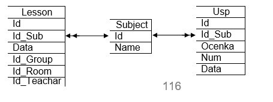

# Лекция 9. Вложенные запросы

## 9.1.	Вложенные запросы

Подзапрос (вложенный запрос) — это запрос, содержащийся в выражении предложения WHERE или HAVING другого запроса с  
целью определения дополнительных ограничений на выводимые данные. Подзапрос в содержащем его запросе используют для  наложения условий на выводимые данные. Подзапросы могут использоваться с операторами SELECT, INSERT, UPDATE или DELETE.
Подзапросы используются для размещения в запросах условий, точные данные для которых неизвестны, тем самым расширяя возможности и гибкость SQL.

Чтобы оценить внешний запрос, SQL сначала должен оценить вложенный запрос внутри предложения WHERE.
Пример. Пусть существует таблица `USP (Id, Id_Stud, Ocenka, Id_Sub, Date)`, известна фамилия студента («Петров»), но неизвестно значение поля Id_Stud (внешний ключ таблицы USP) для него. Чтобы извлечь данные обо всех оценках этого студента, можно записать следующий запрос:

```sql
SELECT * FROM Usp WHERE Id_Stud = (SELECT Id FROM Student WHERE Name = 'Петров')
```
Как работает запрос SQL со связанным подзапросом?

1.	Выбирается строка из таблицы USP, имя которой указано во внешнем запросе.
2.	Выполняется подзапрос и полученное значение применяется для анализа этой строки в условии предложения WHERE внешнего запроса.
3.	По результату оценки этого условия принимается решение о включении или невключении строки в состав выходных данных.
4.	Процедура повторяется для следующей строки таблицы внешнего запроса.

Приведенный выше запрос корректен только в том случае, если в результате выполнения указанного в скобках подзапроса возвращается единственное значение. Если в результате выполнения подзапроса будет возвращено несколько значений, то этот подзапрос будет ошибочным. В данном примере это произойдет, если в таблице STUDENT будет несколько записей со значениями поля Name = 'Петров'.

Таким образом, необходимо чтобы для операторов отношения (>, <, >=, <=, < >) подзапрос возвращал одно и только одно значение. Если в результате выполнения подзапроса получается несколько значений, то это делает невозможной оценку предиката основного запроса на предмет истинности или ложности, что приводит к оценке запроса как ошибочного.
В некоторых случаях для гарантии получения единственного значения в результате выполнения подзапроса используется DISTINCT.
Правила при составлении подзапросов:

1.	Подзапрос необходимо заключить в круглые скобки.
2.	Подзапрос может ссылаться только на один столбец в выражении своего ключевого слова SELECT, за исключением случаев, когда в главном запросе используется сравнение с несколькими столбцами из подзапроса.
3.	Предложение ORDER BY нельзя использовать в подзапросе. В подзапросе можно использовать GROUP BY.
4.	Подзапрос, возвращающий несколько строк данных, можно использовать только в операторах, допускающих множество значений, например в IN.
5.	В списке ключевого слова SELECT не допускаются ссылки на значения типа BLOB, ARRAY, CLOB или NCLOB.
6.	Подзапрос нельзя непосредственно использовать как аргумент допускающий множество значений функции.
7.	Операцию BETWEEN по отношению к подзапросу использовать нельзя, но ее можно использовать в самом подзапросе.

Предикаты с подзапросами являются необратимыми, то есть условия, включающие подзапросы, используют конструкцию следующего вида: `<выражение> <оператор> <подзапрос>`, и не в коем случае не `<подзапрос> <оператор> <выражение>`, или `<подзапрос> <оператор> <подзапрос>`.

-	Оператор IN (в отличии от операторов BETWEEN, LIKE, IS NULL) широко применяется в подзапросах. IN определяет набор значений, которые тестируются на совпадения с другими значениями для определения истинности предиката. Когда используется IN с подзапросом, SQL просто формирует этот набор из вывода подзапроса.

```sql
--Пример.	Выбрать	данные	обо	всех	оценках	(таблица	USP) студентов из Харькова: 
SELECT * FROM Usp
WHERE Id_Stud IN
(SELECT Id
FROM Student
WHERE City = ' Харьков')
```

1. В любой ситуации, когда применяется оператор равенства (=), предпочтительнее использовать IN. В отличии от запроса с оператором равенства (=), IN не может заставить запрос потерпеть неудачу, если подзапросом выбрано больше чем одно значение.
2.	Команда SELECT * … не может использоваться в подзапросе.
3.	Одним из видов функций, которые автоматически всегда выдают в результате единственное значение для любого количества строк, являются агрегатные функции.
Пример. Выбрать данные обо всех оценках студентов, значения которых выше средней оценки (это запрос со связанным подзапросом):
```sql
SELECT *	FROM Usp
WHERE Ocenka > (SELECT AVG(Ocenka) FROM Usp)
```
4. Подзапросы можно применять при использовании предложения
GROUP BY внутри предложения HAVING.
Пример. Требуется определить количество предметов обучения, сданных студентами с оценкой, превышающей среднее значение оценки студента с номером внешнего ключа 301 (запрос со связанным подзапросом):

```sql
SELECT COUNT(DISTINCT Id_Sub), Ocenka FROM Usp
GROUP BY Ocenka
HAVING Ocenka > (SELECT AVG(Ocenka )
FROM Usp
WHERE Id_Stud = 301);
```
Иной вариант решения задачи

```sql
SELECT COUNT(DISTINCT Id_Sub), Ocenka FROM Usp
WHERE Ocenka > (SELECT AVG( Ocenka )
FROM Usp
WHERE Id_Stud = 301)
GROUP BY OCENKA
```

## 9.2.	Формирование связанных подзапросов

Связанный (соотнесенный, коррелированный) подзапрос — это подзапрос, зависящий от информации, предоставляемой главным запросом. Когда в SQL используются подзапросы, во внутреннем запросе можно ссылаться на таблицу, имя которой указано в предложении FROM внешнего запроса, тем самым формируя связанный подзапрос (или соотнесенный подзапрос - correlated subquery). 

В этом случае подзапрос выполняется повторно, по одному разу для каждой строки таблицы из основного запроса. Связанные подзапросы относятся, из- за сложности их оценок, к числу наиболее тонких понятий в SQL. Однако, связанные подзапросы – весьма мощное средство, выполняющее очень сложные функции при достаточно компактных командах.
Пример. Выбрать сведения обо всех предметах обучения, по которым проводился экзамен 20 января 2010 г. В таблице USP есть сведения об оценках и датах экзаменов, в таблице LESSON – сведения обо всех занятиях и экзаменах.



```sql
SELECT *	FROM Lesson LE
WHERE '20/01/2010' = 
(SELECT Date FROM Usp
WHERE LE.Id_ Sub = Usp.Id_Sub)
```
Процедура, выполняемая связанным запросом:
1. выбор текущей строки из таблицы LESSON во внешнем запросе,
2.	сохранение	значения	текущей	строки	в	псевдониме	LE,
определенном во FROM внешнего запроса,
3.	выполнение подзапроса, при этом везде, где найден псевдоним из внешнего запроса, используется значение из текущей строки (это называют внешней ссылкой),
4.	оценка предиката внешнего запроса на основе результатов подзапроса,
5.	описанная выше последовательность повторяется для следующей строки из таблицы внешнего запроса, и так до тех пор, пока все строки из таблицы LESSON не будут проверены.
В некоторых СУБД для выполнения этого запроса может потребоваться преобразование значения даты в символьный тип.
Эту же задачу можно решить с помощью операции объединения таблиц.
Можно использовать подзапросы, связывающие таблицу со своей собственной копией.
Пример. Найти все оценки по дисциплинам со значениями, выше средней по этим же дисциплинам.

```sql
SELECT *	FROM Usp U1
WHERE Ocenka > (SELECT AVG(Ocenka)
FROM USP U2
WHERE U2. ID_Sub = U1. ID_Sub)
```

Следует иметь в виду, что реальное время выполнения запроса в большой степени зависит от оптимизатора запросов конкретной СУБД.
Предложение GROUP BY позволяет группировать выводимые запросом записи по значению некоторого поля. Использование предложения HAVING позволяет при выводе осуществлять фильтрацию таких групп.


Предикат предложения HAVING оценивается не для каждой строки результата, а для каждой группы выходных записей, сформированной предложением GROUP BY внешнего запроса.
Пример. Необходимо по данным из таблицы USP `(Id, Id_Stud, Ocenka, Id_Sub, Date - дата экзамена)` определить сумму полученных студентами оценок (поле OCENKA), сгруппировав значения оценок по датам экзаменов (DATE) и исключив те дни, когда число студентов, сдававших в течение дня экзамены, было меньше 10.

```sql
SELECT Date, SUM(Ocenka) FROM Usp U1 GROUP BY Date
HAVING 10 < (SELECT COUNT(Ocenka)
FROM Usp U2
WHERE U1. Date = U2. Date)
```

Подзапрос вычисляет количество строк с одной и той же датой, совпадающей с датой, для которой сформирована очередная группа основного запроса.
Связанные подзапросы по своей сути близки к соединениям (JOIN) – обе конструкции включают проверку каждой записи одной таблицы с каждой записью другой или с псевдонимом из той же таблицы, при этом большинство операций у них похожи.

**Контрольные вопросы**

1.	Определение подзапроса.
2.	Основные правила при составлении подзапросов?
3.	Определение и особенности работы со связанным подзапросом.