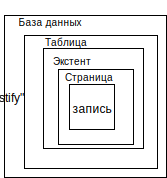

---
title: "Лекция 11. Представления и индексы"
layout: bookpage
lang: ru
navigation_weight: 11
--- 

# Лекция 11. Представления и индексы

## 11.1 Представления

Представление (view) это объект СУБД, который является именованным запросом на выборку, то есть именованным SQL- оператором SELECT. Представление не хранит данные, а только их представляет. Пользователь воспринимает представление как некоторое виртуальное отношение (виртуальную таблицу). Представление это табличный подзапрос, представление содержится в таблицах схемы и вызывается каждый раз при его применении.

Пример. Пусть имеется отношение Student

```sql 
(Id, Name, Enter_Year, Age, Id_Group, Average_Mark).
``` 

Создать представление, скрывающее информацию о годе поступления (атрибут Enter_Year) и о возрасте (атрибут Age), а также изменяющее имена некоторых атрибутов.


```sql

CREATE VIEW SPISOK (Id, Name, Group, Sr_Ball)

```

```sql

AS    SELECT    Id,    Name,    Id_Group,    Average_Mark    FROM
STUDENT

```

Теперь в БД существует представление с именем SPISOK, которое можно использовать в командах так же, как и любую другую таблицу БД. Эта таблица может быть запрошена, модифицирована, вставлена в, удалена из, и соединена с, другими таблицами и представлениями. Запрос такого представления имеет вид:
```sql
SELECT * FROM SPISOK
```
Механизм представлений позволяет:

1. скрыть несущественные или нежелательные детали БД для разных пользователей,
2. обеспечить повышенную производительность БД при частом использовании одного и того же оператора SELECT,
3. модифицировать реальные структуры данных в удобном для приложения виде (например, при росте или реструктуризации БД) (фактически команды модификации перенаправляются к базовой таблице),
4. поддерживать старую структуру БД (структура БД изменена, а старое программное обеспечение не изменено) – функциональность старой БД остается, а структура БД расширяется новыми модулями,
5. разграничивать права доступа к данным,
6. просматривать одни и те же данные разным пользователям в разных вариантах в одно и тоже время,
7. ограничивать объемы данных для удобства работы с БД,
8. после создания представления использовать его в запросах наравне с таблицами,
9. на    основе    представлений    можно    создавать    новые представления.
Синтаксис команды создания представление имеет следующий
вид:
```sql
CREATE VIEW < имя_представления > [(< список_столбцов >)] [WITH [ENCRYPTHION] [, SCHEMABINDING]]
AS < SQL-запрос > [WITH CHECK OPTION]
```
Если список_столбцов при описании представления не указан, то в представление войдут все столбцы из запроса, на основе которых оно создано, с соответствующими именами.

С помощью опции ENCRYPTHION выполняется шифрование представления – недоступны возможности просмотра и редактирования представления, но его можно выполнять и удалить.

С помощью опции SCHEMABINDING выполняется связывание представления со схемой БД, т. е. эта связь определяет от каких объектов (таблиц или других представлений) зависит рассматриваемое представление. Наличие опции SCHEMABINDING позволяет воспрепятствовать внесению изменений (с помощью операторов CREATE, ALTER или DROP) в объекты, от которых зависит представление. Создание индексированного представления возможно только при наличии опции SCHEMABINDING.

Конструкция WITH CHECK OPTION определяет, что модификация или вставка данных с помощью такого представления осуществляется, только если вставляемая строка соответствует критериям конструкции WHERE оператора SELECT представления.Оператор AS в стандарте SQL-92 позволяет давать имена результатам выполнения выражений подзапросов и использовать их. Таким образом, представление можно считать постоянным табличным подзапросом, сохраняемым в схеме БД и вызываемым по имени (таблица 11.1). 

Таблица 11.1 – Список объектов БД и их свойства в запросе

| Объектов БД   | Физическое существование | Доступ со стороны пользователя |
|---------------|--------------------------|--------------------------------|
| Таблица       | да                       | да                             |
| Представление | нет                      | да                             |
| Индекс        | да                       | нет                            |
| Домен         | нет                      | нет                            |

Особенности работы с представлениями:

1. Запрос, на котором основано представление, выполняется всякий раз, когда представление участвует в какой-либо команде. Представление будет модифицировано автоматически всякий раз, когда таблица, лежащая в его основе, изменяется. Представление “собирает в себя” выбранную по условию версию данных, к которым в нем осуществляется доступ.

2. В представлении можно использовать вычислимые поля, группировки, подзапросы (в том числе и соотнесенные), однако при этом следует учитывать ограничения, отражающие природу представления.Пример. Если изменять имена атрибутов в представлении не требуется, то команда создания такого представления будет иметь вид:
	
	```sql
	CREATE VIEW SPISOK_1
	AS    SELECT    Id,    Name,    Id_Group,    Average_Mark    FROM
	STUDENT
	```
	Представление,    содержащее    информацию    о    студентах    со средним баллом больше-равно 4 имеет вид:

	```sql
	CREATE VIEW SPISOK_AVR_4
	AS    SELECT    Id,    Id_Group,    Name,    Average_Mark    FROM STUDENT
	WHERE Average_Mark >= 4
	```

	Желательно, чтобы те поля, которые участвуют в предикате представления, были включены и в состав выводимых полей, даже если они содержат одинаковые значения. Иначе с помощью представления нельзя будет организовать вставку значений в поле Average_Mark.

3. 	С помощью представлений никогда не удастся добиться такого же быстродействия, как при непосредственном вызове на выполнение оператора SELECT, лежащего в основе этого представления.

4. Представление (посредством его имени) можно использовать в командах – запрашивать (SELECT), изменять (UPDATE), вставлять в него записи (INSERT), удалять из БД (DELETE), соединять с другим таблицами и представлениями. Существуют ограничения на операции модификации (UPDATE, INSERT, DELETE), которые зависят от вида представления. Фактически команды модификации представления перенаправляются к базовой таблице БД. Вносимое в модифицируемое представление изменение должно однозначно вноситься и в базовую таблицу.

	Пример. Модификация информации в БД с помощью представления:

	```sql
	UPDATE SPISOK_1
	SET NAME = ’СИДОРОВА’ WHERE Id=32
	```
	Модифицируемое представление должно содержать первичный ключ таблицы – должна быть абсолютная уверенность, что каждая строка обновляемого представления отображается в одну строку базовой таблицы.

	Существует два типа представлений:
	-  модифицируемое (обновляемое) - если команды модификации могут выполняться в представлении;
	-  предназначенное только для чтения при запросе - если в представлении может выполняться только команда SELECT.
	Чтобы обеспечить вставку данных (операторы INSERT) с помощью представления достаточно обеспечить, чтобы этим представлением были охвачены все столбцы без ограничений:
	-  значения по умолчанию,
	-  наличие NULL–значений.

	Критерии, по которым определяют, является ли представление модифицируемым:

	1. необходимо, чтобы представление основывалось только на одной базовой таблице,
	2. представление должно содержать первичный ключ базовой таблицы,
	3. представление не должно иметь никаких полей, которые бы являлись агрегатными функциями,
	4. представление не должно содержать запросов с DISTINCT в своем определении,
	5. представление не должно использовать GROUP BY или HAVING в своем определении,
	6. желательно, чтобы представление не использовало в своем определении подзапросы,
	7. представление может быть использовано в другом представлении, но это представление должно быть также модифицируемым,
	8. представление не должно использовать константы, строки или выражения значений среди выбранных полей вывода,
	9. для команды INSERT представление должно содержать любые поля основной таблицы, которые имеют ограничение NOT NULL, если другое ограничение по умолчанию не определено.

	Таким образом, модифицируемые представления фактически подобны фрагментам базовых таблиц, отображая определенную часть их содержимого.

	Представления – “только для чтения”, с другой стороны, позволяют получать и форматировать данные более рационально – избегать сложных предикатов и снижать вероятность ошибок.

5. Упорядочивание данных в представлении выполняется с помощью предложения ORDER BY запроса, на котором основано представление.

6. Представление может быть основано на нескольких базовых таблицах.
7. Вычисление представления производится каждый раз при его использовании, любые изменения в данных таблиц БД адекватно отобразятся в представлении – в этом его отличие от запроса к БД.
8. Механизм представлений реализуется непосредственно на базовых отношениях и хранится в виде функции.
9. Материализация представлений осуществляется  при реализации соответствующих действий пользователя, до этого момента материализованных данных представления в БД не хранится. Материализация означает, что при ссылке на имя представления СУБД находит его определение в таблицах схемы и создает рабочую таблицу соответствующего имени со столбцами соответствующих типов данных и соответствующими именами. Затем эта новая таблица заполняется результатами работы оператора SELECT, находящегося в теле определения представления.
10. Для внесения изменений в определение представления используют два способа:

	-  с помощью оператора ALTER VIEW, при этом предполагается, что рассматриваемое представление уже существует (выполняется полная замена существующего представления, сохраняются все права на использование представления),
	-  уничтожение представления (DROP VIEW <имя_представления>) и его повторное создание с помощью оператора CREATE VIEW.
	При удалении представления нет необходимости удаления всех данных из представления, потому что реальные данные в нем не содержатся. Для удаления представления пользователь должен являться его владельцем.
	
11. Для получения информации о различных объектах БД используют представления информационной схемы и представления каталогов.

## 11.2 Индексы 


# 11.2.1 Особенности хранения данных на MS SQL-сервере

Данные в реляционной БД хранятся в таблицах, которые в свою очередь состоят из строк определенной структуры. Последовательность строк, с логической точки зрения, представляется непрерывной, хотя с точки зрения реляционной модели, сами по себе записи в отношении не упорядочены.

С точки зрения физического хранения данных для MS SQL– сервера, строки таблиц привязаны к конкретным областям диска фиксированного размера – страницам.Страница – это блок фиксированной длины непрерывных виртуальных адресов памяти, который участвует в операциях чтения и записи как единое целое, то есть требует только одного перемещения головки диска для выполнения этих операций. В MS SQL–сервере размер страницы равен 8 Кбайт (8192 байт). Количество строк в странице может варьироваться в зависимости от их размера. Страница может рассматриваться как контейнер для хранения строк таблиц и индексов. Одна строка не может быть разделена между двумя страницами.

Страница состоит из следующих компонентов:
- заголовка страницы (page header) (96 байт)
- самих данных, - указателей смещения строк (row offset), которые необходимы для определения в странице позиции, с которой начинаются данные конкретной строки,
- двух указателей на предыдущую и последующую страницы
(страницы данных образуют двухсвязный список).

Разновидности страниц базы данных:

-  страницы данных (Data Pages) – используются для хранения реальных данных таблиц (кроме BLOB-данных);
-  страницы индекса (Index Pages) - используются для хранения страниц разных уровней В-дерева, используемого для хранения данных индекса (индексная страница (узел В-дерева) содержит упорядоченный список всех значений индексированного столбца (они называются ключевыми значениями) вместе с указателем местоположения каждой записи, содержащей это значение в таблице);
-  BLOB-страницы (Binari Large Object) – предназначены для хранения больших бинарных объектов;
-  карты размещения страниц (таблицы распределения) (Global и Shared Global Allocation Map - GAM и SGAM) – используются для определения свободных и используемых страниц и экстентов БД;
-  страницы свободного пространства (Page Free Space – PFS);
-  карты (таблицы) размещения индексов (Index Allocation Map – IAM) – содержат сведения об экстентах файла БД, используемых таблицами кучи или индексами, используется для навигации по куче
-  таблица массовых изменений,
-  таблица дифференциальных изменений. Страницы объединяются в экстенты.

Экстент – это единица памяти, которую сервер выделяет по мере необходимости как единое целое при размещении на диске данных таблицы или индекса (рисунок 11.1). Экстент означает пространство, используемое для хранения реальной информации внутри физического пространства, выделенного под БД в целом. В MS SQL– сервере 2005 экстент состоит из 8 смежных страниц данных (64 Кбайта). В MS SQL–сервере при создании таблицы изначально не выделяется ни одной страницы, они выделяются только при вставке в таблицу новых строк.

Особенности работы с экстентами:
-  после заполнения экстента при вставке новой записи выделяется новый экстент,
-  благодаря предварительному выделению памяти сервер экономит время,
-  экстенты таблицы не размещаются физически один за другим в файле БД, они разбросаны, поэтому доступ к данным кучи будет выполняться медленно,
-  общий объем неиспользуемой части экстентов обычно не велик, но он может возрастать особенно при высокой степени дефрагментации данных,
-  экстенты блокируются только во время выделения нового либо освобождения старого экстента.




Рисунок 11.1 – Укрупненная структура расположения данных в БД (по умолчанию БД имеет два файла – физический файл БД (\*.mdf), - файл журнала (\*.ldf))

В зависимости от способа хранения различают два типа таблиц: таблицы кучи и кластерные таблицы. Тип, к которому принадлежит таблица, зависит от того, имеется ли у этой таблицы кластерный индекс или нет.

Таблицы кучи – это таблицы, расположенные в куче, которая представляет собой набор страниц данных, выделяемых по мере надобности для таблиц, не имеющих кластерного индекса, а также  для самих индексов. Строки таблицы кучи не имеют какого-либо конкретного порядка, и страницы данных, принадлежащие одной таблице, также никак не упорядочены и не связаны в список. Для вставки новой строки в таблицу в адресном пространстве выделяется следующий экстент данных, если пространство на уже выделенных страницах заполнено. Доступ к конкретной строке осуществляется путем полного сканирования таблицы.

Кластерные таблицы – это таблицы, которые имеют кластерный индекс. Кластерный индекс – это такой индекс, в котором логический порядок ключевых значений определяет физический порядок соответствующих строк в таблице. Кластерный индекс у таблицы может быть только один, и его наличие приводит к тому, что строки таблицы хранятся на диске в строго определенном порядке – упорядочены по возрастанию (или по убыванию).


Заголовок страницы данных кластерной таблицы  (рисунок 11.2) включает в себя идентификатор таблицы, которой принадлежит страница, а также указатели на следующую и предыдущую страницы. Остальную часть страницы заполняют строки данных.

Рисунок 11.2 – Двусвязный список для организации страниц данных кластерной
таблицы на SQL-сервере


При вставке новой строки в кластерную таблицу, если в нужной странице нет свободного места, происходит *расщепление* (*разбиение*) страницы. Суть процесса расщепления состоит в перемещении половины строк из полностью заполненной страницы во вновь выделенную страницу таким образом, что вместо одной полностью заполненной страницы появляются две, заполненные почти наполовину. Так появляется место для новой строки с сохранением физического порядка сортировки.Доступ к конкретной строке кластерной таблицы осуществляется по алгоритму поиска в сбалансированном дереве по значению ключа, уникальному для каждой строки таблицы.


 Существуют следующие основные методы доступа к данным БД:

 1. сканирование таблицы (последовательный доступ) – последовательное чтение всех строк таблицы в том порядке, в котором они записаны в место их физического хранения, за раз считывается одна страница данных;
 2. доступ посредством индексов (индекс обычно имеет структуру В-дерева или инвертированную структуру файла) – индекс позволяет возвращать по одной строке таблицы за раз;
 3. доступ посредством хешированных индексов – такой индекс делит данные на области с одинаковым значением функции хеширования;
 4. доступ посредством битовых векторных индексов – конкретное значение конкретного атрибута (ключ) представляется в виде одного бита в векторе (маске) или в массиве (битовые индексы появились в Oracle 8.0).

 Методы доступа 3 и 4 используются только в Oracle.

### 11.2.2 Определение индекса и его структура

Существует два существенно различающихся способа извлечения данных посредством запроса из БД в MS SQL–сервере:

1. путем табличного сканирования (путем последовательного сканирования строк, страниц и экстентов таблицы (или таблиц) БД);
2. при помощи индекса.

Какой из способов будет автоматически использован сервером для конкретного запроса зависит от:

- доступных на текущий момент индексов,
- от запрашиваемых в запросе столбцов,
- от типа объединений таблиц, которые используются в запросе,
- от физического размера используемых в запросе таблиц.

Пусть в таблице Student отсутствуют индексы и значит таблица размещена в куче. Как будет реализована эта выборка? Единственным способом реализации этого запроса является табличное сканирование – т. е. при поиске данных из диапазона данных (5.0 >avg_mark> 4.5) сервер должен обратиться к каждой строке каждой страницы каждого экстента таблицы данных Student для поиска каждого конкретного значения из диапазона поПусть требуется вывести список студентов, у которых средний был выше 4,5: SELECT name FROM Student WHERE avg_mark > 4.5;

Табличное сканирование может существенно замедлить работу системы, однако не всегда. Если таблица очень маленькая (занимает около одного экстента), то табличное сканирование может работать быстрее, чем индексированный доступ. Если создается индекс в маленькой таблице, то серверу придется считать индексные страницы, и только после этого считать страницы данных. В данной ситуации быстрее просто сканировать таблицу.

Таким образом, маленькие таблицы предпочтительней делать кучами. Однако в больших таблицах следует избегать сканирования и использовать индексы.

Естественно, что проще было бы выполнить данную выборку из диапазона, если бы данные в таблице Student были бы отсортированы или имелась бы информация о номерах строк (о первичных ключах строк) в порядке возрастания (убывания) значений в поле avg_mark. Эта информация и содержится в объектах БД – индексах.

Индексы – это внутренние объекты СУБД, которые ускоряют процесс обработки данных (выборки, вставки, изменения и удаления). Индекс – упорядоченный список значений полей или значений групп полей в таблице. Когда создается индекс в поле, БД запоминает соответствующий порядок всех значений этого поля в области памяти. Оптимизатор сервера для ускорения доступа к данным автоматически применяет индексы.

Индекс хранит информацию о порядке следования записей, относительно поля avg_mark, что может привести к ускорению выполнения оператора SELECT. Когда требуется выполнить  операцию выборки из БД данных с использованием сортировки, то эта информация из индекса автоматически подключается сервером к процессу извлечения данных.

Пример. Показан фрагмент таблицы Student с полями id – ключевое поле (созданный сервером кластерный индекс), avg_mark - средний балл и таблица с индексами поля avg_mark по возрастанию (некластерный индекс).


В SQL-сервере могут существовать индексы двух типов:

- *кластерные (кластеризованные) индексы* – аналогом такого индекса является словарь, если кластерный индекс будет создан для столбца "Фамилия", то физически запись со значением Иванов в поле "Фамилия" всегда будет стоять   перед записью со значением Петров;
- *некластерные (некластеризованные) индексы* – аналогом такого индекса является предметный указатель в книге, в котором, например, имеется раздел И, в котором есть ссылка на страницы, где упоминается фамилия Иванов.

Кластерный и некластерный индексы реализуются посредством структуры данных В-дерева (balanced tree – сбалансированное дерево).

Между типами индексов имеются существенные различия:

-  c точки зрения физической реализации индексов,
-  с точки зрения числа индексов на таблицу БД – кластерный индекс всегда один на базовую таблицу, а некластерных индексов может быть несколько на таблицу,
-  с точки зрения выполнения различных операций в БД с использованием индексов.

## Кластерные индексы

При определении для таблицы с данными кластерного индекса серверу фактически отдается команда физически отсортировать данные по возрастанию (или убыванию) в порядке индекса (по полю, для которого создан кластерный индекс). При вставке (модификации) данных в таблицу с кластерным индексом запись будет вставляться с учетом поддержки упорядоченности по полю, для которого построен кластерный индекс. Поэтому у любой таблицы может быть только один кластерный индекс.

На уровне листа В-дерева кластерного индекса страницы данных, предназначенные для хранения индексной информации,
физически совпадают со страницами данных базовой таблицы, для которой этот индекс создан.

Средний размер кластерного индекса составляет около 5% от размера таблицы, но может варьироваться в зависимости от размера индексируемого столбца.

В кластерном индексе данные на уровне листа физически отсортированы.

Пусть требуется выполнить запрос – выборка диапазона – SELECT name FROM Student WHERE avg_mark >= 4.5;

Пусть в таблице Student по полю avg_mark создан кластерный индекс. Выборка запроса будет выполнена следующим образом.

Выполняется проход по В-дереву кластерного индекса (от корневой страницы через промежуточные к листовой странице) для поиска значения ключа кластеризации 4,5. Так как страницы данных листового уровня индекса представляют собой двухсвязный список, то далее выполняется проход по списку в порядке возрастания значения поля avg_mark до равенства значению конца диапазона 5,0 (а точнее пока указатель не станет равным Null в данном запросе).

Кластерный индекс является идеальным выбором для столбцов:

-  в которых постоянно выполняется поиск диапазонов данных,
-  с низкой селективностью (низкая селективность значений столбца означает, что в столбце много одинаковых записей – много, например, значений 4,6 в поле “Средний балл”)

Проблемы возникают при модификации данных в поле с кластерным индексом (команды INSERT, UPDATE, DELETE), так при этом сервер должен физически перекомпоновывать данные для их соответствия параметрам кластерного индекса. Для необходимости перекомпоновки сервер оставляет немного свободного места в конце каждой страницы данных с кластерным индексом. Это пустое пространство регулируется параметром FILLFACTOR - фактором заполнения.

Фактор заполнения задается при создании кластерного индекса  и позже может быть изменен. Чем выше фактор заполнения, тем меньше свободного места он выделяет и наоборот. Если фактор заполнения равен 100%, то это означает, что страница данных заполнена на 100%, но еще есть место для одной записи.

Когда требуется вставить данные в полностью заполненную страницу, сервер выполняет разбиение страниц (рисунок 11.3). Это означает, что сервер перемещает примерно половину данных с заполненной страницы на пустую, создавая таким образом две наполовину заполненные страницы. Так как физически новая  страница может находиться в любом месте файла базы данных, а страницы данных таблицы с кластерным индексом должны образовывать двухсвязный список, то далее у трех страниц данных


Рисунок 11.3 – Процесс разбиения (расщепления) страницы кластерного индекса

должны быть обновлены указатели на предыдущую и последующую страницы. Кроме этого еще необходимо произвести вставку в В- дерево кластерного индекса, что приведет к перестройке В-дерева

В БД, где данные используются исключительно для чтения, например, в среде поддержки принятия решений, можно использовать высокий фактор заполнения (меньше свободного места). Высокий фактор заполнения будет гарантировать, что данные считываются из меньшего количества страниц файла БД, что повысит производительность команды SELECT.

Низкий фактор заполнения следует использовать в БД с большими потоками команд INSERT, UPDATE, DELETE. Более низкий фактор заполнения обеспечит меньшее число разбиений страниц и повысит производительность команд INSERT, UPDATE, DELETE.

## Некластерные индексы

Некластерный индекс также реализуется посредством В-дерева. Между двумя типами индексов существуют следующие отличия:

1. листовой уровень некластерного индекса содержит не реальные данные, а только указатели на страницы данных,
2. некластерный индекс не перемещает физически данные таблицы БД. (Все это похоже на разницу между словарем (кластерный индекс) и указателем в конце книги (некластерный индекс).)

Существует два вида реализации некластерного индекса:

-  некластерный индекс основанный на куче (если в таблице изначально нет кластерного индекса по другому полю таблицы) 

– вставка данных в таблицу с некластерным индексом происходит в очередную свободную строку последней страницы и потом происходит обновление указателей индекса,

-  некластерный индекс основанный  на  кластерном  индексе (если в таблице есть кластерный индекс) – при вставка данных в такую таблицу сервер физически помещает данные в соответствии с кластерным индексом с и потом обновляет ключевое значение некластерного индекса для указания на ключевое значение кластерного индекса.

Если в таблице выполняется поиск одного значения с применением некластерного индекса, то сервер обратится к индексу один раз, поскольку листовой уровень индекса приведет прямо к данным. Если же выполняется поиск диапазона значений, то сервер будет постоянно ссылаться на индекс в поисках ключевого значения для каждой записи диапазона. Это означает, что следует использовать некластерный индекс в столбцах, в которых редко выполняется поиск диапазонов данных, или в столбцах с высокой селективностью (с небольшим числом дублирующихся записей).


Различия между кластерным и некластерным индексами приведены в таблице 11.2.

Таблица 11.2 – Различия между кластерным и некластерным
индексами


| Кластерный индекс                                                                      | Некластерный индекс                                                                    |
|----------------------------------------------------------------------------------------|----------------------------------------------------------------------------------------|
| Только 1 на таблицу                                                                    | До 249 индексов на таблицу                                                             |
| Физически перестраивает данные в таблице согласно ограничениям индекса                 | Создает отдельный список ключевых значений с указателями на данные страницы            |
| Используется в столбцах, где часто выполняется поиск диапазонов данных                 | Используется в столбцах, где выполняется поиск отдельных значений                      |
| Используется в столбцах с низкой селективностью (высокое число дублированных значений) | Используется в столбцах с высокой селективностью (низкое число дублированных значений) |

Достоинство индексов 

1. Ускорение операции поиска.
2. Ускорение операции сортировки.
3. Ускорение    фазы    поиска    при    удалении,    вставке    и модификации.

Индексация позволяет находить содержащий индексированную строку блок данных, выполняя небольшое число обращений к внешнему устройству.

Недостатки индексов.

1. Для хранения индексов требуется дополнительная память.
2. При операциях вставки, модификации и удаления требуется перестройка данных (в случае кластерного индекса) и индексов.

Управление индексом существенно замедляет время выполнения операций, связанных с обновлением данных (таких, как INSERT, UPDATE и DELETE), так как эти операции требуют перестройки индексов.

Индексы можно создавать как по одному, так и по множеству полей.

SQL Server сам решает, когда индекс необходим для работы и использует его автоматически.

<<<<<<< HEAD

=======
>>>>>>> 748019316c835bbb7f06c7e495cf89414c73b0b3
### 11.2.3 Создание индекса на MS SQL-сервере

Методы создания индексов в MS SQL-сервере:

1. с    помощью    утилиты    SQL    Sever    Management    Studio    – визуальное средство;
2. с помощью функции Database Tuning Advisor (данная функция входит в утилиту SQL Profiler, которая выполняет мониторинг SQL Sever 2005) – визуальное средство;
3. с помощью команды Create языка SQL– визуальные средства являются только оболочкой для команд SQL;
4. неявное создание индекса как обязательного объекта в результате ввода в действие некоторого ограничения (Primary Key, Unique).

При этом таблица должна быть уже создана и содержать столбцы, имена которых указаны в команде создания индекса. Имя индекса, определенное в команде, должно быть уникальным в базе данных.

Будучи однажды созданным, индекс является невидимым для пользователя, все операции с ним осуществляет СУБД автоматически.

Оператор CREATE INDEX создает на указанной таблице или представлении индекс, основанный на заданных столбцах. Синтаксис команды создания индекса имеет следующий вид:

```sql
CREATE [UNIQUE] [CLUSTERED | NONCLUSTERED]
INDEX <index_name> ON <table or view name> (<column name> [ASC | DESC] [, … n]) INCLUDE (<column name> [, -n])
[WITH
[PAD_INDEX = {ON | OFF}]
[[,] FILLFACTOR = <коэффициент заполнения> ] [[,] IGNORE_DUP_KEY = {ON | OFF}]
[[,] DROP_EXISTING = {ON | OFF}]
[[,] STATISTICS_NORECOMPUTE = {ON | OFF}] [[,] SORT_IN_TEMPDB = {ON | OFF}]
[[,] ONLINE = {ON | OFF}]
[[,] ALLOW_ROW_LOCKS = {ON | OFF}] [[,] ALLOW_PAGE_LOCKS = {ON | OFF}]
[[,] MAXDOP = <maximum degree of parallelism>
]
[ON {<filegroup>|<partition scheme name>|DEFAULT}]
```
Эта команда создает индекс с именем index_name для указанной таблицы table или представления view по перечисленным в параметре column столбцам. Индекс не является автономным объектом, он относится к некоторому столбцу (столбцам) таблицы или представления.

Обязательной    является    только    конструкция
```sql
CREATE    INDEX
<index_name> ON <table or view name>(<column name>)
```
а все остальные конструкции, которые следуют за ней, являются необязательными.Параметры команды создания индекса имеют следующий смысл. 

UNIQUE – говорит о том, что задается индекс, реализующий ограничение уникальности для своих столбцов, которое означает, что данные в этих столбцах не могут повторяться (по умолчанию индексы не являются уникальными).

CLUSTERED – создается кластерный индекс

NONCLUSTERED – создается некластерный индекс (значение по умолчанию).

ASC (сокращение от ascending) – создает индекс в порядке возрастания и это значение установлено по умолчанию, а DESC – в порядке убывания.

INCLUDE – для обеспечения лучшей поддержки “охваченных” запросов (запрос рассматривается как “охваченный”, если все данные, которые должны быть получены в результате выполнения запроса, полностью представлены в используемом индексе). При применении INCLUDE сервер переносит содержимое указанных столбцов на листовой уровень индекса, что влечет за собой значительное сокращение операций ввода/вывода. Эту опцию имеет смысл применять только при создании некластерных индексов, так как кластерные индексы уже содержат данные на листовом уровне. Отрицательные последствия применения опции INCLUDE – увеличение размеров строк индекса листового уровня. В результате может оказаться, что попытка ускорить выполнение одного запроса приведет к снижению быстродействия при выполнении других запросов.

WITH – данная опция применяется для передачи СУБД указания на то, что за ней последует одна или несколько дополнительных опций.

PAD_INDEX – задает степень заполнения страниц индекса на нелистовом уровне (в процентах) при первоначальном создании индекса (по умолчанию остается место для вставки на уровне страниц индекса двух индексных записей максимальной длины). Если значение PAD_INDEX=ON, то это означает, что значение FILLFACTOR распространяется и на степень заполнения страниц на всех уровнях индекса (если значение PAD_INDEX не определено, то FILLFACTOR применяется только к страницам листа в индексе). Применение параметра PAD_INDEX=ON не имеет смысла, если не задана опция FILLFACTOR.

FILLFACTOR – задает степень заполнения данными страниц на уровне листа (значение по умолчанию FILLFACTOR=0 (означает тоже что и FILLFACTOR=100), что обозначает полное заполнение страниц на уровне листа индекса, но имеется пустое место на индексных страницах верхних уровней). Обычно значение опции FILLFACTOR это любое число от 1 до 100. Это число показывает, насколько полным должно стать заполнение страниц в процентах после завершения создания индекса. При разбиении страниц данные все равно перераспределяются между двумя страницами в равных долях. Это значит, что в процессе эксплуатации БД невозможно постоянно сохранять контроль над тем, в каком процентном отношении заполняются страницы индекса, поэтому при техническом сопровождении индекса необходимо проводить перестройку индекса. Если значение FILLFACTOR не задано, то СУБД полностью заполняет страницы, за вычетом двух строк.

Значение FILLFACTOR=100 означает, что и каждая индексная страница должна быть полностью заполнена при создании индекса. Если кластерный индекс имеет FILLFACTOR=100, то это означает, что при вставке записи всегда будет происходить процесс разбиения страницы (многочисленные разбиения страниц могут уменьшить эффективность работы сервера). Если значении FILLFACTOR слишком мало, то индекс займет неоправданно много места в памяти

Идеальное значение FILLFACTOR=R/W, R – среднее число операций чтения, W - среднее число операций записи, выполняемых для компонентов индекса. FILLFACTOR подбирается экспериментально, R и W могут быть определены статистически при работе с БД с помощью утилиты Performance Monitor.

Рекомендации по выбору фактора заполнения FILLFACTOR:

-  редко изменяемые таблицы (выполняется от 100 до 1 операции чтения на одну операцию записи) FILLFACTOR=100,
- часто изменяемые таблицы (количество операций чтения превышает количество операций записи) FILLFACTOR=50-70,
- промежуточная ситуация FILLFACTOR=80-90.

IGNORE_DUP_KEY – говорит о том, что нужно игнорировать совпадающие значения в столбцах индекса. При наличии опции IGNORE_DUP_KEY при попытке вставить уже имеющееся значение, выдается предупреждение (а не сообщение о критической ошибке), вставка строки не выполняется, но отката транзакции нет.

DROP_EXISTING – перед созданием нового индекса требует удалить существующий индекс с именем, которое совпадает с именем создаваемого индекса. Если в результате перестройки должен быть получен индекс, полностью совпадающий с существующим индексом, то СУБД определяет, что такой некластерный индекс не следует подвергать операции удаления и повторного создания (в отличии от выполнения явных операций удаления индекса, а потом его  создания). Эта опция обеспечивает гораздо более эффективное формирование индекса по сравнению с тем, когда происходит просто удаление и повторное создание существующего индекса, если он используется в сочетании с кластерным индексом.

STATISTICS_NORECOMPUTE – приказывает не перестраивать статистику таблиц после создания индекса. По умолчанию в СУБД предпринимается попытка автоматизировать процесс обновления статистических данных, относящихся к используемым таблицам и индексам. Чтобы отменить эту опцию, необходимо вызвать команду UPDATE STATISTICS. Рекомендуется не использовать эту опцию, так как статистические данные, относящиеся к индексу, используются оптимизатором запросов для определения того, насколько данный индекс способствует повышению производительности выполнения данного конкретного запроса. Отказ от автоматического обновления статистических данных приведет к тому, что оптимизатор запросов будет выбирать способы выполнения запросов на основании устаревшей информации.

SORT_IN_TEMPDB    –    требует        выполнять    сортировку        при создании индекса в базе данных TEMPDB (используется при создании индексов на больших таблицах), применение опции дает эффект, если текущая БД и БД TEMPDB находятся на разных дисковых устройствах. ONLINE – если ONLINE=ON, то принудительно устанавливается такой режим доступа к индексируемой таблице, что эта таблица остается применимой и для общего доступа и не создаются какие- либо блокировки, не позволяющие обращаться к таблице и (или) к индексу.

Но        выполнение            операции    создания        индекса    (при ONLINE=ON)    существенно        снизит    производительность    работы пользователей.            По умолчанию (при ONLINE= OFF) при создании индекса происходит полная блокировка таблицы, при этом индекс формируется намного быстрее, чем при ONLINE=ON.

ALLOW_ROW_LOCKS и ALLOW_PAGE_LOCKS (позволение (или нет) блокировки строки или страницы) – служат для указания на то, что могут ли применяться для создаваемого индекса блокировки на уровне страницы или на уровне строки. Блокировка это своего рода способ резервирования ресурсов, позволяющий предотвратить конфликты между операциями доступа к данным, которые могли бы привести к нарушению целостности данных.

MAXDOP – опция позволяет переопределить значение параметра настройки конфигурации системы, определяющее максимальную степень распараллеливания (Degree Of Parallelism - DOP), которая применяется при формировании индекса. Степень распараллеливания определяет максимальное количество процессов, которые могут быть введены в действие в целях осуществления одной операции в БД – операции формирования индекса.

ON filegroup – указывает, в какой группе файлов нужно физически создать и хранить индекс (по умолчанию - PRIMARY). Удобнее использовать для хранения индексов и страниц данных разные жесткие диски.

Пример. Если таблица EXAM часто используется для поиска оценки конкретного студента по значению поля ID_STUDENT, то следует создать индекс по этому полю.

```sql
CREATE UNIQUE CLUSTERED INDEX IND_STUD ON EXAM (ID_STUDENT ASC)
WITH    PAD_INDEX    =    ON,    FILLFACTOR    =    90, DROP_EXISTING = ON;
```

Создан для поля ID_STUDENT таблицы EXAM уникальный кластерный индекс по возрастанию значений с именем IND_STUD, причем фактор заполнения страниц индекса всех уровней равен 90, если перед созданием данного индекса уже существовал индекс с именем IND_STUD, то он будет предварительно удален.

Удаление индекса происходит в следующих случаях:

-  удаление индексов вследствие изменения структуры таблицы,
-  удаление индексов вследствие создания новых индексов, которые позволяют лучше выполнять запросы.
 Для    удаления    индекса    используется    команда    DROP    INDEX,
имеющая следующий синтаксис:
```sql
DROP INDEX <имя индекса> [, … n];
```
Пример 
```sql
DROP INDEX IND_STUD;
```

С помощью команды DROP INDEX можно удалить один или несколько индексов только текущей БД. При удалении индекса происходит освобождение всех страниц, которые использовались для хранения данных индекса.

С помощью команды DROP INDEX нельзя удалить индексы из системных таблиц, а также индексы, созданные сервером при определении ограничений целостности Primary Key и Unique.

Команда ALTER INDEX используется для сопровождения индексов и не вносит никаких изменений в их структуру.

<<<<<<< HEAD
### 11.2.4 Особенности работы с индексами

=======
#### 11.2.4 Особенности работы с индексами
>>>>>>> 748019316c835bbb7f06c7e495cf89414c73b0b3
1. После того, как был проведен анализ интенсивности использования данных и сделан вывод о том, какие столбцы должны быть проиндексированы, обычно приступают к созданию индексов. Создание индекса может быть выполнено непосредственно, или как часть другой, более сложной операции.
2. Некластерные индексы приносят наибольший выигрыш в быстродействии, когда для индекса характерен высокий уровень селективности (selectivity). Практика показывает, что если уровень уникальности в индексируемом столбце меньше 90-95 %, то использование некластерных индексов вообще нецелесообразно из- за большого числа отдельных физических операций чтения при поиске.
3. Кластерные индексы значительно меньше зависят от селективности, так как, когда сервер доберется до начала требуемого интервала, то независимо от процента уникальных значений, можно непосредственно начать извлекать данные, не прибегая к чтению дополнительных страниц индекса.
4. Очень эффективно индексирование для столбца внешнего ключа при частом использовании операции объединения со слиянием (merge joins). Дело в том, что внешние ключи часто выступают в роли целевых объектов при выполнении объединения с таблицей, на которую они ссылаются. При объединении со слиянием, из каждой таблицы извлекаются строки и затем сравниваются между собой на предмет соответствия критерию объединения. Так как для обоих связанных столбцов существуют индексы в обеих таблицах, то процесс извлечения обеих строк выполняется чрезвычайно быстро.
5. По умолчанию для первичного ключа (ограничение целостности Primary Key) сервер автоматически создает уникальный кластерный (Clustered) индекс (если в таблице уже не существует кластерный индекс). Однако поле первичного ключа может быть не самым лучшим претендентом на роль кластерного индекса. Пользователь может явно указать, что для первичного ключа должен быть создан некластерный индекс (Nonclustered).
	```sql
	CREATE TABLE MyTable (
	Column1 int IDENTITY
	PRIMARY KEY NONCLUSTERED,
	Column2 int
	)
	```
6. Уникальный индекс также автоматически создается приопределении в таблице ограничений целостности Unique \[8 c.1030] (определение альтернативного ключа). Индекс, используемый для обеспечения уникальности столбца или группы столбцов, называется первичным. Индексы, применяемые для ускорения работы запросов в неуникальных столбцах, называются вторичными.
7. Случайные индексы (индексы, создаваемые по случаю) – это индексы, которые создаются после ввода в действие ограничений (Primary Key и Unique). Для этого типа индексов не допускается применение любых опций, кроме \[CLUSTERED \| NONCLUSTERED\] и FILLFACTOR.
8. Индекс любого типа может быть создан в процессе создания таблицы. В команде CREATE TABLE предусмотрены средства, позволяющие выполнить организацию индекса как часть процесса создания таблицы. При этом разрешается создание индекса как для одного, так и для нескольких столбцов. Индекс может быть создан уже после создания таблицы с помощью команды CREATE INDEX, специально предназначенной для этого.
9. После создания кластерного индекса единственный способ его изменить – это выполнить его удаление и потом повторное построение. При этом потребуется операция пересортировки таблицы, которая является очень длительной и требующей много дисковой памяти. Для того чтобы выполнить пересортировку таблицы при изменении кластерного индекса суммарно понадобится в 2,2 раза больше дискового пространства, чем обычно занимает таблица (для одновременного хранения старого индекса, нового индекса, старой таблицы и рабочего пространства для хранения временной информации).
10. Кластерные индексы лучше всего подходят для столбцов, участвующих в запросах:

	-  с выражениями Between либо <, > - ранжированные запросы,
	-  с параметрами Group by либо с агрегатными функциями Min, Max и Count (Кластерные индексы хорошо работают в этих случаях, так как при поиске выполняется переход непосредственно к физическим данным, последовательное чтение которых продолжается до достижения конца интервала.),
	-  с    параметром    Order    by    на    основе    кластерного    ключа
(данные уже физически отсортированы по полю кластерного индекса)
11. Главное противопоказание для создания кластерного индекса – когда будет выполняться большое количество вставок непоследовательных данных.
12. Добавление данных в некластерный индекс на основе кучи обычно выполняется быстрее, чем на основе кластерного ключа.
13. Влияние порядка столбцов в индексе. Индекс будет использован, только если запрос начинается с первого столбца, входящего в индекс. Точное совпадение количества и порядка столбцов в запросе и в индексе не обязательно, но чем больше столбцов совпадает (по порядку), тем лучше.
14. Индекс вообще будет проигнорирован, если первый столбец индекса не упомянут в параметрах Join, Order by и Where– запроса.
15. При сопровождении индекса необходимо учитывать два вопроса:
	-  разбиение страниц,
	-  фрагментацию памяти файла данных БД (высокая фрагментация данных означает медленное чтение информации, но с другой стороны позволяет быстро добавлять новые данные).
16. Кластерные индексы обычно являются более быстрыми, чем некластерные
17. Операция SELECT обычно выигрывает от применения индексов.
18. Если столбец входит в состав выражения, то индекс не используется. Чтобы недопустить использования индекса в столбец включают в ничего не значащее выражение.
	```sql
	SELECT * FROM STUDENT WHERE Id=34+0;
	```
19. Операции INSERT, DELETE и UPDATE (в операции UPDATE используется подход – сначала удаление, а потом вставка) замедляются при наличии индексов – в этих операциях выполняется дополнительная работа – вносятся изменения не только в данные, но и в индекс.
20. Лучше создавать индексы на столбцах, которые имеют целочисленные, а не строковые значения. Совсем неудачно использовать для построения индексов столбцы с типом данных Float или Real (эти типы совершенно не подходят для первичных ключей). Строковые типы данных подходят для индексов, если соответствующие столбцы не велики по размеру, так как с ростом ширины столбца увеличиваются затраты на поддержание индекса. Нельзя строить индексы по типам данных Text и Image.
21. Неудачно использовать для построения индексов столбцы с типом данных bit – SQL-сервер не будет использовать такой индекс для ускорения запроса.

Контрольные вопросы и задания


1. Определение и назначение представления.
2. Каков синтаксис создания (удаления) представления?
3. Каковы особенности работы с представлениями базы данных?
4. Какие    типы    представлений    существуют    и    каковы    их особенности?
5. Каковы особенности хранения данных на MS SQL-сервере?
6. Определение и назначение индекса.
7. Какие виды индексов существуют в MS SQL-сервере?
8. Каковы особенности кластерного индекса?
9. Каковы особенности некластерного индекса?
10. На основании каких структур данных строятся индексы?
11. Каков синтаксис создания (удаления) индексов?
12. Какие параметры может иметь команда создания индекса?
13. Каковы достоинства и недостатки индексов?
