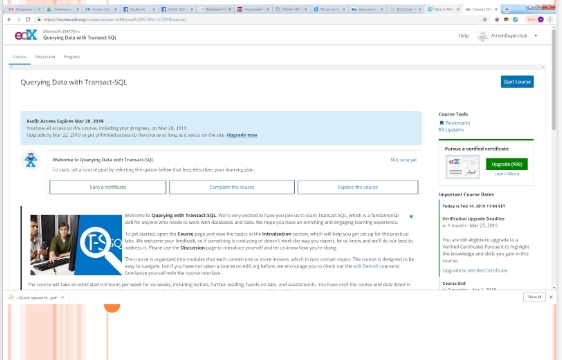
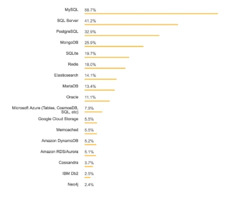
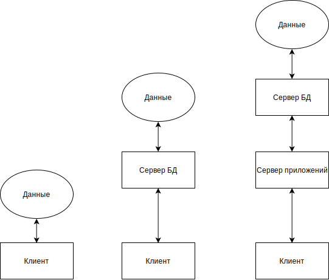

# Лекция 1. Основы использования баз данных

## 1.1. Определения и основные понятия

Курс: 
	Организация баз данных

Лектор: 
	к.т.н. доц. Боярчук Артем 	Владимирович

Контакты:
	Telegram	a.boyarchuk@csn.khai.edu

Калькуляция баллов

8 лабораторных работ (max 5)
Посещение лекций (max 17)
Финальный тест (max 43)

Extra 

1) +5 балла при сдаче всех лабораторных до 01.05.2019

2) +10 баллов при прохождении одного из онлайн-курсов

Option 1: + 10 points (Verified by Developed Course Project)

UDACITY - www.udacity.com 
Course: Intro to Relational Databases (FREE)

Option 2: +10 (verified via Personal classroom) 

EDX - www.edx.org  

Course: Querying Data with Transact-SQL
(FREE mode)

Лекция 1: Введение (Основы использования баз данных)
# 1. Структура курса. Литература.
# 2. Определения, основные понятия и классификация баз данных (БД)

БД: набор программно-аппаратных средств, который выполняет задачи централизованного хранения и обработки данных пользователя
Компоненты:
1. данные,
2. аппаратное обеспечение,
3. программное обеспечение,
4. пользователи.
Система управления БД (СУБД)– это совокупность языковых и программных средств, предназначенных для создания, наполнения, обновления, обработки и удаления данных из БД. 

СУБД разделяют на персональные и многопользовательские
Персональная СУБД обеспечивает возможность создания локальных БД, работающих на одном компьютере (Paradox, dBase, FoxPro, Access и др.)
Многопользовательская СУБД позволяет создавать информационные системы, функционирующие в архитектуре клиент-сервер (Microsoft SQL Server, Oracle DataBase, IBM DB2, InterBase, SyBase, PostgreSQL, MySQL, Informix и др.)

|         Rank             |         DBMS        | Database Model|         Score            |
|------------------------- |---------------------|---------------|--------------------------|
|Jan 2019|Dec 2018|Jan 2018|                     |               |Jan 2019|Dec 2018|Jan 2018|
|--------|--------|--------|---------------------|---------------|--------------------------|
|1       |1       | 1      | Oracle              |Relation BDSM  |1268.84 | -14.39 | -73.11 |
|2       |2       | 2      | MySql               |Relation BDSM  |1154.27 | -6.96  | -145.44|
|3       |3       | 3      | Microsoft SQL Server|Relation BDSM  |1040.26 | -0.08  | -107.81|
|4       |4       | 4      | PostgreSQL          |Relation BDSM  | 466.11 | +5.48  | +79.93 |
|5       |5       | 5      | MongoDB             |Document Store | 387.18 | +8.57  | +56.24 |
|6       |6       | 6      | IBM Bd2             |Relation BDSM  | 179.85 | -0.90  | -10.43 |
|7       |7       | 9      | Redis               |Key-value Store| 149.01 | +2.19  | +25.88 |
|8       |8       | 10     | Elasticsearch       |Search engine  | 143.44 | -1.26  | +20.89 |
|9       |9       | 7      | Microsoft Access    |Relation BDSM  | 141.62 | +2.10  | +14.92 |
|10      |10      | 11     | SQL Lite            |Relation BDSM  | 126.80 | +3.76  | +12.52 |

# ФУНКЦИИ СУБД

1. Непосредственное управление данными во внешней памяти.

2. Управление разделами оперативной памяти с целью увеличения скорости работы БД.

3. Управление транзакциями. Транзакция – это последовательность операций над БД, рассматриваемых СУБД как единое целое. Понятие транзакции необходимо для поддержания логической целостности БД. 

4. Журнализация – ведение журнала изменений БД с целью поддержания надежности хранения данных в БД. Журнал и архивная копия БД – основные средства для восстановления БД.

# ФУНКЦИИ СУБД (2)

1. Подержание языков БД. Языковые средства современных СУБД включают:

2. язык описания данных (схемы данных) (SDL – Schema Definition Language), предназначенный для описания логической структуры БД;

3. язык манипулирования данными (DML – Data Manipulation Language), обеспечивающий выполнение основных операций над данными – ввод, модификацию, выборку и удаление;

4. структурированный язык запросов (SQL – Structured Query Language), обеспечивающий управление структурой БД и манипулирование данными, а также являющийся стандартным средством доступа к удаленным БД. В современных СУБД SQL сочетает средства SDL и DML;

5. язык запросов по образцу (QBE – Query By Example), обеспечивающий визуальное конструирование запросов к БД. 

# Группы пользователей:

1. Администраторы базы данных – администрируют работу базы данных, обеспечивают безопасность данных в БД.

2. Прикладные программисты – отвечают за написание прикладных программ, использующих базу данных.

3. Конечные пользователи – работают с системами баз данных непосредственно через рабочую станцию или терминал. 

# Этапы создания БД:

1. базы данных на больших ЭВМ (работа с централизованной БД в режиме распределенного доступа)

2. эпоха персональных компьютеров (создание БД в основном с монопольным доступом -> вырождение функций администрирования БД -> отсутстве инструментальных средств администрирования БД)

3. распределенные БД (Практически все современные СУБД )

# Этапы создания БД (2):
1. поддержка полной реляционной модели:
2. структурная целостность — допустимыми являются только данные, представленные в виде отношений реляционной модели;

3. языковая целостность, - языки манипулирования данными высокого уровня (в основном SQL);

4. ссылочная целостность — контроль за соблюдением ссылочной целостности в течение всего времени функционирования системы, и гарантии невозможности со стороны СУБД нарушить эти ограничения.

# Особенности распределенных БД

1. Большинство современных СУБД рассчитаны на многоплатформенную архитектуру, то есть они могут работать на компьютерах с разной архитектурой и под разными ОС, при этом для пользователей доступ к данным, управляемым СУБД, на разных платформах практически неразличим.

2. Необходимость поддержки многопользовательской работы с БД и возможность децентрализованного хранения данных

3. Оптимизация реализации распределенных БД и работа с распределенными транзакциями и запросами 

# Развитие систем управления БД
Постреляционные системы:
1. Базы сложных объектов, реляционная модель с отказом от первой нормальной формы 
2. Активные БД (По определению БД называется активной, если СУБД по отношению к ней выполняет не только те действия, которые явно указывает пользователь, но и дополнительные действия в соответствии с правилами, заложенными в саму БД) -> редко организуются из-за сложностей создания семантических моделей 
3. Темпоральные БД (для любого
объекта данных, созданного в момент времени t1 и уничтоженного в момент времени t2, в БД
сохраняются (и доступны пользователям) все его состояния во временном интервале [t1,t2])
4. Объектно-ориентированные базы данных ( данные моделируются в виде объектов, их атрибутов, методов и классов)

# Расположение СУБД

1. Локальные (автономные) БД. К локальным БД относятся Paradox, dBase, FoxPro, Access и др.
2. Таблицы БД хранятся в локальной файловой системе компьютера. БД с локальной архитектурой используются в приложениях обрабатывающих документацию небольшой фирмы, кадровый состав небольшого предприятия, бухгалтерскую документацию небольшой фирмы.

# Расположение СУБД (2)
1. Файл-серверная архитектура: удаленные (многопользовательские или сетевые) БД. К удаленным БД относятся Microsoft SQL Server, Oracle DataBase, IBM DB2, InterBase, SyBase, PostgreSQL, MySQL…

2. БД хранится на сетевом файл-сервере в единственном экземпляре. Для каждого клиента во время работы создается локальная копия БД (периодически обновляемая), с которой пользователь манипулирует. 

# Файл-серверная архитектура СУБД

Достоинство: 
1. Возможность одновременной работы нескольких пользователей с одной БД
 
Недостатки: 
1. Непроизводительная загрузка сети – обновление локальной копии БД. Существует блокировка на уровне таблицы.
2. Забота о целостности данных возлагается на программы пользователей, если они недостаточно тщательно продуманы, то в БД можно легко занести ошибки.
3. Сложности с организацией защиты информации в БД.

# Клиент-серверная архитектура СУБД

БД размещается на мощном удаленном сервере сети, а приложение, работающее с этой БД, находится на компьютере пользователя. Информационная система состоит из двух неоднородных частей – удаленного сервера сети и клиентов БД.

# Клиент-серверная архитектура СУБД (2)

Достоинства архитектуры:
1. Высокая эффективность выполнения приложения за счет использования мощного сервера
2. Низкая нагрузка на сеть, в которой циркулируют только запросы и данные
3. Безопасность информации, так как обработка запросов всех клиентов выполняется единой программой, расположенной на SQL–сервере
4. В клиентских приложениях отсутствует код, обеспечивающий управление БД и разграничение доступа в ней
5. Блокировка на уровне записи и даже отдельного поля: с таблицей могут работать одновременно много пользователей, но доступ к функции изменения конкретной записи и поля обеспечен только одному из них.

Недостатки архитектуры: 

1. Не очень высокая надежность (так как по сути сеть передачи данных логически имеет звездообразную топологию) – если SQL–сервер выходит из строя, то вся работа БД останавливается.
2. Для реализации архитектуры клиент-сервер обычно применяют многопользовательские СУБД – Microsoft SQL Server или Oracle. 

# Распределенная (многоярусная) архитектура СУБД

1. Работает несколько удаленных серверов, и таблицы БД распределены между ними для достижения повышенной эффективности. На каждом сервере функционирует своя копия СУБД. 
2. Наиболее распространен трехъярусный вариант архитектуры 

# Распределенная (многоярусная) архитектура СУБД (2)

Достоинства архитектуры:

1. это распределенная архитектура БД,
2. наиболее сложная, надежная, живучая и гибкая организация баз данных.

Недостатки архитектуры:

1. сложный и дорогостоящий процесс создания и сопровождения (администрирования) БД,
2. высокие требования к серверным компьютерам.

# Распределенная (многоярусная) архитектура СУБД (3)

1. В однозвенной архитектуре используется единственное звено (клиент), обеспечивающее необходимую логику управления данными и их визуализацию. 
2. В двухзвенной архитектуре значительную часть логики управления данными берет на себя сервер БД, в то время как клиент в основном занят отображением данных в удобном для пользователя виде.
3. В трехзвенных СУБД имеется промежуточное звено – сервер приложений, являющееся посредником между клиентом и сервером БД. Цель: избавить клиента от забот по управлению данными и обеспечению связи с сервером БД.

# Классификация БД по структуре организации данных 

1. Иерархическая
2. Сетевая
3. Объектно-ориентированная
4. Реляционная

# Иерархическая БД

1. данные представляются в виде древовидной структуры. Такая структура БД удобна для работы с данными, упорядоченными иерархически.
2. (+) удобство и простота
3. (-) сложность операций включения и удаления
4. (-) взаимосвязь M:M реализуется громоздко с большой избыточностью 

# Сетевая БД

1. Каждый узел (набор) БД взаимодействует с другими узлами посредством сложной структуры связей (данные организуются в виде графа)
2. (+) непосредственная навигация по связанным данным
3. (+) лучшее отображение инфологических связей сложных предметных отраслей
4. (-) сложность модели, жесткость структуры
5. (-)нет универсальной реализации языка описания данных

# Объектно-ориентированная БД

1. Объединение сетевой и реляционной модели и используются для создания крупных БД с данными сложной структуры. 
2. Хранятся не только данные, но и методы их обработки в виде программного кода.

# Реляционная БД
Совокупность таблиц, связанных отношениями (связями). 

Достоинства:
1. Простота,
2. Гибкость структуры,
3. Теоретическая основа – теория отношений реляционной алгебры,
4. Обеспечивает высшую степень логической независимости данных в сравнении с другими моделями

# Ключевые понятия реляционной БД

|Формальный реляционный термин | Традиционный эквивалент                |
|------------------------------|----------------------------------------|
| Отношение, сущность          | Таблица                                |
| Кортеж                       | Строка или запись                      |
| Кардинальное число           | Количество строк                       |
| Атрибут                      | Столбец или поле (наименование столбца)|
| Степень                      | Количество столбцов                    |
| Первичный ключ               | Уникальный идентификатор               |
| Домен                        | Общая совокупность допустимых значений |