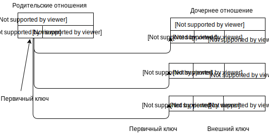

# Лекция 2. Основные понятия реляционной модели данных

# 1. Отношения и их свойства. Домены.
# 2. Понятие ключа в отношении. 
# 3. Ссылочная целостность.

# 1. Отношения и их свойства. Домены.
Основной структурой данных в реляционной модели является отношение, -> модель получила название реляционной.
Достоинства:
1. Наличие небольшого набора абстракций, которые позволяют сравнительно просто моделировать большую часть распространенных предметных областей;
2. Наличие мощного математического аппарата, опирающегося главным образом на теорию множеств и математическую логику; 
3. Возможность ненавигационного манипулирования данными без необходимости знания конкретной физической организации баз данных во внешней памяти.

Недостатки:
1. Недостаточная эффективность реляционных СУБД; 
2. Присущая этим системам некоторая ограниченность при использовании в нетрадиционных областях (САПР), в которых требуются предельно сложные структуры данных; 
3. Невозможность адекватного отражения семантики (смысла) предметной области.

#  1. Характеристика реляционной модели данных

1. Реляционная модель состоит из трех частей: структурной части, манипуляционной части и целостной части. 
2. Структурная часть: единственная СД в реляционных БД -  нормализованное n-арное отношение. 
3. Целостностная часть: ограничения специального вида, которые должны выполняться для любых отношений в любых реляционных БД. Целостность данных - это механизм поддержания соответствия БД предметной области. В реляционной модели данных существует два вида целостности: 1) целостность ссылок; 2) целостность сущностей. 
4. Манипуляционная часть: два фундаментальных механизма манипулирования реляционными БД - реляционная алгебра (базируется на теории множеств) и реляционное исчисление (базируется на аппарате исчисления предикатов первого порядка).

#  1. Структурная часть реляционной модели

Основными понятиями реляционных баз данных являются тип данных, домен, атрибут, кортеж, первичный ключ, внешний ключ и отношение. 

| Целое | Строка | Строка | Целое | Целое |
|---|-----------|---------|---------|------------|
| Номер | Имя   |  Должность      | Деньги                | Деньги |
| Табельный номер | Имя   | Должность      | Оклад               | Премия |
| 24 | Иванов           | Инженер             | 600 | 60|
|25| Петров| вед.инженер| 750| 75|
|26| Сидоров| бухгалтер|500|  50|

Рис.1. Основные компоненты 5-арного реляционного отношения “Сотрудники” (Табельный номер, Имя, Должность, Оклад, Премия)

Домен это семантическое (смысловое) понятие. Домен можно рассматривать как подмножество значений некоторого типа данных, имеющих определенный смысл.
Свойства домена:
1. Уникальное имя (в пределах БД);
2. Оопределен на некотором простом типе данных или  на другом домене;
3. Может иметь некоторое логическое условие, позволяющее описать подмножество данных, допустимых для данного домена (“возраст сотрудника” – D={n N: n≥18 and n≤60});
4. Несёт смысловую нагрузку.

Атрибут

1. Определение 1. Атрибут отношения есть пара <имя_атрибута: имя_домена>.
Имена атрибутов должны быть уникальны в пределах отношения. Часто имена атрибутов отношения совпадают с именами соответствующих доменов.

2. Определение 2. Отношение R, определенное на множестве не обязательно различных доменов D1, D2,..., Dn, содержит две части: заголовок и тело:
1.Заголовок содержит фиксированное множество атрибутов или, точнее, пар <имя- атрибута: имя-домена>: {<A1: D1>, ..., <An: Dn>}, причем каждый атрибут Aj соответствует одному и только одному из лежащих в основе доменов Dj (j = 1, 2, ..., n). 
Иное название заголовка отношения – схема отношения или заголовок таблицы. Число атрибутов n называют степенью (или арностью) отношения R ( n=1 - унарное, n=2 - бинарное, ..., n-арное отношение).

Отношения

Тело отношения содержит множество кортежей. Каждый кортеж содержит множество пар <имя-атрибута: значение-атрибута>: 
{ <A1:V1>, ..., <An:Vn> }.

Тело отношения динамично − оно может изменяться во время работы с БД, то есть кортежи могут изменяться, добавляться и удаляться.

Мощность множества кортежей m называют кардинальным числом (или мощностью) отношения R. 

3.Отношение обычно записывается в виде 
R(A1, A2, ..., An) или еще короче R.
Пример описания отношения “Сотрудники” – Сотрудники (Табельный номер, Имя, Должность, Оклад, Премия).

Определение 3. Реляционной базой данных называется набор отношений.

Определение 4. Схемой реляционной базы данных называется набор заголовков отношений (именованных схем отношений), входящих в БД.

|Реляционный термин      | "Табличный" термин                     |
|------------------------|----------------------------------------|
| База данных            | Набор таблиц                           |
| Схема базы данных      | Набор заголовков таблиц                |
| Отношение, сущность    | Таблица                                |
| Схема отношения        | Заголовок таблицы                      |
| Домен                  | Общая совокупность допустимых значений |
| Заголовок отношения    | Заголовок таблицы                      |
| Тело отношения         | Тело таблицы                           |
| Атрибут отношения      | Наименование столбца таблицы           |
| Кортеж отношения       | Строка (или запись) таблицы            |
| Кардинальльное число   | Количество строк таблицы               |
| Первичный ключ         | Уникальный идентификатор               |

# 1. Фундаментальные свойства отношений

1. Отсутствие кортежей-дубликатов - наличие у каждого кортежа первичного ключа. Первичный ключ - поле или набор полей, однозначно (уникально) идентифицирующих запись. 
2. Отсутствие упорядоченности кортежей – следует из определения отношения-экземпляра как множества кортежей.
3. Отсутствие упорядоченности атрибутов. Атрибуты отношений не упорядочены, поскольку по определению схема отношения есть множество пар {имя-атрибута:имя-домена}. 
4. Атомарность значений атрибутов. Значения всех атрибутов являются атомарными, то есть принадлежащими к простым типам данных без внутренней структуры.

Вывод: не каждая таблица может задавать отношение. Для того, чтобы некоторая таблица задавала отношение, необходимо:
1. чтобы таблица имела простую структуру (содержала бы только строки и столбцы, причем, в каждой строке было бы одинаковое количество полей), 
2. в таблице не должно быть одинаковых строк, 
3. любой столбец таблицы должен содержать данные только одного типа,
4. все используемые типы данных должны быть простыми.

Табл. 2 является отношением, а табл. 3 и 4 – нет.

# 2. Понятие ключа в отношении 

1. Первичный ключ (PRIMARY KEY, PK) − уникальный идентификатор для некоторого отношения. Однако первичный ключ на самом деле является частным случаем более общего понятия потенциального ключа. 
2. Определение 5. Пусть R - некоторое отношение. Тогда потенциальный ключ, например, K для R - это подмножество множества атрибутов R, обладающее следующими свойствами:
3. Свойством уникальности. Нет двух различных кортежей в отношении R с одинаковым значением K.
4. Свойством неизбыточности. В составе потенциального ключа отсутствует меньшее подмножество атрибутов, удовлетворяющее условию уникальности. Иными словами, если из потенциального ключа убрать любой атрибут, он утратит свойство уникальности.

Уникальный ключ

1. На практике также в качестве первичного ключа используют суррогатный (искусственный) ключ – данный ключ не является свойством сущности, но уникален и его просто генерировать (ID). Он не является свойством сущности, но обладает свойствами уникальности, неизбыточности и прост в генерации.
2. Важность потенциальных ключей: обеспечение механизма адресации на уровне кортежей в реляционной системе. 
3. Следовательно, единственный гарантируемый способ точно указать на какой-нибудь кортеж – это указать значение потенциального ключа.

# 2. Внешний ключ

1. Связь между отношениями ОТДЕЛ и СОТРУДНИК создается путем копирования первичного ключа "Номер_отдела" из первого отношения во второе. 
2. Атрибуты, представляющие собой копии ключей (потенциальных или, как правило, первичных ключей) других отношений, называются внешними ключами (FOREIGN KEY, FK). 
3. Отношение R1 («отдел») родительское, R2 («сотрудник») – дочернее.

# 3. Ссылочная целостность

1. Целостность данных - это механизм поддержания соответствия базы данных предметной области. В реляционной модели данных существует два вида целостности: 
2. целостность ссылок;
3. целостность сущностей. 
4. Требование к БД состоит в том, что любой кортеж любого отношения БД должен быть отличим от любого другого кортежа этого отношения, то есть, любое отношение («таблица») должно обладать первичным ключом («ID»). 

# 3. Целостность сущностей
1. Целостность сущностей: каждый кортеж любого отношения («строка таблицы») должен отличаться от любого другого кортежа («другой строки») этого отношения (т.е. любое отношение должно обладать первичным ключом).
2. ИНАЧЕ: противоречивая информация об одном и том же объекте.

Поддержание целостности сущностей - функция СУБД:
1. Проверяется уникальность первичных ключей;
2. Не позволяется изменение значений атрибутов, входящих в первичный ключ.  

NULL 

1. Определитель NULL ("неизвестно") указывает, что значение атрибута в настоящий момент неизвестно или неприемлемо для этого кортежа.
2. Целостность сущностей – в базовом отношении ни один атрибут первичного ключа не может содержать значений, обозначаемых определителем NULL.  

# 3. Целостность ссылок

1. Объекты реального мира представляются в реляционной БД в виде кортежей нескольких отношений, связанных между собой. При этом: 
2. Связи между данными отношения описываются в терминах функциональных зависимостей. 
3. Для отражения функциональных зависимостей между кортежами разных отношений используется дублирование первичного ключа одного отношения (родительского) в другое (дочернее). Атрибуты, представляющие собой копии ключей родительских отношений, называются внешними ключами. 

Ссылочная целостность: для каждого значения внешнего ключа, появляющегося в дочернем отношении, в родительском отношении должен найтись кортеж с таким же значением первичного ключа

1. Поддержание целостности ссылок также возлагается на СУБД: она может не позволить пользователю добавить запись, содержащую внешний ключ с NULL-значением. 

2. Как быть при удалении кортежа из отношения, на которое ведет ссылка? 

В СУБД реализовано три подхода поддержания ссылочной целостность: 
1. Запрещается производить удаление кортежа, на который существуют ссылки (т.е. сначала нужно либо удалить ссылающиеся кортежи, либо соответствующим образом изменить значения их внешнего ключа). 
2. При удалении кортежа, на который имеются ссылки, во всех ссылающихся кортежах значение внешнего ключа автоматически становится неопределенным. 
3. При удалении кортежа из отношения, на которое ведет ссылка, из ссылающегося отношения автоматически удаляются все ссылающиеся кортежи (каскадное удаление). 
В СУБД обычно можно выбрать способ поддержания целостности по ссылкам.
