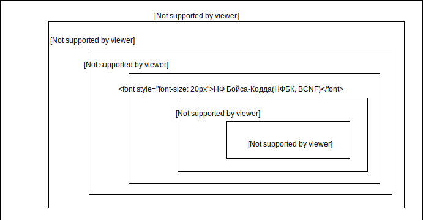
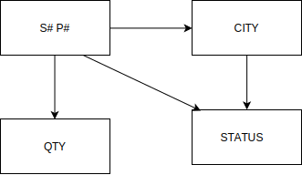
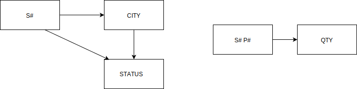

# Лекция 3. Нормальные формы отношений

1. Функциональные зависимости
2. 1, 2, 3 нормальные формы и НФ Бойса-Кодда
3. Денормализация
4. Типы связей

# 1. Функциональные зависимости

|			 	Student   		      |
|----|---------|--------------|-------|
| id | FIO     | Group_Name   | SrBal |
| 1  | Иванов  | 535          | 4.57  |
| 2  | Петров  | 535_a        | 4.83  |
| 5  | Сидоров | 535_б        | 4.06  |
| 7  | Петренко| 535_а        | 4.00  |

|	    Group       |
|----|--------------|
| id | Group_Name   |
| 1  | 535          |
| 2  | 535_a        |
| 3  | 535_б        |
| 4  | 535_а        |

|		  	Student               |
|----|---------|----------|-------|
| id | FIO     | ID_Group | SrBal |
| 1  | Иванов  | 1        | 4.57  |
| 2  | Петров  | 2        | 4.83  |
| 5  | Сидоров | 3        | 4.06  |
| 7  | Петренко| 4        | 4.00  |

Как выбрать лучшую схему БД? 

Какая схема БД лучше? 

В каком смысле одна схема БД лучше другой?

*Структура* базы данных определяется числом и видом включенных в нее отношений, и связями типа "один ко многим", существующими между кортежами этих отношений.

*Семантическая* часть описывает множество функциональных зависимостей, существующих между атрибутами этих отношений.

Определение: *Функциональная зависимость* 
1. В отношении R атрибут Y функционально зависит от атрибута X (X и Y могут быть составными) в том и только в том случае, если каждому значению X соответствует в точности одно значение Y:   R . X (r) R . Y.
2. Другими словами: если даны два атрибута X и Y некоторого отношения, то говорят, что Y функционально зависит от X, если в любой момент времени каждому значению X соответствует ровно одно значение Y. 
3. Функциональная зависимость (ФЗ) обозначается X → Y (читается как X функционально определяет Y). 
4. ФЗ - связи типа «один ко многим».

*Пример 1*: значения атрибута “Ср.бал” функционально определяют  значения атрибута “Ср.бал (%)” (это для переменной отношения

|	      Успеваемость              |
|----|------------------------------|
| id |  ...  | Ср. Бал | Ср. бал (%)|
| ...|  ...  | ...     | ...        |
| 15 |  ...  | 4.00    | 80.0       |

Иначе говоря, если два кортежа отношения R совпадают по значению X, они так же совпадают и по значению Y. 

*Пример 2*: все кортежи отношения с одинаковым значением атрибута S# имеют одинаковое значение атрибута CITY:

{ S# } → { CITY }

|		                               	   SCP                                        |
|---------------------|-------------|------------|------------------------------------|
| S# Номер поставщика | CITY - Город| P# - товар | QTY - количество товара в поставке |
| S1                  | Харьков     | P1         | 100                                |
| S1                  | Харьков     | P2         | 100                                |
| S2                  | Киев        | P1         | 200                                |
| S2                  | Киев        | P2         | 200                                |
| S3                  | Киев        | P2         | 300                                |
| S4                  | Харьков     | P2         | 400                                |
| S4                  | Харьков     | P4         | 400                                |
| S4                  | Харьков     | P5         | 400                                |

{ S#, P# } → { QTY }			{ S# } → { QTY }

{ S#, P# } → { CITY }			{ QTY } → { S# }

{ S#, P# } → { CITY, QTY }

Левая и правая стороны функциональной зависимости - детерминант и зависимая часть 

| № |   Детерминант   |  Зависимая часть         |                               
|---|-----------------|--------------------------|
| 1 |   { S# }        |  { CITY }                |
| 2 |   { S#, P# }    |  { QTY }                 |
| 3 |   { S#, P# }    |  { CITY }                |
| 4 |   { S#, P# }    |  { CITY, QTY }           |
| 5 |   { S#, P# }    |  { S# }                  |
| 6 |   { S#, P# }    |  { S#, P#, CITY, QTY }   |
| 7 |   { S# }        |  { QTY }                 |
| 8 |   { QTY }       |  { S# }                  |

Определение. *Функциональная зависимость для набора всех возможных значений отношений*
1. Пусть R является переменной отношения, а X и Y - произвольными подмножествами множества атрибутов отношения R. Тогда Y функционально зависимо от X (X→Y) тогда и только тогда, когда для любого допустимого значения отношения R каждое значение X связанно в точности с одним значением Y.
2. (для любого допустимого значения отношения R, когда бы два кортежа отношения R ни совпадали по значению X, они также совпадают и по значению Y).
3. КРОМЕ ЭТОГО: Если X является первичным ключом, то все атрибуты Y отношения R должны быть обязательно функционально зависимы от X.

# 2. 1, 2, 3 нормальные формы и НФ Бойса-Кодда

Определение. *Взаимно независимые атрибуты*  - ни один
из этих атрибутов не является функционально зависимым от 
других. 

|	                Student                  |
|----|---------------------------------------|
| id |  ...  | Математика | Программирование |
| ...|  ...  | 4          | 5                |
| 15 |  ...  | 5          | 4                |

Определение. *Избыточная функциональная зависимость*  -
зависимость, заключающая в себе такую информацию, которая может быть получена на основе других зависимостей, имеющихся в базе данных. 

|	                     Student                            |
|----|------------------------------------------------------|
| id |  ...  | Математика | Программирование | Средний балл |
| ...|  ...  | 4          | 5                | 4.5          |
| 15 |  ...  | 5          | 4                | 4.5          |

Нормализация: формальный процесс удаления избыточных данных, основанный на определенных математических понятиях реляционной теории 
(ИЛИ: Обратимый пошаговый процесс замены данной совокупности отношений другой схемой отношений с устранением избыточных функциональных зависимостей)

Т.е. для заданного множества функциональных зависимостей S желательно найти такое множество T, которое было бы гораздо меньшего размера, чем множество S, причем каждая функциональная зависимость множества S могла быть заменена функциональной зависимостью множества T.

Механизм выполнения: отношение разбивается на два отношения по значению определенного атрибута. (Декомпозиция должна быть выполнена без потерь информации в БД.) При этом порождаемое множество содержит большее число отношений, которые являются проекциями отношений исходного множества. 

Условия:

*не должны появляться ранее отсутствовавшие кортежи;*

*отношениях новой схемы должно выполняться исходное множество функциональных зависимостей.*

Для чего?
1. Исключение возможной противоречивости хранимых данных (основная цель),
2. Минимизация занимаемой данными памяти,
3. Оптимизация затрат на выполнение различных операций над данными БД.

Результат нормализации: 
1. Получение такого проекта базы данных, в котором каждый факт появляется лишь в одном месте, т.е. исключена избыточность информации. 

Взаимосвязь нормальных форм
Большинство БД находятся в нормальной форме Бойса-Кодда (НФБК)
Дальнейшая нормализация  часто невыполнима из-за избыточности

Свойства нормальных форм (НФ): 
1. Каждая следующая НФ лучше предыдущей; 
2. При переходе к следующей НФ свойства предыдущих НФ сохраняются. 

Процесс проектирования БД : декомпозиция отношения, находящегося в предыдущей НФ, в два или более отношения, удовлетворяющих требованиям следующей НФ.

|            S          |
|----|------------------|
| S# |  STATUS | CITY   |
| S3 |  30     | Киев   |
| S5 |  30     | Полтава|

|      SST     |
|----|---------|
| S# |  STATUS |
| S3 |  30     |
| S5 |  30     |

|       STC        |
|--------|---------|
| STATUS | CITY    |
| 30     | Киев    |
| 30     | Полтава |

Декомпозиция с потерями: оба поставщика S# имеют статус 30, но при этом нельзя сказать, какой из них в каком городе находится.

|            S          |
|----|------------------|
| S# |  STATUS | CITY   |
| S3 |  30     | Киев   |
| S5 |  30     | Полтава|

|      SST     |
|----|---------|
| S# |  STATUS |
| S3 |  30     |
| S5 |  30     |

|    SC        |
|----|---------|
| S# | CITY    |
| S3 | Киев    |
| S% | Полтава |

Декомпозиция без потерь: отношения SST и SC содержат данные о том, что поставщик S3 имеет статус 30 и находится в Киеве, а поставщик S5 имеет статус 30 и находится в Полтаве. 

Определение *первой нормальной формы:*
Отношение находится в 1NF если значения всех его атрибутов атомарны (неделимы). 

Свойства 1НФ
1. В отношении нет одинаковых кортежей,
2. Кортежи не упорядочены,
3. Атрибуты не упорядочены и отличаются по наименованию,
4. Все значения атрибутов атомарны.

Вывод: 

Первая нормальная форма (1НФ) – это обычное отношение. В реляционной БД любое отношение автоматически находится в 1НФ. 

|		                               	   SCP                                                                       |
|-----------------------|----------------------------|-------------|------------|------------------------------------|
| S# - Номер поставщика | Status - статус поставщика | CITY - Город| P# - товар | QTY - количество товара в поставке |
| S1                    | 20                         | Харьков     | P1         | 100                                |
| S1                    | 20                         | Харьков     | P1         | 100                                |
| S1                    | 20                         | Харьков     | P1         | 100                                |
| S1                    | 20                         | Харьков     | P1         | 100                                |
| S1                    | 20                         | Харьков     | P1         | 100                                |
| S1                    | 20                         | Харьков     | P2         | 100                                |
| S2                    | 10                         | Киев        | P1         | 200                                |
| S2                    | 10                         | Киев        | P2         | 200                                |
| S3                    | 10                         | Киев        | P2         | 300                                |
| S4                    | 20                         | Харьков     | P2         | 400                                |
| S4                    | 20                         | Харьков     | P4         | 400                                |
| S5                    | 30                         | Сумы        | P5         | 400                                |

Функциональная зависимость CITY→STATUS - статус поставщика определяется его местоположением.

4 недостатка:

1. Избыточность (повторяются города, статусы поставщиков, виды товара)
2. Аномалии обновления (Update) – Названия городов (статусов, товаров) повторяются во многих кортежах.  При обновлениях необходимо просматривать всю таблицу для нахождения и изменения всех соответствующих кортежей
3. Аномалии включения (Insert) - В БД не может быть записан новый поставщик (S6, 30, Полтава, Р2), если продукт (Р2) им пока не поставляется. Т.е. Нельзя добавить поставщика, не указав его товар.
4. Аномалии удаления (Delete) - При удалении одних данных происходит потеря других. (При удалении товара (Р5) удаляются сведения о его поставщике (S5).

Определение *второй нормальной формы:*
Отношение R находится во второй нормальной форме (2NF) в том случае, когда оно находится в 1NF, и каждый неключевой атрибут полностью зависит от первичного ключа. 

Перевод во 2NF: провести его декомпозицию на два отношения SECOND и SP:
SECOND { S#, STATUS, CITY } (неключевой атрибут CITY зависит от всего ключа S#)
SP { S#, P#, QTY }

|      Second           |
|----|---------|--------|
| S# | Status  | CITY   |
| S1 | 20      | Харьков| 
| S2 | 10      | Киев   |
| S3 | 10      | Киев   |
| S4 | 20      | Харьков|
| S5 | 30      | Сумы   |

|	    SP       |
|-----|----|-----|
| S1  | P1 | 100 |
| S1  | P1 | 100 |
| S1  | P1 | 100 |
| S1  | P1 | 100 |
| S1  | P1 | 100 |
| S1  | P2 | 100 |
| S2  | P1 | 200 |
| S2  | P2 | 200 |
| S3  | P2 | 300 |
| S4  | P2 | 400 |
| S4  | P4 | 400 |
| S5  | P5 | 400 |

Достоинства:
1. В SECOND можно включить информацию о городе без указания товаров
2. Операции удаления позволяют удалить информацию о поставке, в которой сведены все сведения о поставщике S3 и товаре P2, при этом информация о том, что поставщик S3 находится в Киеве, не утрачивается.
3. Название города для каждого поставщика встречается один раз, поскольку существует только один кортеж для данного поставщика в отношении SECOND (избыточность данных S# - CITY устранена). 

Недостатки:
1. Аномалии включения (Insert) - нельзя включить данные о городе, обладающим некоторым статусом (нельзя указать, что все поставщики из Ровно обладают статусом 50, до тех пор пока в этом городе не существует некоторого конкретного поставщика).
2. Аномалии удаления (Delete) - при удалении из SECOND кортежа для некоторого города будет удалена не только информация о данном поставщике ПЛЮС информация о статусе города.
3. Аномалии обновления (Update) – в SECOND статус для каждого города повторяется несколько раз. 

Определение. *Взаимно независимые атрибуты*

Два или более атрибута взаимно независимы, если ни один из этих атрибутов не является функционально зависимым от других.

В отношении SECOND атрибут STATUS зависит от атрибута CITY.

Определение. *Неключевой атрибут* – это атрибут, который не входит в состав ключа (в том числе и первичного ключа).

Определение *третьей нормальной формы:* 

Отношение R находится в 3NF в том случае, когда оно находится во 2NF, и все неключевые атрибуты взаимно независимы.

|     SC      |
|----|--------|
| S# | CITY   |
| S1 | Харьков| 
| S2 | Киев   |
| S3 | Киев   |
| S4 | Харьков|
| S5 | Сумы   |

|        CS        |
|---------|--------|
| CITY    | STATUS |
| Харьков | 20     | 
| Киев    | 10     |
| Сумы    | 30     |
| Полтава | 40     |

Перевод отношение SECOND в 3NF

3NF достаточна в большинстве случаев, процесс проектирования реляционной БД обычно заканчивается. 

Однако существуют более сложные отношения с условиями:
1. Отношение имеет два или более потенциальных ключа.
2. Два потенциальных ключа являются сложными.
3. Они перекрываются (имеют один общий атрибут).

Оригинальное определение 3НФ заменено строгим определением Бойса-Кодда – нормальная форма Бойса-Кодда (НФБК / BCNF). 
Отношение R находится в BCNF, если оно находится в 3NF и когда детерминанты всех функциональных зависимостей являются потенциальными ключами. 
ИЛИ: Отношение находится в BCNF, если любая функциональная зависимость между его полями сводится к полной функциональной зависимости от возможного ключа.

Переход к BCNF: специально вносят атрибут, который выполняет только роль первичного ключа и только от которого функционально зависят остальные атрибуты отношения. 

Проектировщик не ищет первичный ключ в множестве атрибутов, а искусственно вводит атрибут, назначая ему роль первичного ключа. 

Алгоритм нормализации (приведения к BCNF):
1. К 1NF. По модели предметной области (а не по отношениям) выписываются функциональные зависимости. Все отношения автоматически находятся в 1NF.
2. К 2NF. Если обнаружена зависимость от части составного ключа, то проводится декомпозицию этих отношений на несколько отношений – атрибуты, которые зависят от части сложного ключа, выносятся в отдельное отношение вместе с этой частью ключа. 
3. К 3NF. Если обнаружена зависимость некоторых неключевых атрибутов от других неключевых атрибутов, то проводится декомпозицию этих отношений – те неключевые атрибуты, которые зависят от других неключевых атрибутов, выносятся в отдельное отношение. В новом отношении ключом становится детерминант функциональной зависимости.

К BCNF. Если имеются отношения, имеющие несколько  потенциальных ключей, необходимо проверить, имеются ли функциональные зависимости, детерминанты которых не являются потенциальными ключами. 
	Если такие функциональные зависимости имеются, то необходимо провести дальнейшую декомпозицию отношений. Те атрибуты, которые зависят от детерминантов, не являющихся потенциальными ключами, выносятся в отдельное отношение вместе с детерминантами. 

Вывод: любое изменение информации в BCNF приведет к изменению только одной записи таблицы.

# 3. Денормализация

Обратный процесс – внесение избыточности в интересах производительности (чрезмерно нормализованная БД замедляет работу)

Рекомендации по денормализации таблиц:
1. если модель нормализованных данных содержит таблицы с составными первичными ключами (в ключе 4 и более полей), целесообразно денормализировать данные, введя произвольные суррогатные ключи;
2. если в запросах часто используются вычисляемые значения (максимальные, минимальные и так далее), то средством денормализации данных может являться вставка этих вычисляемых данных в сами таблицы;
3. разбиение экстремально больших таблиц на множество избыточных таблиц, в которые вынесены либо отдельные столбцы, либо отдельные строки (редко используемые) исходной таблицы;
4. если запросы к некоторой таблице часто используют столбец (фрагмент) из другой таблицы, то можно внести в эту таблицу копию этого столбца (фрагмента).

# 3. Типы связей

1. Связь (relationship) – поименованная ассоциация между двумя отношениями (сущностями), значимая для рассматриваемой предметной области.
2. Характеристики:
степень связи (кардинальное число / мощность),
обязательность (модальность / класс принадлежности).
3. Типы:

*Один-к-одному* (каждому кортежу отношения А соответствует 0 или 1 кортеж отношения В).

*Один-ко-многим* (каждому кортежу отношения А соответствует несколько кортежей отношения В)

*Многие-ко-многим* (множеству кортежей отношения А соответствует множество кортежей отношения В - в реляционных БД не поддерживается непосредственно)

|     Предмет    |
|----------------|
| SJ# |  Имя     |
| SJ1 | Предмет1 |
| SJ2 | Предмет2 |
| SJ3 | Предмет3 |
| SJ4 | Предмет4 |

|     Предмет_студент    |
|------------------------|
| SJ# | ST#              |
| SJ1 | ST1              |
| SJ1 | ST2              |
| SJ2 | ST1              |
| SJ3 | ST5              |
| SJ3 | ST4              |
| SJ1 | ST5              |
| SJ2 | ST4              |

|     Предмет    |
|----------------|
| ST# |  Имя     |
| ST1 | Студент1 |
| ST2 | Студент2 |
| ST3 | Студент3 |
| ST4 | Студент4 |
| ST5 | Студент5 |
| ST6 | Студент6 |
| ST7 | Студент7 |
