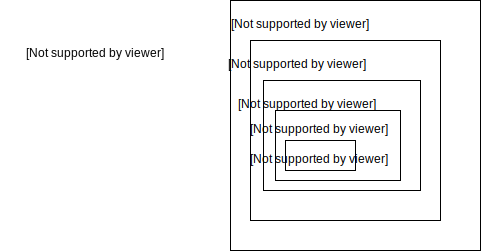

# 1. Представления
*Представление* (view) - объект СУБД, который является именованным запросом на выборку (именованный SQL-оператор SELECT)

= табличный подзапрос, содержится в таблицах схемы и вызывается при его применении

может быть запрошено, модифицировано, вставлено в, удалено из, и соединено с другими таблицами и представлениями.
```sql
CREATE  VIEW SPISOK (Id, Name, Group, Sr_Ball)

AS  SELECT  Id, Name, Id_Group, Average_Mark FROM STUDENT

SELECT  * FROM  SPISOK
```
Возможности:

- скрыть несущественные или нежелательные детали БД для разных пользователей,

- обеспечить повышенную производительность БД при частом использовании одного и того же оператора SELECT,

- модифицировать реальные структуры данных в удобном для приложения виде (при росте или реструктуризации БД) (фактически команды модификации перенаправляются к базовой таблице),

- поддерживать старую структуру БД (структура БД изменена, а старое программное обеспечение не изменено) – функциональность старой БД остается, а структура БД расширяется новыми модулями

Возможности (2):

- разграничивать права доступа к данным,

- просматривать одни и те же данные разным пользователям в разных вариантах в одно и тоже время

- ограничивать объемы данных для удобства работы с БД

- после создания представления использовать его в запросах наравне с таблицами

- на основе представлений создавать новые представления

Механизм работы представлений

Выполняется при реализации соответствующих действий пользователя, до этого момента материализованных данных представления в БД не хранится. Материализация – при ссылке на имя представления СУБД находит его определение в таблицах схемы и создает рабочую таблицу соответствующего имени со столбцами соответствующих типов данных и соответствующими именами. Затем эта новая таблица заполняется результатами работы оператора SELECT, находящегося в теле определения представления.

Синтаксис:
```sql
CREATE  VIEW < имя_представления  > [(< список_столбцов  >)]

[WITH [ENCRYPTION] [, SCHEMABINDING]]

AS < SQL-запрос >
```

ENCRYPTION - шифрование представления – недоступны возможности просмотра и редактирования представления, но его можно выполнять и удалить.

SCHEMABINDING - воспрепятствовать внесению изменений (с помощью операторов CREATE, ALTER  или DROP) в объекты, от которых зависит представление

Пример.

На основании таблицы STUDENT (id, Name, id_groups, sr_ball, stip) создать представление STUDENT_V_0 (Name, Groupa, Sr_ball), не содержащее сведений о РК (id) и стипендиях  студентов (stip).
```sql
CREATE View  Student_V_0(Name, Groupa, Sr_ball)

As Select Name,id_groups,sr_ball From Student
```
Особенности работы с представлениями:

- Запрос, на котором основано представление, выполняется всякий раз, когда представление участвует в какой-либо команде. Представление будет модифицировано автоматически всякий раз, когда таблица, лежащая в его основе, изменяется.

- В представлении можно использовать вычислимые поля, группировки, подзапросы, однако при этом следует учитывать ограничения, отражающие природу представления.

Представление о студентах-хорошистах:
```sql
CREATE  VIEW SPISOK_AVR_4

AS  SELECT  Id, Id_Group, Name, Average_Mark FROM STUDENT

WHERE Average_Mark >= 4
```
Особенности работы с представлениями (2):

- Представление (посредством его имени) можно использовать в командах – запрашивать (SELECT), изменять (UPDATE), вставлять в него записи (INSERT), удалять из БД (DELETE), соединять с другим таблицами и представлениями. Существуют ограничения на операции модификации (UPDATE, INSERT, DELETE), которые зависят от вида представления. Фактически команды модификации представления перенаправляются к базовой таблице БД. Вносимое в модифицируемое представление изменение должно однозначно вноситься и в базовую таблицу.

Пример. Модификация информации в БД с помощью представления:

```sql
UPDATE  SPISOK_1

SET NAME = ’СИДОРОВА’ WHERE Id=32
```
- 1. Модифицировать таблицу Student с помощью представления Student_V_0 – студенту Рыбакову назначить стипендию 2000.

```sql
CREATE View

Student_V_0(Name, Groupa, Sr_ball)

As Select Name, id_groups, sr_ball From Student

Update Student_V_0 set stip=2000 Where name='Рыбаков'
```
- 2. Модифицировать таблицу Student с помощью представления Student_V_0 – у студента Рыбакова средний бал 4,7.

```sql
Update Student_V_0 set sr_ball=4.7 Where name='Рыбаков'
```

Два типа представлений:

-  модифицируемое (обновляемое) - если команды модификации могут выполняться в представлении;

-  предназначенное только для чтения при запросе - если в представлении может выполняться только команда SELECT.

*Обновляемые представления*

Можно изменять данные базовой таблицы через представление до тех пор, пока выполняются следующие условия:

- Изменения (UPDATE, INSERT и DELETE), должны ссылаться на столбцы только одной базовой таблицы.

- Изменяемые в представлении столбцы должны непосредственно ссылаться на данные столбцов базовой таблицы. Столбцы нельзя сформировать каким-либо другим образом (через агрегатные функции: AVG, COUNT, SUM, MIN, MAX, GROUPING, STDEV, STDEVP, VAR и VARP)

Критерии, по которым определяют, является ли представление модифицируемым:

- представление основывается только на одной базовой таблице,

- содержит первичный ключ базовой таблицы,

- не должно иметь никаких полей, которые бы являлись агрегатными функциями,

- не должно содержать запросов с DISTINCT  в своем определении,

- не должно использовать GROUP BY  или HAVING  в своем определении,

- желательно, чтобы представление не использовало в своем определении подзапросы,

- представление может быть использовано в другом представлении, но это представление должно быть также модифицируемым

Внесение изменений в определение представления:

- с помощью оператора ALTER VIEW: выполняется полная замена существующего представления, сохраняются все права на использование представления,

- уничтожение представления (DROP VIEW <*имя\_представления*>) и его повторное создание с помощью оператора CREATE  VIEW.

- При удалении представления нет необходимости удаления всех данных из представления, потому что *реальные данные в нем не содержатся*. Для удаления представления пользователь должен являться его владельцем.

Пример

пусть есть представление Student_V_4

```sql
Create  View  Student_V_4 (Name, Group, Stip)

As Select Name, id_groups, stip From Student
```

Модифицировать так, чтобы получить имена, группы и стипендии только тех студентов, у которых стипендия больше 1500 грн

```sql
Alter  View  Student_V_4 (Name, Group, Stip)

As Select Name, id_groups, stip

From  Student  Where  stip>1500
```

# 2. Индексы



*Страница* – блок фиксированной длины непрерывных виртуальных адресов памяти, который участвует в операциях чтения и записи как единое целое, то есть требует только одного перемещения головки диска для выполнения этих операций.

В MS SQL–сервере размер страницы равен 8 Кбайт (8192 байт).

Страница - контейнер для хранения строк таблиц и индексов. Одна строка не может быть разделена между двумя страницами.

Страницы объединяются в экстенты.

*Экстент* –единица памяти, которую сервер выделяет по мере необходимости *как единое целое* при размещении на диске данных таблицы или индекса.

Экстент означает пространство, используемое для хранения реальной информации внутри физического пространства, выделенного под БД в целом.

В MS SQL–сервере экстент состоит из 8 смежных страниц данных (64 Кбайта).

Методы доступа к данным БД:

- сканирование таблицы (*последовательный* доступ) – последовательное чтение всех строк таблицы в том порядке, в котором они записаны в место их физического хранения, за раз считывается одна страница данных;

- доступ посредством *индексов* (индекс обычно имеет структуру В-дерева или инвертированную структуру файла), индекс позволяет возвращать по одной строке таблицы за раз;

- доступ посредством *хешированных индексов* – такой индекс делит данные на области с одинаковым значением функции хеширования;

- доступ посредством *битовых векторных индексов* Методы доступа 3 и 4 используются только в Oracle.

Два способа извлечения данных из БД в MS SQL–сервере:

1. табличное сканирования (путем последовательного сканирования строк, страниц и экстентов таблицы (или таблиц) БД);

2. при помощи индекса.

Какой из способов - зависит от:

– доступных на текущий момент индексов,

– от запрашиваемых в запросе столбцов,

– от типа объединений таблиц, которые используются в запросе,

– от физического размера используемых в запросе таблиц.

Выполнение запроса:

```sql
SELECT name FROM Student

WHERE avg_mark > 4;
```

при поиске данных из диапазона данных (5.0 >avg\_mark> 4.0) сервер должен обратиться к каждой строке каждой страницы каждого экстента таблицы данных Student для поиска каждого конкретного значения из диапазона поиска.

Проще и быстрее – если данные отсортированы или имелась бы информация о первичных ключах строк в порядке возрастания (убывания) значений в поле avg\_mark. Эта информация и содержится в объектах БД – индексах.
Индексы – внутренние объекты СУБД, которые ускоряют процесс обработки данных.

*Индекс* – упорядоченный список значений полей (групп полей) в таблице. Когда создается индекс в поле, БД запоминает соответствующий *порядок* всех значений этого поля в области памяти. Оптимизатор сервера для ускорения доступа к данным автоматически применяет индексы.

Индекс хранит информацию о порядке следования записей, относительно поля avg\_mark, что может привести к ускорению выполнения оператора SELECT. Когда требуется выполнить операцию выборки из БД данных с использованием сортировки, то эта информация из индекса автоматически подключается сервером к процессу извлечения данных.

| id | avg_mark | ... |
|---|--------------------|---------------------|
| 1 | 4,3         |                |
| 2 | 5,0             |                 |
| 3 | 3,7           |               |
| 4 | 4,1          |               |
| 5 | 3,7             |                |

| Индексы по возрастанию поля avg_mark |
|---|--------------------|
| 3,7 | Указатель на запись с Id=3         | 
| 3,7 | Указатель на запись с Id=5             | 
| 4,1 | Указатель на запись с Id=4| 
| 4,3 | Указатель на запись с Id=1| 
| 5,0 | Указатель на запись с Id=2| 


Различия:

-c точки зрения *физической реализации* индексов,

-с точки зрения *числа индексов на таблицу* БД – кластерный индекс всегда один на базовую таблицу, а некластерных индексов может быть несколько на таблицу,

- с точки зрения *выполнения различных операций* в БД с использованием индексов.

Кластерный индекс:

серверу фактически отдается команда *физически отсортировать данные* по возрастанию (или убыванию) в порядке индекса (по полю, для которого создан кластерный индекс).

У  любой таблицы может быть только один кластерный индекс.

Идеальным выбор для столбцов:

- в которых постоянно выполняется поиск диапазонов данных,

- с низкой селективностью (в столбце много одинаковых записей).


Некластерный индекс:

- некластерный  индекс не изменяет физический порядок строк в таблице;

- содержит не реальные данные, а только указатели на страницы данных,

Следует использовать некластерный индекс в столбцах, в которых *редко* выполняется поиск *диапазонов данных*, или в столбцах с высокой селективностью (с небольшим числом дублирующихся записей).

| Кластерный индекс | Доля рынка СУБД( %) |
|--------------------|---------------------|
| Только 1 на таблицу        | До 249 индексов на таблицу        |
| Физически перестраивает данные в таблице согласно ограничениям индекса  | Создает отдельный список ключевых значений с указателями на страницы данных   |
| Используется в столбцах, где часто выполняется поиск диапазонов данных | Используется в столбцах, где выполняется поиск отдельных значений |
| Используется в столбцах с низкой селективностью (высокое число дублированных значений) | Используется в столбцах с высокой селективностью (низкое число дублированных значений) |

*Достоинства индексов*

- Ускорение операции поиска.

- Ускорение операции сортировки.

- Ускорение фазы поиска при удалении, вставке и модификации.

- Индексация позволяет находить содержащий индексированную строку блок данных, выполняя небольшое число обращений к внешнему устройству.

*Недостатки индексов*

- Для хранения индексов требуется дополнительная память.

- При операциях вставки, модификации и удаления требуется перестройка данных (в случае кластерного индекса) и индексов.

- Усложнение алгоритмов работы СУБД

# 3. Особенности хранения данных на MS SQL-сервере

В SQL-сервере индексы двух типов:

*кластерные* (кластеризованные) индексы – аналогом такого индекса является *словарь*, если кластерный индекс будет создан для столбца “Фамилия”, то физически запись со значением Иванов в поле “Фамилия” всегда будет стоять перед записью со значением Петров;

*некластерные*  (некластеризованные) индексы – аналогом такого индекса является *предметный указатель* в книге, в котором, например, имеется раздел И, в котором есть ссылка на страницы, где упоминается фамилия Иванов.

Кластерный и некластерный индексы реализуются посредством структуры данных В-дерева (balanced tree – сбалансированное дерево).
# 4. Определение индекса и его структура

```sql
CREATE [UNIQUE] [CLUSTERED | NONCLUSTERED]

INDEX <index_name> ON <table or view name>

(<column name> [ASC | DESC] [, … n])

INCLUDE (<column name> [, -n])

[WITH

[PAD_INDEX = {ON | OFF}]

[[,] FILLFACTOR = <коэффициент заполнения> ]

[[,] IGNORE_DUP_KEY = {ON | OFF}]

[[,] DROP_EXISTING = {ON | OFF}]

[[,] STATISTICS_NORECOMPUTE = {ON | OFF}]

[[,] SORT_IN_TEMPDB = {ON | OFF}]

[[,] ONLINE = {ON | OFF}]

[[,] ALLOW_ROW_LOCKS = {ON | OFF}]

[[,] ALLOW_PAGE_LOCKS = {ON | OFF}]

[[,] MAXDOP = <maximum degree of parallelism>

]

[ON {<filegroup>|<partition scheme name>|DEFAULT}]
```

# 5. Создание индекса
Индекс не является автономным объектом, он относится к некоторому столбцу (столбцам) таблицы или представления.

Обязательной является конструкция

```sql
CREATE INDEX <index_name> ON <table or view name>(<column name>)
```

UNIQUE  – индекс, реализующий ограничение уникальности для своих столбцов - данные в этих столбцах не могут повторяться (по умолчанию индексы не являются уникальными).

CLUSTERED – создается кластерный индекс.

NONCLUSTERED – создается некластерный индекс (значение по умолчанию).

ASC – создает индекс в порядке возрастания

DESC  – в порядке убывания

 - List item

INCLUDE – СУБД переносит содержимое указанных столбцов на листовой уровень некластерного  индекса - > значительное сокращение операций ввода/вывода

PAD\_INDEX –  степень заполнения страниц индекса  (в процентах) при первоначальном создании индекса
*Пример*. Если таблица EXAM часто используется для поиска оценки конкретного студента по значению поля ID\_STUDENT, то следует создать индекс по этому полю.

```sql
CREATE UNIQUE CLUSTERED INDEX IND_STUD

ON EXAM (ID_STUDENT ASC)

WITH

(PAD_INDEX=ON, FILLFACTOR = 90, DROP_EXISTING=ON)
```

Создан для поля ID\_STUDENT таблицы EXAM уникальный кластерный индекс по возрастанию значений с именем IND\_STUD, причем фактор заполнения страниц индекса всех уровней равен 90, если перед созданием данного индекса уже существовал индекс с именем IND\_STUD, то он будет предварительно удален.

*Удаление индекса*:

- удаление неверно созданных индексов,

- удаление индексов вследствие изменения структуры таблицы,

- удаление индексов вследствие создания новых индексов, которые позволяют лучше выполнять запросы.

```sql
DROP  INDEX <имя индекса>
```

