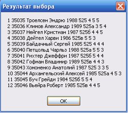

---
title: "Лекция 10. Вние DML-операций в разъединенном окружении"
layout: bookpage
lang: ru
navigation_weight: 12
--- 


# Лекция 10: Общая характеристика технологии ADO.NET

1. Общая характеристика технологии ADO.NET доступа к БД
2. Создание соединения с источником данных
3. Доступ к данным таблиц БД с помощью объекта считывания данных DataReader

## 1. Общая характеристика технологии ADO.NET доступа к БД

**Технологии для работы с БД на платформе .NET Framework:**
- ADO.NET
- BDE.NET
- dbGo.NET
- dbExpress.NET
- IBX.NET


**Технология ADO.NET:**

- библиотека управляемого кода, взаимодействие с ней производится как с обычной сборкой .NET
- типы ADO.NET используют возможности управления памятью CLR
- обращение к типам ADO.NET (и их членам) производится практически одинаково (не зависит от языка)
- предназначена для организации доступа к хранилищам информации различного типа

**Различают следующие типы хранилищ:**

- **неструктурированные хранилища**           (например, текстовый файл с произвольным доступом)
- **структурированные неиерархические хранилища**                                                (например, таблицы Excel)
- **иерархические хранилища**                  (например, XML-файлы)
- **реляционные базы данных**                  (например, MS SQL Server, Oracle)
- **объектно-ориентированные БД**

**Пространства имен ADO.NET:**

- *System.Data*   
- *System.Data.SqlTypes* 
- *System.Data.Common* 
- *System.Data.OleDb* 
- *System.Data.OracleClient* 
- *System.Data.Odbc* 
- *System.Xml*


* подробнее на слайде №11

**Соединенное окружение** (*connected environment*) – приложение по работе с БД устанавливает соединение с источником данных и работает с ним через это соединение. 

**Преимущества этого способа:**
- такое соединение легко контролировать
- просто реализовать систему безопасности
- реализация работы приложения и БД проста и прозрачна

**Недостатки этого способа:**
- не эффективен при работе приложения с удаленными БД через Internet, так как число пользователей и, следовательно, соединений возрастает
- каждое соединение требует ресурсов компьютера
- беспрерывная передача данных загружает сеть

Основные классы ADO.NET для работы в соединенной среде:​
Connection – класс, реализующий работу с соединением​
Command – позволяет выполнять команды, направленные в источник данных​
DataReader – является курсором, осуществляющим переход по записям в БД​


**Разъединенное окружение** (disconnected environment) – приложение получает из БД необходимое множество данных и разрывает соединение с БД. ​

**Преимущества этого способа:**

- пользователь может работать с данными сколько угодно, а соединение с БД может использоваться другим приложением​
- работа с данными не перегружает сеть, так как данные идут по сети только в момент занесения изменений или чтения их из БД​
**Недостатки этого способа:​**
- данные, с которыми работает пользователь, могут быть в это время изменены или вовсе удалены, в результате чего могут возникать конфликты​
- сложность обеспечения безопасности данных​

**Основные компоненты технологии ADO.NET при работе в разъединенной среде:**

- **БД** – реальная серверная база данных
- **связь** – компоненты, обеспечивающие связь с данным
- **адаптеры (класс DataAdapter)** – компоненты, формирующие SQL–запросы к серверу БД (или драйверу ODBC) для получения и/или модификации данных
- **набор данных (класс DataSet)** – компонент, обеспечивающий виртуальное хранилище для полученных и, возможно, измененных данных
- **визуализация** – компоненты, обеспечивающие визуальное представление данных


**Провайдеры данных ADO.NET**

| SQL Server .NET |Предназначен для работы с СУБД MS SQL Server 7.0 и выше. | 
|---|-----------|---------|---------|------------|
| Oracle .NET | Обеспечивает доступ к БД Oracle версии 8.1.7 и выше. |  
|OLE DB .NET |Предназначен для источников данных, которые имеют OLE DB провайдеры данных. Источниками данных могут быть или MS SQL Server 6.6 ниже, Oracle, Access, Sybase, DB2  | 
| ODBC .NET| Обеспечивает доступ к источникам данных через их ODBC–драйвера.| 


**Классы провайдеров данных ADO.NET:**
- Connection
- Command
- DataReader
- DataAdapter
- Transaction
- CommandBuilder
- Parameter
- Exception
- Error
- ClientPermission

# 2. Создание соединения с источником данных 

Независимо от окружения объект типа *Connection* необходимо создавать явно.
**Пример 1.** Способ создания объекта типа *Connection* с использованием конструктора без параметра.

```sql
// для SQL Server.NET провайдера данных
System.Data.SqlClient.SqlConnection con = new SqlConnection();
```

Или так

```sql
using System.Data.SqlClient;
…
SqlConnection con = new SqlConnection(); 
// для Oracle.NET провайдера данных
System.Data.OracleClient.OracleConnection con = new OracleConnection();
```

Свойство *ConnectionString* представляет собой текстовую строку, в которую могут входить следующие параметры:

- **Data Source (или Server)** – параметр для указания пути к БД (в случае с файлом MS Access) либо имени сервера БД;
Initial Catalog (или database) – имя БД;
- **Integrated Security** – использование аутентификация пользователя с помощью Windows;
- **Connection Time** – параметр показывает длину временного промежутка в секундах, в течении которого будут осуществляться попытки создать соединение с сервером, по умолчанию время ожидания равно 15 секунд;
- **Password** – пароль для доступа к БД;
- **User ID** – имя для доступа к БД;
- **Provider (поставщик)** – параметр для хранения имени провайдера, используется только для создания объекта OleDbConnection, хранит имя родного провайдера OleDb;
- **Driver** – определяет ODBC–драйвер, используется только при работе через ODBC–драйвер.

**Пример 2.** Синтаксис задания строки связи для связи с БД MS SQL Server  (имя сервера - COMP-25\SQLEXPRESS, имя БД - Exampl_SQL).
```sql
con.ConnectionString =
              @"Data Source=COMP-25\SQLEXPRESS; " + 
              "integrated security=true;" + 
              "initial catalog=Exampl_SQL;";
// integrated security=true - если использовать Windows 
// Authentication – аутентификация пользователя с 
// помощью Windows – пример использования 
// интегрированной безопасности в строке подключения
// initial catalog (или database) - имя БД
```

Или так 

```sql

@"server =COMP-25\SQLEXPRESS;" +
                "integrated security=true;" +
                "database =Exampl_SQL;";

```

Или так – cинтаксис задания строки связи для связи с БД MS MS SQL Server в параметрах конструктора при создании объекта *SqlConnection*.

```sql
System.Data.SqlClient.SqlConnection con = new 	SqlConnection(@"server =COMP-25\SQLEXPRESS;" +
                "integrated security=true;" +
                "database =Exampl_SQL;";);
```

Открытие соединения делается с помощью метода Open – после выполнения которого устанавливается связь с источником данных.
**Пример 4.** Синтаксис открытия и закрытия соединения. 

```sql
// создание и инициализация объекта con
System.Data.SqlClient.SqlConnection con = new SqlConnection(@"server =COMP-25\SQLEXPRESS;“ + "integrated security=true;" + "database =Exampl_SQL;";
try {    
     con.Open();
     MessageBox.Show("Connection is open ");   …
}
catch {  MessageBox.Show("Connection is not open "); } // здесь перехватываются все исключения
try {    
     con.Close();
     MessageBox.Show("Connection is closed ");   …
}
catch {  MessageBox.Show("Connection is not closed"); } // вызов метода происходит в блоке finally
```

Объект типа *Connection* имеет свойство *State*, которое содержит одно из значений перечисления *ConnectionState* и позволяет определить состояние соединения.

| Значение |Описание | 
|---|-----------|-
| Closed | Соединение закрыто |  
|Open |Соединение открыто| 
| Broken| Соединение с источником было утеряно (не реализовано)| 
|Connecting| Объект устанавливает соединение с источником (не реализовано)|
|Executing| Объект выполняет команду (не реализовано)|
|Fetching| Ведется выборка данных из источника (не реализовано)| 

**Пример 5.** Работа с состоянием соединения *con.State*
```sql
con.Open();
    if (con.State == ConnectionState.Open) {
    	MessageBox.Show(con.State.ToString()); }
```
**Пример 6.** Демонстрация обработки исключения *ArgumentException.*

```sql
…
            try {
                    con.ConnectionString = "error info"; } 
            catch (Exception exc) {   
MessageBox.Show (exc.ToString(), "Сообщение об исключении");     }
```


**Пример 7.** Попытка второй раз открыть уже открытое соединение.

```sql
//демонстрация обработки исключения InvalidOperationException
try {
       con.Open();
       con.Open(); } //открываем соединение второй раз
catch (Exception exc) {   
       MessageBox.Show(exc.ToString(),"Сообщение об исключении"); }
```
Для обработки ошибок, возникающих на сервере, существуют следующие классы – *SqlException, SqlError*, (или *OleDbException*, *OleDbError*, *OdbcException*, (*OdbcError*, *OracleException*, *OracleError*).

 

# 3. Доступ к данным таблиц БД с помощью объекта считывания данных DataReader 

- обеспечивает простейший и наиболее быстрый способ выбора множества записей из источника данных 
- предназначен только для чтения данных
- является однонаправленным курсором на сторону сервера и реально не содержит данные в локальной памяти клиента

Недостаток работы с *DataReader* – невысокая гибкость работы с данными.

**Пример 8.** Выборка множества записей из таблицы БД с помощью *SQL*-запроса и визуализация их с использованием элемента управления “сетка” *DataGridView* и в диалоговом окне. Таблица БД создана и заполнена в *Microsoft Sql Server*. ( использовать *using System.Data.SqlClient*;) 

**1) в классе формы опишем следующие поля:**

```sql
public partial class Form1 : Form
{
// класс SqlConnection используется для создания соединения
        // с источником данных у провайдера Sql Server
        public SqlConnection con;
        // класс SqlCommand содержит команду 
        public SqlCommand cmd;
 // класс SqlDataReader для чтения информации из БД 
        public SqlDataReader dr;
…
```
**2) создадим обработчик события Form1_Load**

```sql
// при загрузке формы
private void Form1_Load(object sender, EventArgs e)
{
            con = new SqlConnection();
//задание строки связи для связи с БД Sql Server database
            con.ConnectionString =
                @"Data Source=COMP-25\SQLEXPRESS;" +
                 "integrated security=true;" + 
                 "initial catalog=Exampl_SQL;";  }
```
**3) создадим обработчик события button1_Click**
```sql
//кнопка "Просмотр БД" - выборка данных из БД с помощью SQL-запроса
private void button1_Click(object sender, EventArgs e)
{
            con.Open();
            string select = "select * from Table_1";
            cmd = new SqlCommand(select, con);
//метод ExecuteReader выполняет команду, возвращающую //множество строк
            dr = cmd.ExecuteReader();
            string strtemp = null;
            int i = 0, k = 0;
            // определение числа возвращаемых строк k
            while (dr.Read())
            { k += 1; }
            dr.Close();// закрытие dr
            //повторный вызов метода 
            dr = cmd.ExecuteReader();
            dGV.RowCount = k; // число строк в сетке равно k
            dGV.ColumnCount = dr.FieldCount;
            while (dr.Read()) // выбор данных 
            { 
           for (int j = 0; j < dr.FieldCount; j++)
              dGV[j, i].Value = dr[j].ToString();
           i += 1;
                // строка для MessageBox
           for (int j = 0; j < dr.FieldCount; j++)
                strtemp += dr[j].ToString() + " ";
                strtemp += "\n";
            }
// задание имен полей сетки с помощью метода dr.GetName(j)
           for (int j = 0; j < dr.FieldCount; j++)
       dGV.Columns[j].HeaderText = dr.GetName(j);
            for (i = 0; i < dGV.ColumnCount; i++)
                dGV.Columns[i].Width = 45;
            dGV.Columns[1].Width = 55;
            dGV.Columns[2].Width = 90;
            dGV.Columns[3].Width = 80;
            dr.Close();// закрытие объекта dr
            con.Close();// закрытие соединения
         MessageBox.Show(strtemp, "Результат выбора");
        }


```


 

- фильтрация,
- поиск,
- сортировка,
- выборка записей из таблиц БД – SQL-запросы,
- вставка записи (записей) в таблицы БД,
- удаление записи (записей) из таблицы БД,
- обновление записи (записей) в таблицах БД,
- произвольные вычисления над данными в таблицах БД.

Существует несколько способов выполнения одной и той же операции над данными таблиц БД.


