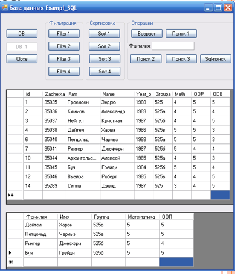
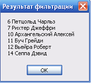
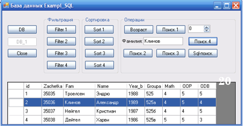

---
title: "Лекция 11: Фильтрация и поиск данных в таблице БД"
layout: bookpage
lang: ru
navigation_weight: 12
--- 


# Лекция 11: Фильтрация и поиск данных в таблице БД

**1. Фильтрация данных (классы DataTable, DataView, BindingSource)**
**2. Поиск данных (SQLDataAdapter, BindingSource)**

# 1. Фильтрация данных

Над данными таблиц БД c помощью инструментов ADO.NET могут быть выполнены следующие операции:

- фильтрация,
- поиск,
- сортировка,
- выборка записей из таблиц БД – SQL-запросы,
- вставка записи (записей) в таблицы БД,
- удаление записи (записей) из таблицы БД,
- обновление записи (записей) в таблицах БД,
- произвольные вычисления над данными в таблицах БД.

Способы фильтрации данных в таблице БД:
- с помощью SQL-запроса, определяющего объект класса *DataAdapter,*s
- с помощью объекта класса *DataView,*
- с помощью объекта класса *DataTable,*
- с помощью объекта класса *BindingSourc*

**Фильтрация данных с помощью SQL-запроса объекта класса DataAdapter**


Пример: выбрать студентов с оценками по математике и по программированию больше 4. 

```sql
// кнопка "Filter 1" - фильтрация с помощью SQL-запроса
private void filter1_Click(object sender, EventArgs e)
        {
            try
            {// объявление объекта da типа SqlDataAdapter
                SqlDataAdapter da;
                DataSet ds = new DataSet();
// задание SQL-запроса
string sel = "select Fam as Фамилия,Name as Имя,Group as Группа,Math as Математика,"
+ "OOP as ООП from T where Math>4 and OOP>=4";
   da = new SqlDataAdapter(sel, con);
     //заполнение объекта ds данными из таблиц БД
               da.Fill(ds);
               
               // источником данных является первая (с 0-м индексом) // таблица объекта ds
                dGV1.DataSource = ds.Tables[0];
}
            catch (Exception ex)
            {// разъединение клиента с БД 
                this.con.Close();
//сообщение в случае исключения при соединении клиента с БД
                MessageBox.Show(ex.Message.ToString());
            }
        }

```


1.2 **Фильтрация данных с помощью объекта класса DataTablе**



Пример - выбираются данные о студентах (поля Id, Fam, Name), у которых номер в таблице больше 4. Используется метод Select класса DataTable

```sql
private void filter3_Click(object sender, EventArgs e)
        {      string filterStr = "Id > 4";
           DataRow [] m = ds.Tables[0].Select(filterStr);
              if (m.Length == 0)
                MessageBox.Show("Строк нет!");
            else
            {
                string s = null;
                for (int i = 0; i < m.Length; i++)
                {
                    DataRow temp = m[i];
s += temp["Id"].ToString() + " " + temp["Fam"].ToString() + " " + temp["Name"].ToString() + "\n";
                }
       MessageBox.Show(s, "Результат фильтрации");
}         }
```

Метод **Select** класса DataTable. Метод Select перегружен и может выполнять следующие действия

1. Фильтрация - можно передать в метод Select строку фильтра в запросе (строку условия после слова where),

2. Фильтрация и сортировка – в параметрах метода Select содержится строка фильтра и порядок сортировки (Asc - возрастающий порядок, Desc - убывающий порядок),

3. Фильтрация и сортировка для записей определенного состояния - в параметрах метода Select также присутствует параметр, определяющий состояние искомых записей (например, только добавленные записи или только измененные записи). 
Метод Select возвращает массив объектов DataRow.

**1.3 Фильтрация данных с помощью объекта класса DataView** 

Пример - выбираются данные о студентах, у которых номер в таблице больше 5; строки сортируются **DESC по Fam**. Используется свойство **RowFilter** класса DataView. 

```sql
//кнопка "Filter 4" - фильтрация с помощью представления
private void filter4_Click(object sender, EventArgs e)
        {
            DataTable tab = ds.Tables[0];
            // объявление представления на таблице tab
            DataView view = new DataView(tab);
        // настройка представления при помощи фильтра
            view.RowFilter = "Id>5";//как в условии where
            // сортировка по убыванию поля Fam
            view.Sort = "Fam desc";
        // привязка представления к сетке dataGridView
            dGV.DataSource = view;
        }
```
У метода Select класса DataTable есть два основных ограничения:

- метод Select принимает динамические критерии поиска и поэтому не может быть сверхэффективным,

- Windows- и Web-формы не поддерживают связывание с возвращаемым значением метода Select — массивом объектов DataRow. 

В  ADO.NET предусмотрено решение, обходящее оба этих ограничения,  объект DataView.

**1.4 Фильтрация данных с помощью объекта класса BindingSource**

 


Пример из таблицы T выбрать данные о студентах в соответствии с фильтром "Math>'4' and OOP>'3' and ODB>='4'". Использовать свойство Filter класса BindingSource. 

```sql
// кнопка "Filter 2" - фильтрация с помощью свойства 
// Filter объекта bs класса BindingSource 
 private void button6_Click(object sender, EventArgs e)
        {
   bs.Filter = "Math>'4' and OOP>'3' and ODB>='4'";
       dGV.DataSource = bs; 
       private void db_Click(object sender, EventArgs e)
        {
//выбираются все поля таблицы Table_1 БД и заносятся в адаптер
    ad = new SqlDataAdapter("select * from Table_1", сon);
                //заполнение объекта ds данными из таблиц БД
                ad.Fill(ds);
// источником данных является первая (с 0-м индексом) таблица объекта ds
                bs.DataSource = ds.Tables[0];
// источником данных для сетки dataGridView1 является объект bs типа BindingSource
                dGV.DataSource = bs;
                // задание ширины столбцов сетки dataGridView1
                for (int i = 0; i < dGV.ColumnCount; i++)
                    dGV.Columns[i].Width = 45;
                dGV.Columns[1].Width = 55;
                dGV.Columns[2].Width = 80;
                dGV.Columns[3].Width = 80;
            }

```


# 2. Поиск данных 

Поиск данных в таблице БД может быть выполнен следующими способами:

- с помощью SQL-запроса (в объекте класса DataAdapter),
- с помощью фильтрации, используя в условии проверку на равенство (в объектах классов DataView, DataTable, BindingSource),
- с помощью объекта класса BindingSource 

**2.1 Поиск строки по номеру
Пример:** выбрать из таблицы БД строку по ее номеру в таблице – задание номера строки выполняется с помощью элемента numericUpDown (пример работы с классом DataRow). Особенностью примера является то, что с помощью адаптера заполняется не объект типа DataSet, а таблица – объект типа DataTable.

```sql
// кнопка "Поиск 1" - поиск строки по номеру 
private void find1_Click(object sender, EventArgs e)
        {// работа с объектом tab класса DataTable
            try
            {// выбираются все поля таблицы Table_1 БД и заносятся в адаптер
            ad = new SqlDataAdapter("select * from Table_1", сon);
                DataTable tab = new DataTable();
// заполнение объекта tab данными из таблицы Table_1 БД
                ad.Fill(tab);
// визуализация выбранной строки таблицы БД
                label2.Text = " ";
// поиск строки – выбор строки по номеру!!!
DataRow row = tab.Rows[(int)numericUpDown1.Value];
// выбор данных из строки в свойство Text метки label2
                foreach (DataColumn dc in tab.Columns)
                    if(dc.Caption!="id")
//выбор всех полей кроме поля "id"
           label2.Text = label2.Text + " " + row[dc];
            }
```

**2.2 Поиск строки с помощью SQL-запроса для объекта типа SQLDataAdapter**

Пример. Найти в таблице БД всех студентов, фамилии которых начинаются на буквы ‘С’ или ’Т’.

```sql
//кнопка "Sql-поиск" – поиск с помощью SQL-запроса
private void button9_Click(object sender, EventArgs e)
// задание SQL-запроса
// поиск фамилий, начинающихся на букву 'С' или 'Т'
string sel = "select Fam as Фамилия,Name as Имя from Table_1 where (Fam like 'С%')or(Fam like 'Т%')";
    ad = new SqlDataAdapter(sel, сon);
                DataTable tab = new DataTable();
                //заполнение объекта tab данными запроса
                ad.Fill(tab);
// источником данных для сетки dGV является объект tab
                dGV.DataSource = tab;
// задание ширины столбцов сетки dataGridView
              for (int i = 0; i < dGV.ColumnCount; i++)
                    dGV.Columns[i].Width = 80;
            }
            catch (Exception ex)
            {// сообщение в случае исключения при 
            // разъединение клиента с БД
                сon.Close();
                MessageBox.Show(ex.Message.ToString());
            }}
```
**2.3 Поиск данных с помощью фильтрации**

Пример поиска данных с помощью фильтрации с использованием объекта класса DataView – из таблицы Table_1 выбираются данные о студентах, у которых номер в таблице равен 2. Используется свойство RowFilter класса DataView. 

```sql
// кнопка "Поиск 2" - поиск с помощью фильтрации в представлении
private void find2_Click(object sender, EventArgs e)
        {
            DataTable tab = new DataTable();
// таблица в ds уже должна быть создана
            tab = ds.Tables[0];
            // объявление представления на таблице tab
            DataView view = new DataView(tab);
     //  view.Table = tab;// или так задается таблица 
// настройка представления при помощи фильтра
view.RowFilter = "id="+numericUpDown1.Value.ToString();
    // привязка представления к сетке dataGridView
            dGV.DataSource = view;
        }
```
**2.4 Поиск данных с помощью объекта класса BindingSource**

Пример: Найти в таблице фамилию студента (строка с найденной фамилией выделяется в сетке), фамилия вводится в свойстве Text элемента textBox. 
Используется метод Find класса BindingSource, имеющий аргументы – имя поля для поиска (типа string) и ключ поиска (типа object). 
При удачном поиске метод Find возвращает индекс элемента (типа int), имеющего ключ поиска, при неудачном поиске – значение (-1).

```sql
//кнопка "Поиск 4"-используется метод Find класса BindingSource
private void button12_Click(object sender, EventArgs e)
{
// поиск индекса строки, если в столбце с именем 
// ("Fam")ColumnName есть значение textBox1.Text
// если нет строки, то i<0, если есть – i>=0
int i = bs.Find((string)ds.Tables[0].Columns["Fam"].ColumnName, textBox1.Text);
if(i>=0)// поиск успешен – индекс >=0
                      dGV.Rows[i].Selected = true;
             if(i<0) 
MessageBox.Show("Строка не 
найдена!", "Сообщение");
   }
```



