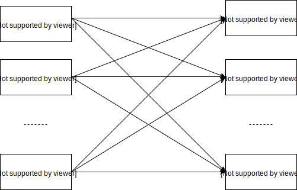
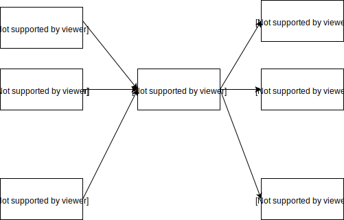
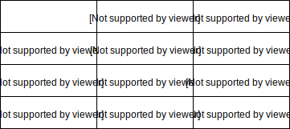
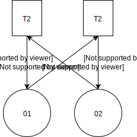
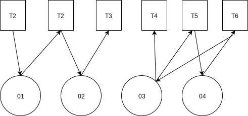

---
title: "Лекция 15: Средства языка SQL для обеспечения авторизации доступа к данным, управления транзакциями, сессиями и подключениями"
layout: bookpage
lang: ru
navigation_weight: 15
--- 

# Лекция 15: Средства языка SQL для обеспечения авторизации доступа к данным, управления транзакциями, сессиями и подключениями

# 1. Поддержка авторизации доступа к данным в языке SQL
# 2. Управление транзакциями в SQL

# 1. Поддержка авторизации

В языке SQL предусмотрены возможности контроля доступа к разным объектам базы данных, в том числе к следующим объектам:

- таблицам;
- столбцам таблиц;
- представлениям;
- доменам;
- порядкам сортировки символов (collation);
- преобразованиям (translation);
- триггерам;
- подпрограммам, выызываемым из SQL;
- определенным пользователями типам.

Принцип сокрытия данных - сокрытие информации об объектах, содержащихся в схеме базы данных, от пользователей, которые лишены доступа к этим объектам.

Если некоторый пользователь не обладает, например, привилегией на просмотр таблицы PRO, то при выполнении операции SELECT * FROM PRO он получит такое же сообщение, как если бы таблица PRO **не существовала.**

В модели контроля доступа SQL **создатель** любого объекта базы данных автоматически становится **владельцем** этого объекта.

Владелец объекта обладает полным набором **привилегий** для выполнения действий над объектом.

Владелец обладает привилегией на **передачу** всех (или части) своих привилегий другим пользователям или ролям.

- Привилегии уровня DBA (DataBase Administrator) для выполнения операций DDL – Data Definition Language (CREATE, ALTER и DROP над объектами, входящими в схему базы данных). 

- В стандарте SQL требуется соблюдение следующих правил:
 
- Любые пользователь или его роль могут выполнять любые операции DDL внутри схемы, которой владеют;

- Не допускается выполнение каких-либо операций DDL внутри схемы, которой не владеет пользователь или роль, пытающиеся выполнить соответствующую операцию;

- Эти правила не допускают исключений.

# 1. Пользователи и роли

- Стандарт SQL: пользователь характеризуется своим идентификатором авторизации (authID).

- В стандарте SQL не специфицированы средства создания идентификаторов авторизации.

- Идентификатор авторизации (authID) может являться либо *идентификатором пользователя*, либо *именем роли*.

- Роль идентифицирует динамически образуемую группу пользователей СУБД, где каждый из которых обладает

- Привилегией на исполнение данной роли;

- Всеми привилегиями данной роли для доступа к объектам БД.



а) Определение привелегий пользователей без использования роли 



b)Определение привелегий пользователей с помощью роли 

Привилегии, пользователи и роли

- Заданная SQL-сессия ассоциируется с идентификатором пользователя и с именем роли. Почти всегда привилегии, связанные с этими идентификатором и именем, используются для определения допустимости выполнения различных операций во время данной сессии.

- Пользовательский идентификатор SQL-сессии совпадает с регистрационным именем пользователя или является идентификатором, специально устанавливаемым специалистами по security.

- Значение текущего пользовательского идентификатора SQL-сессии возвращается функцией SESSION_USER

- Значение текущего имени роли SQL-сессии возвращается функцией CURRENT_ROLE

- Создание роли:

```sql
CREATE ROLE role_name [ WITH ADMIN { CURRENT_USER | CURRENT_ROLE } ]
```

- Если не содержится раздел WITH ADMIN, то привилегию на исполнение роли получает текущий идентификатор пользователя SQL-сессии,

- Если задан раздел WITH ADMIN, то можно выбрать, будет ли являться владельцем роли authID, соответствующий текущему идентификатору пользователя SQL-сессии (CURRENT_USER), или authID, соответствующий текущему имени роли (CURRENT_ROLE)

- Передача привилегий:

```sql 
GRANT { ALL PRIVILEGES | privilege_commalist } ON privilege_object 
TO { PUBLIC | authID_commalist } [ WITH GRANT OPTION ] [ GRANTED BY { CURRENT_USER | CURRENT_ROLE } ] 
privilege ::= SELECT [ column_name_commalist ] | DELETE | INSERT [ column_name_commalist ] | UPDATE [ column_name_commalist ] | REFERENCES [ column_name_commalist ] | USAGE | TRIGGER | EXECUTE 
privilege_object ::= [ TABLE ] table_name | DOMAIN domain_name | CHARACTER SET character_set_name | COLLATION collation_name | TRANSLATION translation_name
```

- Поскольку authID может являться идентификатором пользователя или именем роли, привилегии могут передаваться: от пользователей пользователям, 
от пользователей ролям, от ролей ролям

- ALL PRIVILEGES - передаются все привилегии доступа к соответствующему объекту базы данных, которыми обладает текущий authID SQL-сессии

- Один оператор GRANT  - передавать привилегии доступа только к одному объекту

- Если объектом является таблица, разные привилегии могут передаваться по отношению к одному и тому же набору столбцов или к разным наборам. 

- WITH GRANT OPTION - получателям передаваемых привилегий дается также привилегия на *дальнейшую передачу* полученных привилегий, включая привилегию на передачу привилегий.

- Аннулирование привилегий

```sql
REVOKE [ GRANT OPTION FOR] privilege_commalist ON privilege_object 
FROM { PUBLIC | authID_commalist } [ GRANTED BY { CURRENT_USER | CURRENT_ROLE } ] { RESTRICT | CASCADE }
```

RESTRICT, - система проверит, не передавалась ли какая-либо из указанных привилегий каким-либо authID от того authID, у которого привилегия должна быть аннулирована (если ранее привилегия была передана с правом передачи). Если так, операция не выполняется; в противном случае привилегии у указанных authID аннулируются.

- Аннулирование привилегий

```sql
REVOKE [ GRANT OPTION FOR] privilege_commalist ON privilege_object 
FROM { PUBLIC | authID_commalist } [ GRANTED BY { CURRENT_USER | CURRENT_ROLE } ] { RESTRICT | CASCADE }
```

CASCADE - указанные привилегии аннулируются у всех authID, прямо или косвенно (через промежуточные authID) получивших привилегии от текущего authID SQL-сессии, в которой выполняется данная операция.

- Аннулирование ролей

```sql
REVOKE [ ADMIN OPTION FOR ] role_name_commalist 
FROM { PUBLIC | authID_commalist } [ GRANTED BY { CURRENT_USER | CURRENT_ROLE } ] { RESTRICT | CASCADE }
```
# 2. Управление транзакциями

- SQL - классическое понимание транзакции, характеризуемое ACID (Atomicy, Consistency, Isolation и Durability). Т.е. транзакция  = последовательность операций, обладающая свойствами:

- **Атомарность** (Atomicy). Результаты всех операций, успешно выполненных в пределах транзакции, должны быть отражены в состоянии базы данных, либо в состоянии базы данных не должно быть отражено действие ни одной операции («все или ничего»)

- **Согласованность** (Consistency). Транзакция может быть успешно завершена с фиксацией результатов своих операций только в том случае, когда действия операций не нарушают целостность базы данных.

- **Изоляция** (Isolation). Две одновременно выполняемые транзакции никоим образом не действовали одна на другую (результаты выполнения операций транзакции T1 не должны быть видны никакой другой транзакции T2 до тех пор, пока транзакция T1не завершится успешным образом).

- **Долговечность** (Durability). После успешного завершения транзакции все изменения, которые были внесены в состояние базы данных операциями этой транзакции, должны гарантированно сохраняться, даже в случае сбоев аппаратуры или программного обеспечения.

- Реализация изолированности транзакций: в СУБД должны использоваться какие-либо методы регулирования совместного выполнения транзакций.

- **Сериализация** транзакций – механизм их выполнения по некоторому сериальному плану. 

- Обеспечение такого механизма является **основной функцией** СУБД. Система, в которой поддерживается сериализация транзакций, обеспечивает реальную изолированность пользователей.

- Пусть в системе одновременно выполняется некоторое множество транзакций S = {T1, T2, …, Tn}. 

- План (способ) выполнения набора транзакций S (в котором чередуются или параллельно выполняются операции разных транзакций) называется *сериальным*, если результат совместного выполнения транзакций эквивалентен результату некоторого **последовательного** выполнения этих же транзакций (Ti1, Ti2, …, Tin).

- Конфликты:

- W/W – транзакция T2 пытается изменять объект, измененный не закончившейся транзакцией T1(наличие такого конфликта может привести к возникновению ситуации **потерянных изменений**);

- R/W – транзакция T2 пытается изменять объект, прочитанный не закончившейся транзакцией T1(наличие такого конфликта может привести к возникновению ситуации **неповторяющихся чтений**);

- W/R – транзакция T2 пытается читать объект, измененный не закончившейся транзакцией T1(наличие такого конфликта может привести к возникновению **ситуации «грязного» чтения**).

- Cинхронизационная блокировка объекта:

- Подход, основанный на соблюдении двухфазного протокола синхронизационных захватов объектов баз данных (Two-Phase Locking Protocol, 2PL);

- Режимы синхронизационных блокировок:

- **совместный режим – S**(Shared): совместная (по чтению) блокировка объекта и требуемый для выполнения операции чтения объекта;

- **монопольный режим – X** (eXclusive): монопольная (по записи) блокировка объекта и требуемый для выполнения операций вставки, удаления и модификации объекта.




Совместимость блокировок S и X

"-" соответствует состоянию объекта, для которого не установлен никакой захват.

Транзакция, запросившая синхронизационный захват объекта БД, уже захваченный другой транзакцией в несовместимом режиме, блокируется до тех пор, пока захват с этого объекта не будет снят.

- *Объект* синхронизационной блокировки:

- *Файл* – физический (с точки СУБД) объект, область хранения нескольких таблиц и, возможно, индексов;

- *Таблица* – логический объект, соответствующий множеству кортежей данной таблицы;

- *Страница данных* – физический объект, хранящий кортежи одной или нескольких таблиц, индексную или служебную информацию;

- *Кортеж* – элементарный физический объект базы данных.

- Синхронизационные блокировки могут запрашиваться по отношению к объектам разного уровня: файлам, таблицам и кортежам.

- Проблема: при блокировке **крупных** объектов возрастает вероятность **конфликтов** транзакций и, уменьшается допускаемая степень чередования их операций или реального параллельного выполнения.

- Для согласования блокировок разного уровня вводятся специальный протокол **гранулированных блокировок** и новые типы блокировок. 

- Блокировка в режиме **IS** (Intented for Shared lock) некоторого составного объекта БД - намерение заблокировать некоторый объект o', входящий в o, в **совместном** режиме (режиме S). Например, при намерении читать кортежи из таблицы Tab эта таблица должна быть заблокирована в режиме IS (а до этого в таком же режиме должен быть заблокирован файл, в котором располагается таблица Tab).

- Блокировка в режиме **IX** (Intented for eXclusive lock) некоторого составного объекта БД - намерение заблокировать некоторый объект o', входящий в o, в **монопольном режиме** (режиме X). Например, для удаления кортежей из таблицы Tab эта таблица должна быть заблокирована в режиме IX (а до этого в таком же режиме должен быть заблокирован файл, в котором располагается таблица Tab).

- Блокировка в режиме **SIX** (Shared, Intented for eXclusive lock) некоторого составного объекта БД - совместная блокировка всего этого объекта с намерением впоследствии блокировать какие-либо **входящие в него объекты** в **монопольном** режиме (режиме X)

- Недостаток метода сериализации транзакций на основе синхронизационных блокировок - возникновение **тупиков** (deadlocks) между транзакциями. 



Ситуация синхронизационного тупика между транзакциями T1 и T2

- Тупик:

- транзакции T1 и T2 устанавливают монопольные блокировки (X) объектов o1 и o2 соответственно;

- после этого T1 требуется совместная блокировка S объекта o2, а T2 – совместная блокировка S объекта o1;

- ни одно из этих требований блокировки не может быть удовлетворено, следовательно, ни одна из транзакций не может продолжаться; поэтому монопольные блокировки объектов никогда не будут сняты, а требования совместных блокировок не будут удовлетворены.

- Обнаружение тупиков - построение (и постоянное поддержание) графа ожидания транзакций. 

- **Граф ожидания транзакций** – ориентированный двудольный граф с 2 типами вершин – вершины-транзакции (прямоугольник), и вершины-объекты блокировок (окружности).



- Распознавание тупиков - путем построения / поддержания графа ожидания транзакций и поиска в нем **циклов**. 

- Традиционная техника нахождения циклов в ориентированном графе является **редукция графа** (удаление «лишних» дуг).

- Альтернативный метод сериализации транзакций - метод **временных меток**.

- Идея: если транзакция T1 началась **раньше** транзакции T2, то СУБД обеспечивает такой сериальный план, как если бы транзакция T1 была целиком выполнена до начала T2.

- Каждой транзакции T предписывается временная метка t(T), (время начала выполнения транзакции T). При выполнении операции над объектом o транзакция T помечает его своими идентификатором, временной меткой и типом операции (чтение или изменение).

Алгоритм начала транзакции :

1. СУБД Проверяет, помечен ли объект o какой-либо транзакцией T1. Если нет, то помечает этот объект своей временной меткой и типом операции и выполняет операцию. Конец действий.

2. Иначе транзакция T2 проверяет, не завершилась ли транзакция T1, пометившая этот объект. Если транзакция T1 закончилась, то T2 помечает объект o и выполняет свою операцию. Конец действий.

- Если транзакция T1 не завершилась, то T2 проверяет конфликтность операций. Если операции неконфликтны, то транзакция T2 выполняет свою операцию.

- Если операции транзакций T2 и T1 конфликтуют, то если t(T1) > t(T2) (т.е.  T1 является более «молодой», чем T2), то производится *откат* T1 , и T2 выполняет свою операцию.

- Если же t(T1) < t(T2) (T1 «старше» T2), то производится откат T2; T2 получает новую временную метку и начинается заново.

Недостатки метода временных меток:

Потенциально **более частые откаты транзакций**, чем в случае использования синхронизационных захватов (конфликтность транзакций определяется более грубо). 

В распределенных системах сложно вырабатывать **глобальные временные метки** с отношением полного порядка.


