# 1. Базы данных NoSQL

## Реляционные СУБД

1. Жесткая структура данных в таблицах.
2. Нормализация данных (разделение по нескольким таблицам).
3. Поддержка ACID-транзакций (Atomicity, Consistency, Isolation, Durability).
4. Стандартный язык SQL для выборки и манипуляции с данными.
5. Вертикальная масштабируемость (увеличение производительности сервера).

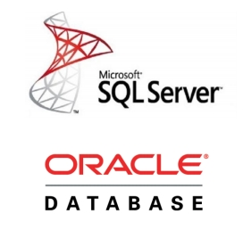

## Чем могут не устраивать?

Необходимо поддерживать две разнородные модели:
реляционную в базе и объектную в коде.
1. Любые изменения в схеме сущностей нужно отражать в структуре таблиц + менять SQL-запросы и проекции таблиц на объекты.
2. При больших объемах данных возникает порог вертикального масштабирования. Необходима параллельная обработка в кластере серверов (горизонтальная масштабируемость).
3. Падение производительности в больших распределенных системах из-за необходимости поддерживать согласованность данных + проблемы с устойчивостью к
физическому разделению узлов.

## NoSQL СУБД

Основные особенности:

1. Отказ от реляционной модели и языка SQL
2. Использование распределенной архитектуры
3. Отсутствие полноценной поддержки ACID-транзакций

Преимущества:

1. Большая производительность
2. Хорошая масштабируемость при возрастающих нагрузках и огромных объемах данных

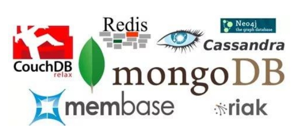

## Отсутствие жесткой структуры объектов БД

Schema-less данные – в NoSQL БД структура данных заранее не
регламентируется.
Вместо строго структурированных таблиц имеем, например, набор
разнородных документов

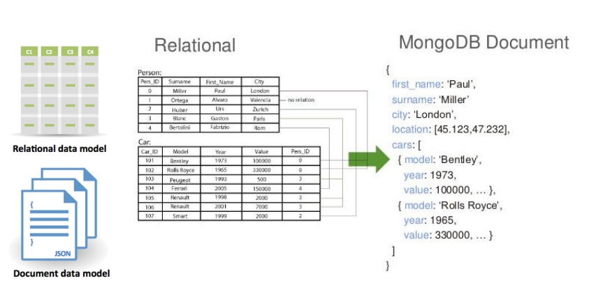

Schema-less данные – в NoSQL БД структура данных заранее
не регламентируется.
Плюсы: структура каждого документа может быть уникальной
(он сам себя описывает).
Минусы: поддержка структуры данных переносится с сервера
в логику приложений.

## Агрегирование данных (= денормализация)

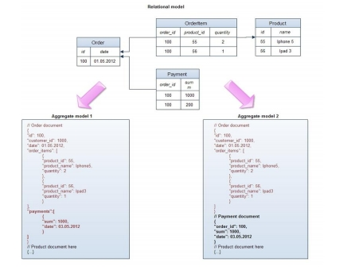

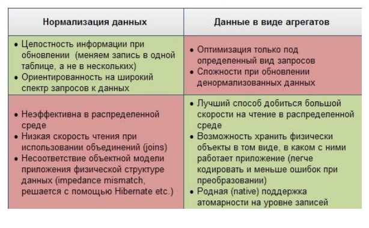

## NoSQL СУБД

Причины появления – распределенность систем:
1. Потребность в горизонтальной масштабируемости БД (путем добавления новых узлов).
2. Сложность эффективной реализации транзакций в распределенной среде.

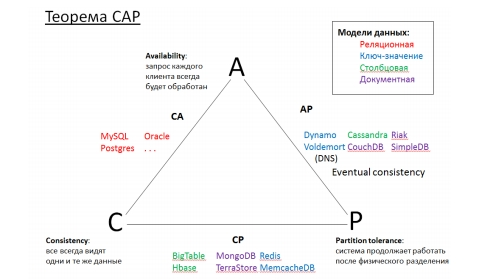

## Борьба с большими объемами данных

Масштабирование БД для ускорения чтения + повышение надежности системы.

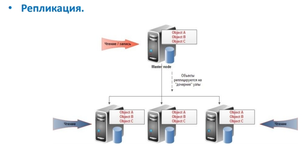

Синхронное обновление – увеличивается время ответа системы
Асинхронное обновление – есть время, когда реплики несогласованы

Масштабирование БД для ускорения записи

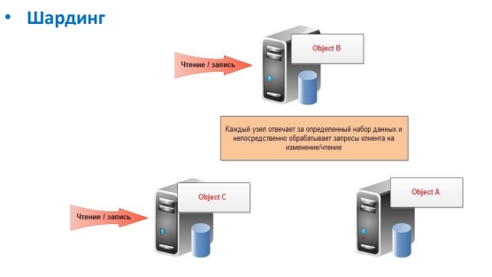

Возникают задачи:
1. Распределение данных по узлам.
2. Балансировка нагрузки.
3. Оптимизация загрузки сети.

## MapReduce

Механизм параллельной обработки больших данных на
кластерах.

Map: Главный узел (master node) делит задачу на части, распределяя их по остальным машинам (worker nodes).

Reduce: Master node получает предварительные результаты, и формирует из них конечный результат.

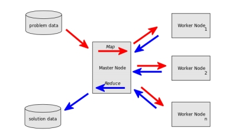

Пример: Подсчет количества слов во входном тексте

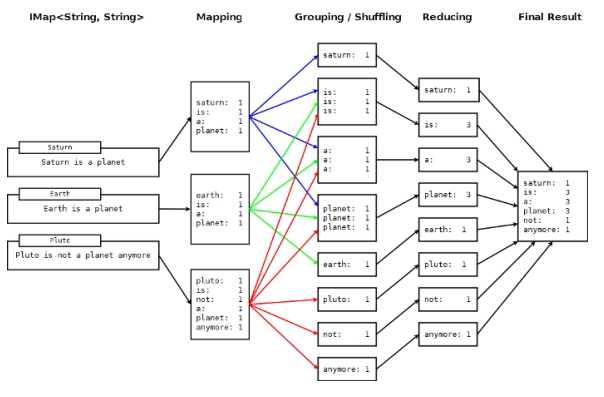

## Реляционные СУБД vs NoSQL

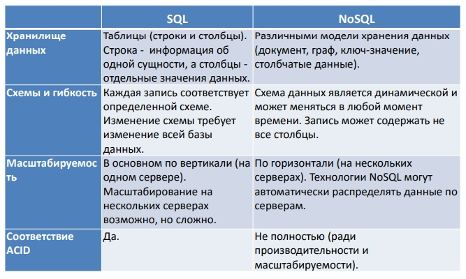

## Модели данных NoSQL

Системы «ключ-значение»
1. CRUD-операции (Create-Retrieve-Update-Delete)
2. Хорошая горизонтальная масштабируемость
3. Простота и производительность
4. Плохо подходят для операций, отличных от CRUD

Документ-ориентированные системы
1. Единица хранения – документ, т.е. объект, обладающий произвольным набором атрибутов (полей), который может быть представлен, например, в JSON
2. Поддерживают поиск по полям документов, индексы, часто допускаются вложенные документы и массивы.

## Документ-ориентированные модели

Расширять структуру данных проще, чем в реляционной модели

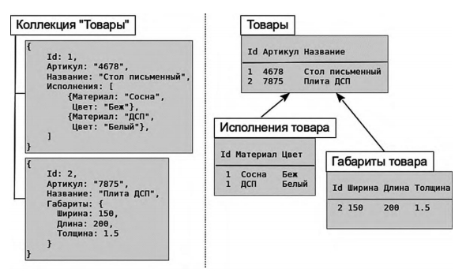

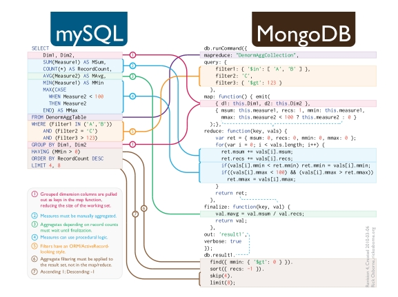

## Модели данных NoSQL

Системы типа Google BigTable
1. Данные хранятся в виде строк. Для доступа к данным три ключа: ключ строки (по нему отсортированы строки в базе), ключ столбца, временная метка.
2. Связанная информация хранится в одном месте.

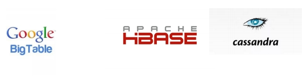

Графовые системы

1. Состоит из узлов и связей между ними.
2. Как с узлами, так и со связями можно ассоциировать свойства (пары ключ-значение), в которых хранятся данные.
3. Быстрый просмотр узлов и связей для поиска нужных данных.

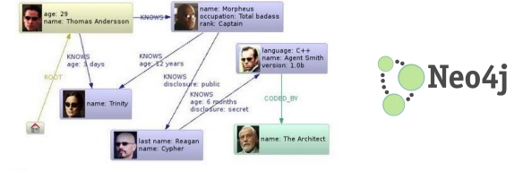